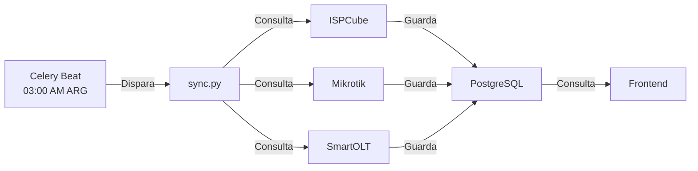

# 🔗 Guía de Integraciones Externas

Emerald ERP integra datos de tres proveedores principales de infraestructura ISP:

---

## 1. ISPCube

### ¿Qué es?
Sistema de gestión comercial para ISPs. Emerald sincroniza:
- **Clientes** (datos demográficos, contacto)
- **Conexiones** (planes, velocidades, direcciones)
- **Planes** (descripción, velocidad de descarga/carga)

### Configuración

```bash
# En tu archivo .env
ISPCUBE_API_URL=http://192.168.1.100:8080  # URL de la API
ISPCUBE_API_KEY=tu_api_key_aqui             # Token de autenticación
ISPCUBE_SYNC_ENABLED=true                   # Habilitar sincronización
```

### Endpoints Utilizados

| Endpoint | Método | Descripción |
|----------|--------|-------------|
| `/api/clientes` | GET | Lista de clientes |
| `/api/conexiones` | GET | Conexiones activas |
| `/api/planes` | GET | Catálogo de planes |

### Estructura de Datos Esperada

#### Cliente (response de `/api/clientes`)
```json
{
  "id": 12345,
  "code": "CLI001",
  "name": "Juan Pérez",
  "doc_number": "12345678",
  "address": "Calle 123, Piso 2",
  "status": "active",
  "email": "juan@example.com"
}
```

#### Conexión (response de `/api/conexiones`)
```json
{
  "connection_id": "CONN001",
  "pppoe_username": "juan_perez",
  "customer_id": 12345,
  "node_id": "NODE01",
  "plan_id": "PLAN_50",
  "direccion": "Calle 123, Piso 2"
}
```

### Manejo de Errores

```python
# Si ISPCube no responde, la sincronización continúa
# pero registra un warning en los logs
try:
    clientes = ispcube.obtener_clientes()
except Exception as e:
    logger.warning(f"ISPCube offline: {e}")
    # Usa datos cacheados o continúa con otras fuentes
```

---

## 2. Mikrotik (RouterOS)

### ¿Qué es?
Sistema de enrutamiento. Emerald sincroniza:
- **PPP Secrets** (usuarios PPPoE, contraseñas, perfiles)
- **Validación de conexión** (verificar si un usuario está conectado)
- **Estadísticas en tiempo real** (velocidad, bytes transferidos)

### Configuración

```bash
# En tu .env
MK_HOST=192.168.1.100           # IP del router Mikrotik
MK_PORT=8728                     # Puerto API (default 8728)
MK_USER=admin                    # Usuario con acceso API
MK_PASS=tu_password_aqui         # Contraseña
MK_ENABLE_SSL=false              # Si usas puerto 8729 (SSL), ponerlo en true
```

### Endpoints Utilizados (API RouterOS)

| Recurso | Método | Descripción |
|---------|--------|-------------|
| `/ppp/secret` | GET/ADD/REMOVE | Gestión de usuarios PPPoE |
| `/interface/pppoe-client` | GET | Estado de conexiones PPPoE |
| `/queue/simple` | GET | Colas y limits de ancho de banda |

### Estructura de Datos (PPP Secret)

```json
{
  "name": "juan_perez",
  "password": "p@ssw0rd123",
  "profile": "PLAN_50M",
  "service": "pppoe",
  "comment": "Casilda 123, Piso 2",
  "last-caller-id": "192.168.1.50",
  "last-logged-out": "2025-12-29T14:23:00Z"
}
```

### Validación de PPPoE

```python
from src.clients import mikrotik

# Validar si un usuario está conectado
estado = mikrotik.validar_pppoe(
    router_ip="192.168.1.100",
    pppoe_user="juan_perez",
    port=8728
)

# Response esperado:
{
    "active": True,
    "current_address": "192.168.100.50",
    "uptime": "2d 3h 14m",
    "identity": "PPPoE_Session_12345"
}
```

### Manejo de Autenticación

La API de RouterOS requiere:
1. **Conexión directa TCP** al puerto 8728 (o 8729 con SSL)
2. **Credenciales válidas** con permisos en `/ppp/secret`
3. **Timeout razonable** (recomendado: 10 segundos)

```python
# En mikrotik.py:
from routeros_api import RouterOsApiPool

pool = RouterOsApiPool(
    host=router_ip,
    username=username,
    password=password,
    port=port,
    plaintext_login=True  # O False si usas SSL
)
```

---

## 3. SmartOLT

### ¿Qué es?
Sistema de OLT (Optical Line Terminal) para FTTH. Emerald sincroniza:
- **Estado de ONUs** (Online/Offline)
- **Señales ópticas** (RX Power, TX Power en dBm)
- **VLAN asignadas** (por puerto/ONU)

### Configuración

```bash
# En tu .env
SMARTOLT_API_URL=http://192.168.2.100:8080
SMARTOLT_API_KEY=tu_api_key_aqui
SMARTOLT_OLT_ID=OLT_001
```

### Endpoints Utilizados

| Endpoint | Método | Descripción |
|----------|--------|-------------|
| `/api/onus` | GET | Lista de ONUs |
| `/api/onus/{external_id}/status` | GET | Estado de una ONU |
| `/api/onus/{external_id}/signals` | GET | Señales ópticas |
| `/api/onus/{external_id}/vlans` | GET | VLANs asignadas |

### Estructura de Datos

#### Estado de ONU
```json
{
  "unique_external_id": "ONU_ABCD1234",
  "status": "online",
  "olt_id": "OLT_001",
  "board": 1,
  "port": 16,
  "onu_id": 128
}
```

#### Señales Ópticas
```json
{
  "rx_power": -20.5,    # dBm (more negative = weaker)
  "tx_power": 2.3,      # dBm
  "distance": 12850,    # metros
  "frequency": "1577nm" # wavelength
}
```

### Umbrales de Alerta

```python
# En diagnosis.py:
SIGNAL_THRESHOLDS = {
    "rx_weak": -27,     # Alerta si RX < -27 dBm
    "tx_high": 5,       # Alerta si TX > 5 dBm
    "distance_max": 20000  # Alerta si distancia > 20km
}
```

---

## Flujo de Sincronización Completo



---

## Troubleshooting de Integraciones

### ISPCube no responde
```bash
# 1. Verificar conectividad
curl -H "Authorization: Bearer $ISPCUBE_API_KEY" \
  http://192.168.1.100:8080/api/clientes

# 2. Ver logs de Celery
docker-compose logs -f celery_worker | grep ispcube
```

### Mikrotik rechaza conexión
```bash
# 1. Verificar que el puerto 8728 está abierto
nc -zv 192.168.1.100 8728

# 2. Probar credenciales con SSH
ssh admin@192.168.1.100

# 3. En RouterOS, verificar permisos de usuario:
[admin@MikroTik] > /user/group/print
```

### SmartOLT devuelve errores 401
```bash
# 1. Validar API key
curl -H "Authorization: Bearer $SMARTOLT_API_KEY" \
  http://192.168.2.100:8080/api/onus

# 2. Verificar expiración de token
# En SmartOLT admin panel: Settings → API Keys
```

---

## Mejores Prácticas

✅ **Hacer:**
- Usar variables de entorno para credenciales
- Implementar reintentos con backoff exponencial
- Loguear todas las fallas de sincronización
- Caché local para datos de larga duración

❌ **Evitar:**
- Hardcodear credenciales en el código
- Usar credenciales débiles o por defecto
- Sincronizar en horario pico
- Exponentes de la API sin autenticación

