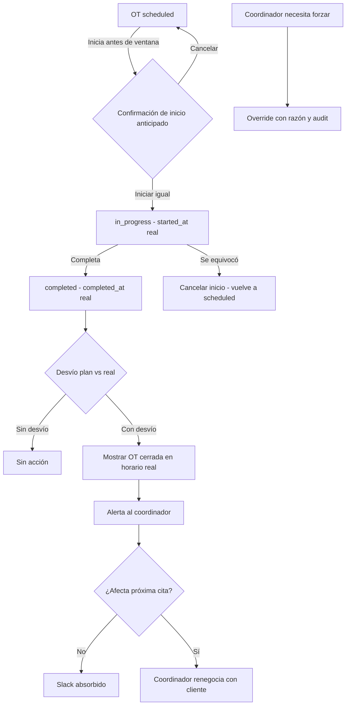

# Plan: Agenda lógica vs agenda real — compromiso con el cliente y manejo de excepciones

## 1. Contexto y problema

Aparecieron casos de "mal uso" que en realidad son **flujos sin salida** o **validaciones demasiado duras**:

1. Técnico inicia una OT por error → quedaba en `in_progress` sin forma de volver atrás (ya resuelto con el botón Cancelar).
2. Técnico hace la tarea **antes** de su horario pactado y la completa → la OT queda cerrada ocupando visualmente un slot de la grilla que en la realidad ya está libre.
3. Para corregir estos casos hoy se parchea directo con DBeaver, con los riesgos de consistencia y auditoría que eso implica.

**Premisa aceptada:** no existen "malos usos", existen sistemas poco sólidos y flujos no analizados. La distancia entre teoría y práctica es normal en el primer año de release.

## 2. Benchmark — qué hace el software carrier-class (FSM)

Sistemas como Salesforce Field Service, ServiceMax, IFS FSM, Dynamics 365 Field Service o Sitetracker comparten estos patrones.

### 2.1 El appointment es una ventana, no un minuto exacto

El compromiso con el cliente se expresa como **ventana horaria** ("entre 9:00 y 11:00"), no como un punto fijo. Esto cambia todo:

- Llegar a las 9:15 cuando la ventana es 9:00–11:00 **cumple** el acuerdo.
- Llegar **antes** de que abra la ventana es lo único que exige comunicación, no bloqueo.
- Llegar **después** de que cierre la ventana es una violación de SLA, que se mide y se comunica.

En Emerald hoy el plan es un punto (`scheduled_start` + `estimated_duration`). Ese es el origen del conflicto: un punto fijo no tolera la realidad de la calle.

### 2.2 Plan vs. Real como dos líneas de tiempo separadas

- **Agenda lógica (plan):** `scheduled_start` / `scheduled_end`. Es lo que el coordinador armó y lo que la grilla muestra. Son **promesas**.
- **Agenda real:** `started_at` / `completed_at` (más `scheduled_at` histórico). Es lo que efectivamente pasó.

La grilla muestra el plan. La realidad se registra aparte y **no pisa** el plan. Al final del día, métricas reconcilian plan vs real (on-time, early, late, tiempo de viaje) para mejorar la planificación futura.

### 2.3 Compromiso con el cliente: comunicación, no re-promesa automática

El punto clave que el usuario plantea es correcto y es la regla de oro carrier-class:

> **Nunca se mueve automáticamente la cita del próximo cliente, porque es una promesa independiente.**

Cuando la realidad se desvía del plan:

1. El sistema **captura** el desvío (no lo oculta).
2. El sistema **comunica** al cliente cuando hay cambio real de ETA (notificaciones "técnico en camino", "llegando").
3. El **despachador/coordinador** decide: llama al cliente, re-promete, reordena. El sistema no decide solo.
4. Si el técnico termina antes, ese tiempo se convierte en **slack** (holgura). Puede ofrecerle al cliente siguiente adelantar la visita **si el cliente acepta** — eso es una interacción humana, no un auto-move.

### 2.4 Break-glass acotado, no god-mode

No se crea un rol que saltee todo. Se crea un **override por operación**, con motivo obligatorio, rol específico, before/after en audit log y visibilidad para el coordinador. Emerald ya tiene la semilla en [`validate_coordination_not_locked()`](backend/src/routers/work_orders_guards.py:41) con `override_reason`.

## 3. Las dos realidades, con ejemplo

Plan (agenda lógica / promesas):

| Slot | OT | Cliente | Promesa |
|---|---|---|---|
| 08:30–09:30 | #1 | A | 08:30–09:30 |
| 10:00–11:00 | #2 | B | 10:00 |
| 11:30–12:30 | #3 | C | 11:30 |

Realidad (calle):

| OT | Realidad | Consecuencia |
|---|---|---|
| #1 | Llega 08:35, termina 09:10 | Cumplió su ventana. Quedan 20 min de slack. |
| #2 | Prometido 10:00 | **No se mueve.** El técnico puede llamar a B para ofrecer adelantar, o esperar/usar el slack. |
| #3 | Prometido 11:30 | **No se mueve.** |

Qué hace el sistema carrier-class en este escenario:

1. Registra actuales de #1 (08:35–09:10) **sin** reescribir el plan de #2 ni #3.
2. Muestra en la grilla la OT #1 cerrada en su **horario real** (o la marca como completada sin bloquear), de modo que el slot 08:30–09:30 quede visualmente libre.
3. Alerta al coordinador: "OT #1 terminó 20 min antes. #2 sigue a las 10:00" para que decida si renegocia.
4. Opcional: notifica a B "el técnico viene en camino" cuando realmente sale hacia B.

El problema concreto de hoy ("OT cerrada ocupando un slot que en realidad está libre") es, entonces, un problema de **visualización del plan vs lo real**, no de lógica de bloqueo.

## 3.1 Cómo conviven ambos mundos en la grilla (respuesta operativa)

Hoy la grilla posiciona cada tarjeta por `scheduled_start` (la promesa). Por eso una OT completada a la mañana sigue apareciendo a la tarde.

**Regla 1 — La fecha de cierre siempre es la real.**
`completed_at` (y `started_at`) ya guardan la hora real de la calle. Nunca se reescriben para "cuadrar" con el plan. Si el técnico cerró a las 09:10, la fecha de cierre es 09:10, aunque el plan dijera 14:00.

**Regla 2 — La posición en la grilla es el plan (la promesa), y solo se reacomoda la OT ya cerrada.**
- OT completada con desvío → su tarjeta se muestra en el horario **real** (o se marca con la varianza), y el slot prometido queda **libre** para que coordinación lo reutilice.
- Las OTs siguientes (promesas independientes con otros clientes) **no se mueven jamás** por una tarea anterior.

**Regla 3 — Una sola grilla operativa, enriquecida con la realidad.**
- La grilla sigue ordenada por promesas (`scheduled_start`). No hay un segundo modo para el operador.
- Cada tarjeta muestra badges de realidad: inicio/fin real y varianza ("duró 40', +10'").
- La realidad alimenta **alertas proactivas** (ver 3.2), no una segunda grilla.
- La "vista real" solo existe como **reporte de fin de día** (auditoría/métricas), no como toggle del operador.

Ejemplo antes/después:

```
ANTES (hoy): la tarjeta queda clavada en la promesa
  08:30  [#2 A]   10:00  [#3 B]   11:30  [#4 C]   14:00  [#1 D - completada]
                                                          ^ el slot "ocupado"

DESPUÉS (reacomodo acotado de UNA sola OT cerrada):
  08:35  [#1 D - completada, real]  10:00  [#3 B]  11:30  [#4 C]  14:00  libre
```

Nada de esto cambia las promesas de #2, #3 ni #4: solo se reubica la tarjeta de la OT que ya terminó, para que la grilla no mienta sobre qué slot está libre.

## 3.2 La colisión no se muestra tarde: se predice a tiempo

Dos observaciones del usuario simplifican el modelo: una segunda grilla complica a los operadores, y a las 09:10 ya no hay nada que reajustar. Por eso el valor de la realidad **no es mostrar la colisión tarde, sino predecirla temprano** y permitir re-prometer la tarea aún no ejecutada.

**Principio 1 — Una sola grilla.** No hay "Vista Real" para el operador. La grilla es la de siempre, ordenada por promesas. La realidad se muestra como badges y alimenta alertas.

**Principio 2 — La alerta llega cuando todavía se puede actuar.**
Mientras OT#1 está en curso, el sistema proyecta su fin (`started_at` + duración estimada o duración real en curso) y lo compara con la próxima promesa. A las 08:50, si OT#1 viene atrasada, avisa: "OT#1 probablemente termine 09:10 y pisa la cita de #2 (09:00). ¿Renegociás con B?". Ahí todavía hay 10 minutos para llamar al cliente. A las 09:10 ya es tarde.

**Principio 3 — Se puede re-prometer una tarea no ejecutada, aunque su hora original haya pasado.**
El bloqueo actual "no se puede editar una OT con fecha pasada" confunde dos cosas:
- **Ejecutada/cerrada** → inmutable (correcto).
- **No ejecutada pero con slot vencido** → debe poder **reprogramarse** (la promesa se actualiza, el cliente sigue esperando).

Regla nueva: una OT en `scheduled`/`assigned`/`pending_closure` **no iniciada** puede reprogramarse aunque `scheduled_start` haya pasado, con confirmación, motivo y audit. Eso permite "reajustar la tarea de las 9" a las 9:10.

**Principio 4 — La duración real es dato aparte.** `actual_duration_minutes = completed_at - started_at` (derivada o persistida). Nunca se escribe en `estimated_duration`.

## 4. Decisión recomendada — enfoque por capas

### Capa 0 — Override acotado y auditable (reemplaza god-mode)
Generalizar `override_reason` a todos los mutadores de OT (PATCH, assign, unassign, complete, reopen). Guard reutilizable, rol admin/coordinator, motivo obligatorio, timeline + audit con before/after. Se implementa **una sola vez**, no en cada validación.

### Capa 1 — Confirmación de inicio anticipado
Si el técnico inicia **antes** de `scheduled_start`, diálogo: "Esta tarea está planificada para las HH:mm del día DD/MM. ¿Deseás iniciarla ahora?". No bloquea, informa y deja trazabilidad.

### Capa 2 — Captura de actuales y varianza visible
Garantizar `started_at` / `completed_at` siempre, y mostrar en el detalle de la OT (y en la grilla) la varianza plan vs real sin reescribir el plan.

### Capa 3 — Reacomodo acotado + alerta proactiva + reprogramar no ejecutadas
- La OT completada se muestra en su **horario real** (movimiento cosmético de esa única OT), liberando el slot prometido.
- **Nunca** se desplazan en cascada las OTs siguientes (son promesas independientes).
- **Alerta proactiva:** mientras una OT está en curso, se proyecta su fin y se avisa al coordinador si amenaza la próxima cita, con tiempo para renegociar.
- **Reprogramar no ejecutadas:** habilitar reschedule de OTs `scheduled`/`assigned`/`pending_closure` no iniciadas aunque su slot original haya pasado (con confirmación, motivo y audit).
- Solo mueve la OT si el slot destino está libre y sin cambiar `team_id`.

### Capa 4 — Completar la máquina de estados
Cada estado no terminal con salida legal:
- `in_progress` → Cancelar inicio (ya) + Completar + No realizada.
- `scheduled`/`assigned` → reprogramar, backlog, iniciar con confirmación.
- `pending_closure` → cerrar o backlog (ya).
- `completed`/`failed` → inmutables por defecto; solo reacomodo acotado (Capa 3) u override con razón (Capa 0).

### Capa 5 — Disciplina de proceso
Cada parche manual a DBeaver se registra como candidato a flujo faltante y se prioriza como feature.

## 5. Alternativas evaluadas

| Alternativa | Veredicto |
|---|---|
| Rol GOD-MODE que saltea validaciones | Descartado. Corrupción silenciosa, difícil de auditar y mantener. |
| Inicio fuera de horario sin aviso | Parcial. Ya existe en backend; falta confirmación (Capa 1). |
| Auto-reshuffle libre de toda la grilla | Descartado como default. Rompe promesas independientes con cada cliente. |
| Reacomodo acotado solo de la OT cerrada | Adoptado (Capa 3), con alerta al coordinador y sin cascada. |
| Mantener bloqueos duros actuales | Insuficiente. Genera atascos resueltos hoy con DBeaver. |

## 6. Diagrama



## 7. Checklist propuesta

- [ ] Capa 0: generalizar `override_reason` a todos los mutadores de OT (guard reutilizable + audit).
- [ ] Capa 1: diálogo de confirmación de inicio anticipado en `WorkOrderExecutionPage`.
- [ ] Capa 2: captura garantizada de `started_at`/`completed_at` y varianza plan vs real en UI.
- [ ] Capa 3: reacomodo acotado de la OT cerrada a su horario real + alerta al coordinador, sin cascada.
- [ ] Capa 4: auditoría de salidas legales por estado de la OT.
- [ ] Capa 5: log de flujos sin salida para convertir parches DBeaver en features.
