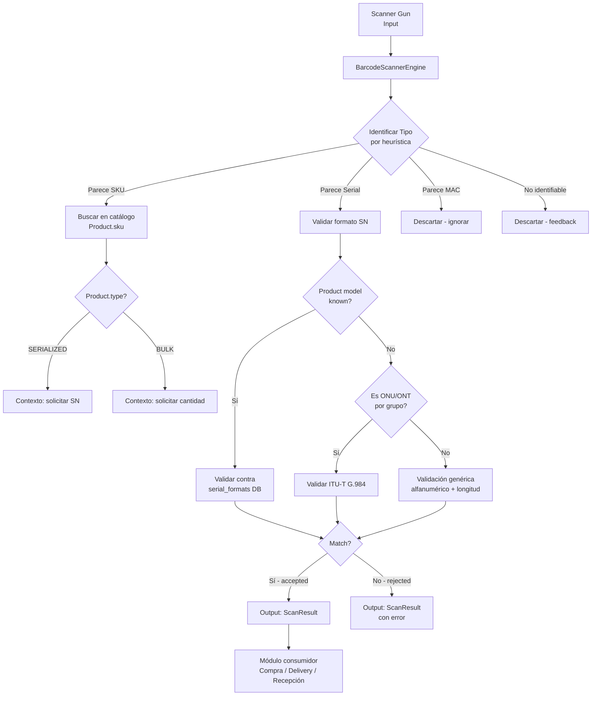
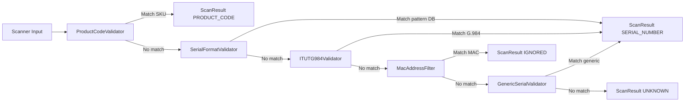
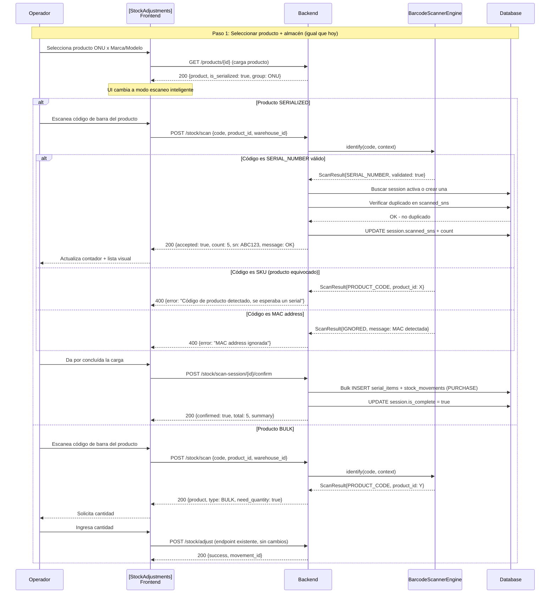
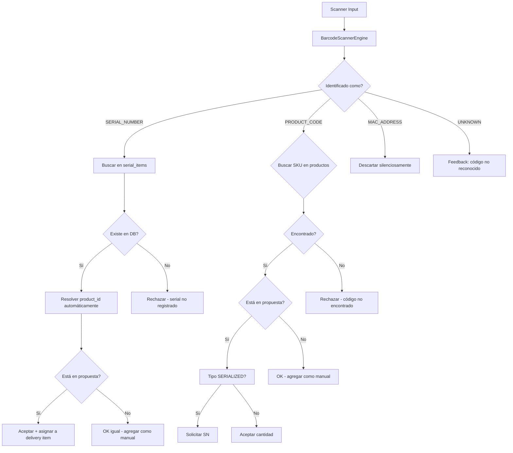

# Plan: Módulo de Lector de Códigos de Barra Inteligente

## Objetivo

Crear un motor de inteligencia para lector de códigos de barra, **reutilizable** entre módulos existentes (Compras → [`StockAdjustments`](frontend/src/pages/inventory/StockAdjustments.jsx), Delivery → [`MaterialDeliveryWizard`](frontend/src/pages/logistics/MaterialDeliveryWizard.jsx), Recepción → [`MaterialReceiptWizard`](frontend/src/pages/logistics/MaterialReceiptWizard.jsx)). El motor debe entender qué está leyendo, validarlo según reglas configurables, y devolver resultados tipados para que cada módulo los consuma sin duplicar lógica.

---

## 1. Arquitectura del Módulo `barcode_reader`

### Estructura de directorios

```
backend/src/barcode_reader/
├── __init__.py
├── core.py                  # BarcodeScannerEngine - orquestador principal
├── validators.py            # Validadores específicos pluggables
├── patterns.py              # Registry de patrones SN con soporte DB + fallback
├── schemas.py               # Pydantic schemas públicos del scanner
└── protocols.py             # Protocol classes para extensibilidad
```

### Diagrama de Arquitectura



### Core: `BarcodeScannerEngine`

```python
# Pseudocódigo de la interfaz pública
from dataclasses import dataclass
from enum import Enum, auto
from typing import Protocol

class ScanType(Enum):
    PRODUCT_CODE = auto()  # SKU de producto
    SERIAL_NUMBER = auto() # Número de serie válido
    MAC_ADDRESS = auto()   # MAC - se ignora
    UNKNOWN = auto()       # No se pudo identificar

class Confidence(Enum):
    HIGH = auto()
    MEDIUM = auto()
    LOW = auto()

@dataclass
class ScanContext:
    module: str                    # PURCHASE | DELIVERY | RECEIPT
    known_product_id: int | None   # Si ya se seleccionó producto (compra)
    known_group_id: int | None     # Grupo de producto (ONU/ONT, etc.)
    proposal_product_ids: set[int] | None  # Para delivery: items de propuesta

@dataclass
class ScanResult:
    type: ScanType
    raw_value: str                 # Lo que se escaneó
    cleaned_value: str | None      # Valor sanitizado
    product_id: int | None         # Producto resuelto
    product_name: str | None
    product_sku: str | None
    confidence: Confidence
    validated: bool                # Pasó validaciones de formato
    message: str                   # Feedback legible para el operador


class BaseValidator(Protocol):
    """Protocolo para validadores pluggables."""
    def validate(self, code: str, context: ScanContext) -> ScanResult | None: ...


class BarcodeScannerEngine:
    """
    Motor central de identificación de códigos de barra.
    
    - Toma un string crudo del scanner
    - Lo pasa por múltiples validadores registrados
    - Devuelve un ScanResult tipado
    - El primer validador que matchea gana (orden por confidence)
    """
    
    def __init__(self):
        self._validators: list[BaseValidator] = []
        self._register_defaults()
    
    def identify(self, code: str, context: ScanContext) -> ScanResult:
        """Identifica un código escaneado."""
        for validator in self._validators:
            result = validator.validate(code, context)
            if result is not None:
                return result
        return ScanResult(
            type=ScanType.UNKNOWN,
            raw_value=code,
            confidence=Confidence.LOW,
            validated=False,
            message="Código no reconocido"
        )
    
    def register_validator(self, validator: BaseValidator): ...
```

---

## 2. Validadores (Pluggables)

Se implementan como clases independientes que siguen el Protocolo `BaseValidator`. El engine los recorre en orden de prioridad.

| Validador | Prioridad | Qué hace |
|-----------|-----------|----------|
| [`ProductCodeValidator`](backend/src/barcode_reader/validators.py) | Alta | Busca el código como SKU en catálogo (`Product.sku`) |
| [`SerialFormatValidator`](backend/src/barcode_reader/validators.py) | Alta | Si hay contexto de producto, valida contra `serial_formats` DB |
| [`ITUTG984Validator`](backend/src/barcode_reader/validators.py) | Media | Si el producto pertenece al grupo ONU/ONT, aplica regex ITU-T G.984 |
| [`MacAddressFilter`](backend/src/barcode_reader/validators.py) | Media | Detecta MAC address pattern y la marca como `IGNORED` |
| [`GenericSerialValidator`](backend/src/barcode_reader/validators.py) | Baja | Fallback: alfanumérico, sin caracteres extraños, longitud > 4 |

**Orden de ejecución**:



---

## 3. Modelo `SerialFormat` (Nuevo)

Se agrega al [`models/inventory.py`](backend/src/models/inventory.py) existente.

```python
class SerialFormat(Base):
    """
    Diccionario de formatos de número de serie por producto.
    Permite configurar patrones regex sin hardcodeo.
    Si no hay patrón registrado para un producto, cae a validación genérica.
    """
    __tablename__ = "serial_formats"

    id: Mapped[int] = mapped_column(Integer, primary_key=True, index=True)
    product_id: Mapped[int] = mapped_column(
        Integer, ForeignKey("products.id", ondelete="CASCADE"),
        nullable=False, index=True,
        comment="Producto asociado"
    )
    regex_pattern: Mapped[str] = mapped_column(
        String(255), nullable=False,
        comment="Patrón regex que debe cumplir el SN (ej: ^[A-Z0-9]{4}[A-Z0-9]{8}$)"
    )
    description: Mapped[Optional[str]] = mapped_column(
        String(200), nullable=True,
        comment="Descripción legible (ej: ITU-T G.984 ONT - 4 chars vendor + 8 chars serial)"
    )
    is_active: Mapped[bool] = mapped_column(
        Boolean, nullable=False, server_default=text("true")
    )
    created_at: Mapped[datetime] = mapped_column(
        DateTime, nullable=False, server_default=text("CURRENT_TIMESTAMP")
    )

    # Relaciones
    product: Mapped["Product"] = relationship("Product", lazy="joined")

    __table_args__ = (
        UniqueConstraint("product_id", name="uq_serial_format_product"),
    )
```

### ITU-T G.984 Standard (ONT/ONU Serial)

El estándar ITU-T G.984.4 define el formato de serial para ONTs:
- **4 caracteres**: Código del fabricante (alfanumérico, uppercase)
- **8 caracteres**: Serial único del equipo (alfanumérico, uppercase)

Patrón: `^[A-Z0-9]{4}[A-Z0-9]{8}$` (12 caracteres total)

Este patrón se guarda como seed data en `serial_formats` para los productos ONU/ONT, y además se usa como **fallback duro** si el producto pertenece al grupo ONU/ONT pero no tiene un patrón específico registrado.

---

## 4. Integración con Módulo de Compras Existente

### Estado Actual

El endpoint [`POST /stock/adjust`](backend/src/routers/inventory.py:1180) maneja compras BULK (con `StockAdjustmentRequest`), y para SERIALIZED se usa [`createSerialItem`](frontend/src/services/inventory.service.js) iterativamente desde el frontend.

El formulario [`StockAdjustments.jsx`](frontend/src/pages/inventory/StockAdjustments.jsx) tiene un `<textarea>` para seriales (uno por línea o coma separados).

### Mejora Propuesta

Se **agregan** nuevos endpoints de escaneo al router [`inventory.py`](backend/src/routers/inventory.py) SIN romper los existentes:

| Método | Ruta | Descripción |
|--------|------|-------------|
| `POST` | `/stock/scan` | Escanea código de barra para compra. Usa `BarcodeScannerEngine` para identificar producto |
| `POST` | `/stock/scan-serial` | Escanea serial de producto SERIALIZED en compra. Valida formato + dedup |
| `DELETE` | `/stock/scan-session/{session_id}/serial/{serial}` | Elimina un SN de la sesión de escaneo |
| `POST` | `/stock/scan-session/{session_id}/confirm` | Confirma sesión y ejecuta ingreso masivo de seriales |

Se agrega modelo liviano [`PurchaseScanSession`](backend/src/models/inventory.py) para mantener estado de escaneo en DB durante la sesión de compra:

```python
class PurchaseScanSession(Base):
    """
    Sesión de escaneo activa para una compra.
    Permite manejar escaneos múltiples con estado en DB,
    validación de duplicados y contador en tiempo real.
    """
    __tablename__ = "purchase_scan_sessions"

    id: Mapped[int] = mapped_column(Integer, primary_key=True, index=True)
    warehouse_id: Mapped[int] = mapped_column(
        Integer, ForeignKey("warehouses.id", ondelete="RESTRICT"),
        nullable=False
    )
    product_id: Mapped[int] = mapped_column(
        Integer, ForeignKey("products.id", ondelete="RESTRICT"),
        nullable=False
    )
    scanned_sns: Mapped[list] = mapped_column(
        JSONB, nullable=False, default=list,
        comment="Array de strings con SNs escaneados"
    )
    count: Mapped[int] = mapped_column(
        Integer, nullable=False, default=0,
        comment="Contador de seriales ingresados"
    )
    is_complete: Mapped[bool] = mapped_column(
        Boolean, nullable=False, default=False
    )
    reference: Mapped[Optional[str]] = mapped_column(
        String(200), nullable=True,
        comment="Referencia de compra (factura, orden)"
    )
    notes: Mapped[Optional[str]] = mapped_column(Text, nullable=True)
    user_id: Mapped[int] = mapped_column(
        Integer, ForeignKey("users.id", ondelete="RESTRICT"),
        nullable=False
    )
    created_at: Mapped[datetime] = mapped_column(
        DateTime, nullable=False, server_default=text("CURRENT_TIMESTAMP")
    )
    updated_at: Mapped[datetime] = mapped_column(
        DateTime, nullable=False, server_default=text("CURRENT_TIMESTAMP"),
        onupdate=datetime.utcnow
    )

    # Relaciones
    product: Mapped["Product"] = relationship("Product", lazy="joined")
    warehouse: Mapped["Warehouse"] = relationship("Warehouse", lazy="joined")
```

### Flujo de Compra Mejorado con Scanner



---

## 5. Refactor de Endpoints de Delivery Existentes

### Endpoints a modificar en [`logistics.py`](backend/src/routers/logistics.py)

| Endpoint | Línea | Cambio |
|----------|-------|--------|
| [`scan_barcode`](backend/src/routers/logistics.py:373) | 373 | Delegar identificación a `BarcodeScannerEngine` + agregar auto-resolución de producto desde SN |
| [`scan_serial`](backend/src/routers/logistics.py:433) | 433 | Delegar validación a `BarcodeScannerEngine` |
| [`scan_receipt_item`](backend/src/routers/logistics.py:640) | 640 | Delegar identificación a `BarcodeScannerEngine` |

### Mejoras específicas de delivery

1. **Auto-resolución**: Si se escanea un SN (sin código de producto previo), el motor:
   - Busca `serial_number` en `serial_items` 
   - Resuelve `product_id` automáticamente
   - Valida contra la propuesta (si existe)
   - Retorna producto + serial resuelto

2. **Filtro de MAC**: Si el código coincide con pattern de MAC address, se descarta inmediatamente sin tocar DB.

3. **Soporte para items por grupo**: Si la propuesta tiene un item por `group_id` (ej: "ONU" sin modelo específico), al escanear un serial de cualquier ONU disponible, se resuelve el modelo real y se asigna.



---

## 6. Componentes Frontend Reutilizables

### Estructura

```
frontend/src/components/barcode-reader/
├── BarcodeScanner.jsx        # Componente base: input + botón scan + feedback
├── SerialScanner.jsx         # Input de serial con validación visual en tiempo real
├── ScanCounter.jsx           # "SN ingresados: 5" con barra de progreso
├── ScannedSerialsList.jsx    # Lista de seriales escaneados con dedup visual
├── useBarcodeScan.js         # Hook con debounce para scanner gun
└── index.js                  # Exportaciones públicas
```

### Hook `useBarcodeScan`

Los scanners de código de barras se comportan como un teclado: emiten keydown events muy rápidos y terminan con un Enter. El hook:

```javascript
// Pseudocódigo
function useBarcodeScan({
  onScan,       // Callback cuando se completa una lectura
  timeout = 50, // Timeout entre caracteres para detectar fin de lectura
  minLength = 3,// Longitud mínima para considerar lectura válida
}) {
  const buffer = useRef('');
  const timer = useRef(null);

  const handleKeyDown = (e) => {
    if (e.key === 'Enter') {
      // Scanner gun terminó de leer
      const code = buffer.current.trim();
      if (code.length >= minLength) {
        onScan(code);
      }
      buffer.current = '';
      clearTimeout(timer.current);
      return;
    }

    buffer.current += e.key;
    
    // Resetear timer - si no llega otro char en X ms, no es scanner gun
    clearTimeout(timer.current);
    timer.current = setTimeout(() => {
      buffer.current = ''; // Descartar buffer incompleto
    }, timeout);
  };

  useEffect(() => {
    window.addEventListener('keydown', handleKeyDown);
    return () => window.removeEventListener('keydown', handleKeyDown);
  }, []);
}
```

### Integración en StockAdjustments

El formulario actual [`StockAdjustments.jsx`](frontend/src/pages/inventory/StockAdjustments.jsx) se modifica para:

1. Cuando se selecciona un producto **SERIALIZED**, el `<textarea>` se reemplaza por el componente `BarcodeScanner` + `SerialScanner`
2. El `ScanCounter` muestra en tiempo real cuántos SNs van
3. El `ScannedSerialsList` muestra la lista con opción de eliminar individualmente
4. Al confirmar, se envía todo de una vez al endpoint de confirmación de sesión (en lugar de N requests individuales)

### Integración en MaterialDeliveryWizard

El Step 3 actual ([línea 591](frontend/src/pages/logistics/MaterialDeliveryWizard.jsx:591)) se refactoriza para usar los mismos componentes, pero con contexto diferente (`module: DELIVERY`, `proposalItems`).

---

## 7. Resumen de Tareas (TODO)

### Fase 1: Core del Motor Barcode Reader
- [ ] Crear directorio [`backend/src/barcode_reader/`](backend/src/barcode_reader/)
- [ ] Implementar `protocols.py` con `BaseValidator` Protocol
- [ ] Implementar `schemas.py` con `ScanType`, `Confidence`, `ScanContext`, `ScanResult`
- [ ] Implementar `validators.py`:
  - `ProductCodeValidator` - busca SKU en catálogo
  - `SerialFormatValidator` - valida contra `serial_formats` DB
  - `ITUTG984Validator` - regex ITU-T G.984 para ONU/ONT
  - `MacAddressFilter` - detecta y descarta MACs
  - `GenericSerialValidator` - fallback alfanumérico
- [ ] Implementar `core.py` - `BarcodeScannerEngine` con registro de validadores
- [ ] Tests unitarios del motor con casos de cada tipo

### Fase 2: Modelo SerialFormat + Migración
- [ ] Agregar modelo [`SerialFormat`](backend/src/models/inventory.py) en `models/inventory.py`
- [ ] Agregar modelo [`PurchaseScanSession`](backend/src/models/inventory.py) en `models/inventory.py`
- [ ] Crear migración Alembic: `2026_06_09_001_add_serial_formats_and_scan_sessions.py`
- [ ] Seed data: patrón ITU-T G.984 para productos ONU/ONT

### Fase 3: Endpoints de Escaneo para Compras
- [ ] Agregar schemas de escaneo en [`schemas/inventory.py`](backend/src/schemas/inventory.py):
  - `BarcodeScanRequest`, `BarcodeScanResponse`
  - `SerialScanRequest`, `SerialScanResponse`
  - `ScanSessionResponse`, `ScanSessionConfirmResponse`
- [ ] Agregar endpoints en [`routers/inventory.py`](backend/src/routers/inventory.py):
  - `POST /stock/scan` - escaneo inteligente con `BarcodeScannerEngine`
  - `POST /stock/scan-serial` - escaneo serial con validación + dedup
  - `DELETE /stock/scan-session/{id}/serial/{serial}` - eliminar SN de sesión
  - `POST /stock/scan-session/{id}/confirm` - confirmar sesión + ingreso masivo
- [ ] Tests de integración de flujo de compra con scanner

### Fase 4: Refactor de Delivery
- [ ] Refactor [`scan_barcode`](backend/src/routers/logistics.py:373) para usar `BarcodeScannerEngine`
- [ ] Refactor [`scan_serial`](backend/src/routers/logistics.py:433) para usar `BarcodeScannerEngine`
- [ ] Refactor [`scan_receipt_item`](backend/src/routers/logistics.py:640) para usar `BarcodeScannerEngine`
- [ ] Agregar auto-resolución de producto desde serial number en delivery
- [ ] Agregar detección y filtrado de MAC addresses
- [ ] Agregar soporte para items por grupo (template ONU)
- [ ] Tests de regresión de flujo de delivery

### Fase 5: Componentes Frontend
- [ ] Crear hook [`useBarcodeScan`](frontend/src/components/barcode-reader/useBarcodeScan.js) con debounce de scanner gun
- [ ] Crear componente [`BarcodeScanner`](frontend/src/components/barcode-reader/BarcodeScanner.jsx)
- [ ] Crear componente [`SerialScanner`](frontend/src/components/barcode-reader/SerialScanner.jsx) con validación visual
- [ ] Crear componente [`ScanCounter`](frontend/src/components/barcode-reader/ScanCounter.jsx)
- [ ] Crear componente [`ScannedSerialsList`](frontend/src/components/barcode-reader/ScannedSerialsList.jsx)
- [ ] Refactor [`StockAdjustments.jsx`](frontend/src/pages/inventory/StockAdjustments.jsx): reemplazar textarea por componentes de escaneo inteligente
- [ ] Refactor Step 3 de [`MaterialDeliveryWizard.jsx`](frontend/src/pages/logistics/MaterialDeliveryWizard.jsx): usar componentes reutilizables

---

## Principios de Diseño

1. **Sin hardcodeos**: Todos los patrones y reglas son configurables vía DB o inyectables.
2. **Pluggable**: Nuevos validadores implementan `BaseValidator` Protocol y se registran en el engine sin tocar el core.
3. **Reutilizable**: `BarcodeScannerEngine` funciona para cualquier módulo. Los componentes frontend aceptan props de contexto (`module`, `orderId`, `proposalItems`).
4. **No romper lo existente**: Los endpoints actuales de delivery y compras se mantienen. Se agregan nuevos endpoints y se refactorizan los existentes por delegación, no reemplazo.
5. **NASA Level**: Type hints, validación exhaustiva, logging estructurado, manejo de errores sin excepciones silenciosas, tests unitarios + integración.
6. **Eficiente**: Las validaciones son O(1) para patrones registrados, con caché de patrones en memoria. El debounce evita procesar caracteres sueltos del scanner.
