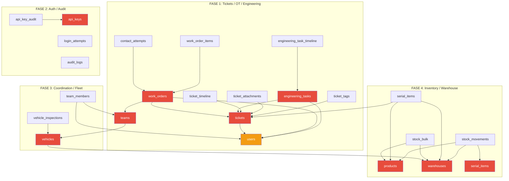

# Plan: Script de Blanqueo — Día Operativo Cero

## 1. Objetivo

Dejar la base de datos lista para producción, conservando solo configuración del sistema y datos ISP reales (sincronizados). Resetear toda la información operativa mock.

## 2. Inventario completo de tablas

### 2.1. Tablas a RESETEAR (limpiar datos)

**Módulo Tickets / OT / Engineering (operaciones):**

| Tabla | Depende de | Registros Mock |
|-------|-----------|----------------|
| `ticket_tags` | tickets, tags | Tags asignados a tickets |
| `ticket_attachments` | tickets, users | Archivos subidos |
| `ticket_timeline` | tickets | Eventos de timeline |
| `work_order_items` | work_orders | Items de OT |
| `contact_attempts` | work_orders, users | Intentos de contacto |
| `engineering_task_timeline` | engineering_tasks | Eventos de tareas NOC |
| `engineering_tasks` | tickets, users | Tareas de ingeniería |
| `work_orders` | tickets, users, teams | Órdenes de trabajo |
| `tickets` | users, connections | Tickets |

**Módulo Inventario / Productos:**

| Tabla | Depende de | Registros Mock |
|-------|-----------|----------------|
| `stock_movements` | products, warehouses, serial_items, users | Movimientos de stock |
| `serial_items` | products, warehouses, tickets | Items serializados |
| `stock_bulk` | warehouses, products | Stock a granel |
| `products` | (nada, catálogo) | Productos del catálogo |
| `warehouses` | (nada, raíz) | Depósitos/almacenes |

**Módulo Flota / Vehículos:**

| Tabla | Depende de | Registros Mock |
|-------|-----------|----------------|
| `vehicle_inspections` | vehicles, users | Planillas de inspección |
| `vehicles` | warehouses (FK RESTRICT) | Vehículos |

**Módulo Coordinación / Cuadrillas:**

| Tabla | Depende de | Registros Mock |
|-------|-----------|----------------|
| `team_members` | teams, users | Miembros de cuadrilla |
| `teams` | vehicles (FK SET NULL) | Cuadrillas |

**Auth / Seguridad:**

| Tabla | Registros Mock |
|-------|----------------|
| `api_key_audit` | Auditoría de API keys |
| `api_keys` | API keys (ej: "ISPCube Sync") |
| `login_attempts` | Intentos de login |
| `audit_logs` | Logs de auditoría |

**Usuarios:**

| Tabla | Acción |
|-------|--------|
| `users` | DELETE WHERE is_superuser = false |

**Historial operativo (mock):**

| Tabla | Registros Mock |
|-------|----------------|
| `monitor_check_history` | Historial de checks de monitoreo |
| `sync_status` | Estados de sincronización |

### 2.2. Tablas a PRESERVAR (sin cambios)

| Tabla | Motivo |
|-------|--------|
| `system_config` | Configuración general del sistema |
| `service_monitors` | Config de monitoreo (URLs, intervalos) |
| `scheduled_tasks` | Tareas programadas (solo resetear execution_count=0) |
| `product_categories` | Catálogo seed (Cableado, Equipos, Accesorios, Herramientas) |
| `installation_types` | Catálogo seed (Fibra, Inalámbrico, Híbrido) |
| `work_order_types` | Config de tipos de OT (labels, colores, iconos) |
| `ticket_categories` | Catálogo de categorías de tickets |
| `ticket_reasons` | Catálogo de motivos de tickets |
| `tags` | Etiquetas de clasificación (sin relación a tickets) |
| `roles` | Roles del sistema (admin, technician, coordinator, etc.) |
| `cities`, `neighborhoods` | Geografía |
| `subscribers`, `nodes`, `plans` | Datos ISP sincronizados |
| `connections`, `clientes`, `cliente_emails`, `cliente_telefonos` | Datos ISP |
| `ppp_secrets` | Secretos PPPoE |
| `sync_status` | **(OPCIONAL)** Se puede preservar si tiene datos reales |

## 3. Mapa de Dependencias Completo



## 4. Orden de Borrado (con restricciones FK)

```
FASE 1 — Tickets / OT / Engineering
  1. ticket_tags                    (asociación pura, sin FKs restrictivas)
  2. ticket_attachments             (FK ticket → CASCADE)
  3. ticket_timeline                (FK ticket → CASCADE)
  4. work_order_items               (FK work_order → CASCADE)
  5. contact_attempts               (FK work_order → CASCADE)
  6. engineering_task_timeline      (FK engineering_task → CASCADE)
  7. engineering_tasks              (FK ticket → CASCADE, FK user → SET NULL)
  8. work_orders                    (FK ticket → CASCADE, FK team → SET NULL)
  9. tickets                        (FK user → SET NULL)

FASE 2 — Auth / Audit
 10. api_key_audit                  (sin FK estricta)
 11. api_keys                       (sin FKs salientes)
 12. login_attempts                 (sin FKs)
 13. audit_logs                     (FK user → SET NULL)

FASE 3 — Coordinación / Flota
 14. vehicle_inspections            (FK vehicle → CASCADE, FK user → RESTRICT)*
 15. team_members                   (FK team → CASCADE, FK user → CASCADE)
 16. teams                          (FK vehicle → SET NULL)
 17. vehicles                       (FK warehouse → RESTRICT ← OJO)

FASE 4 — Inventario / Depósitos
 18. stock_movements                (FK product → CASCADE, FK warehouse → SET NULL, FK serial_item → SET NULL)
 19. serial_items                   (FK product → CASCADE, FK warehouse → RESTRICT, FK ticket → SET NULL)
 20. stock_bulk                     (FK warehouse → CASCADE, FK product → CASCADE)
 21. warehouses                     (raíz, sin FKs restrictivas hacia arriba)
 22. products                       (raíz, catálogo)

FASE 5 — Usuarios
 23. DELETE FROM team_members WHERE user_id IN (SELECT id FROM users WHERE NOT is_superuser)
 24. DELETE FROM users WHERE NOT is_superuser

FASE 6 — Historial operativo (opcional)
 25. monitor_check_history          (sin FKs)
 26. sync_status                    (sin FKs) — OPCIONAL: limpiar si hay registros mock
```

### ⚠️ Restricciones críticas a respetar:

1. **vehicles.warehouse_id** tiene `ondelete="RESTRICT"` → NO se puede truncar warehouses si vehicles los referencia. Orden correcto: vehicles ANTES que warehouses.
2. **serial_items.warehouse_id** tiene `ondelete="RESTRICT"` → Misma situación. serial_items ANTES que warehouses.
3. **vehicle_inspections.technician_id** tiene `ondelete="RESTRICT"` hacia users → Si se borran users no-admin, las inspections de esos users deben borrarse PRIMERO. (Ya se cumple porque vehicle_inspections se borra en Fase 3, antes que users en Fase 5).
4. **stock_movements.user_id** tiene `ondelete="RESTRICT"` hacia users → stock_movements se borra en Fase 4, antes que users en Fase 5. ✅

## 5. Respuesta sobre IDs

- `TRUNCATE` **con** `RESTART IDENTITY` → **IDs se resetean a 1**. El primer ticket post-blanqueo será ID=1.
- `DELETE FROM` (sin truncate) → **IDs NO se resetean**. El próximo usuario creado tendrá ID = (último ID existente + 1).
- Tablas ISP (clientes, conexiones, nodos, etc.) → **no se tocan**, mantienen sus IDs actuales.

**Recomendación:** Usar `TRUNCATE ... RESTART IDENTITY` para todas las tablas de negocio. Para users usar `DELETE` (porque solo borramos algunos, no todos).

Ejemplo de cómo queda post-blanqueo:
- Primer ticket: ID=1
- Primera OT: ID=1
- Primer engineering task: ID=1
- Primer audit_log: ID=1
- Primer movement: ID=1
- Admin user: ID original (ej: 1, 2, etc.)
- Clientes: IDs originales (ej: 1..8402)
- Conexiones: IDs originales

## 6. Scripts Implementados

### Script Python (`backend/scripts/blanqueo_dia_cero.py`)

Características:
- Se conecta a la DB via **psycopg2 directo** (no depende del backend SQLAlchemy)
- CLI con dos modos: `--dry-run` (default) y `--apply`
- En `--dry-run`: ejecuta todo dentro de una transacción, muestra cuentas, hace ROLLBACK al final
- En `--apply`:
  1. Genera backup automático via `pg_dump` en `/tmp/`
  2. TRUNCATE en orden con RESTART IDENTITY (6 fases)
  3. DELETE usuarios no-admin (con limpieza previa de team_members)
  4. Resetea execution_count en scheduled_tasks
  5. Verificación post-blanqueo con conteos
  6. Muestra ruta del backup para posible restauración
- Logging detallado de cada paso
- Parámetro `--backup-dir` para directorio de backup personalizado
- Parámetro `--restore <path>` para restaurar un backup previo

### Script SQL (`scripts/blanqueo_dia_cero.sql`)

SQL puro ejecutable directo con `psql`. Incluye verificación final con consultas SELECT.

## 7. Testing

```bash
# 1. Backup completo de la base actual
docker compose exec db pg_dump -U emerald_owner -d emerald_stock > /tmp/emerald_backup_$(date +%Y%m%d).sql

# 2. Modo dry-run (solo muestra, no modifica nada)
docker compose exec backend python scripts/blanqueo_dia_cero.py
# Output example:
# 🔍 DRY-RUN - No se realizarán cambios
# 📊 Tickets: 89 → 0
# 📊 WorkOrders: 47 → 0
# 📊 EngineeringTasks: 12 → 0
# 📊 Products: 23 → 0
# 📊 Warehouses: 5 → 0
# 📊 Vehicles: 3 → 0
# 📊 Teams: 4 → 0
# 📊 Users (no-admin): 5 → 0
# ✅ Dry-run OK. Usa --apply para ejecutar.

# 3. Modo apply (ejecuta con backup automático)
docker compose exec backend python scripts/blanqueo_dia_cero.py --apply

# 4. Verificar que quedó como esperabas

# 5. Restaurar backup (para volver a mock)
cat /tmp/emerald_backup_20260525.sql | docker compose exec -T db psql -U emerald_owner -d emerald_stock
```

## 8. Archivos creados

| Archivo | Descripción |
|---------|-------------|
| `backend/scripts/blanqueo_dia_cero.py` | Script principal Python con CLI dry-run/apply |
| `scripts/blanqueo_dia_cero.sql` | SQL puro de respaldo (ejecutable directo con psql) |

## 9. Checklist de confirmación post-blanqueo

- [ ] `SELECT count(*) FROM tickets` = 0
- [ ] `SELECT count(*) FROM work_orders` = 0
- [ ] `SELECT count(*) FROM engineering_tasks` = 0
- [ ] `SELECT count(*) FROM products` = 0
- [ ] `SELECT count(*) FROM warehouses` = 0
- [ ] `SELECT count(*) FROM vehicles` = 0
- [ ] `SELECT count(*) FROM teams` = 0
- [ ] `SELECT count(*) FROM audit_logs` = 0
- [ ] `SELECT count(*) FROM users WHERE NOT is_superuser` = 0
- [ ] `SELECT count(*) FROM users WHERE is_superuser` = 1 (admin)
- [ ] `SELECT count(*) FROM clientes` > 0 (datos ISP preservados)
- [ ] `SELECT count(*) FROM nodes` > 0 (datos ISP preservados)
- [ ] `SELECT count(*) FROM system_config` > 0 (config preservada)
- [ ] `SELECT count(*) FROM service_monitors` > 0 (monitoreo preservado)
- [ ] `SELECT count(*) FROM scheduled_tasks` > 0 AND execution_count = 0 (tareas preservadas, contadores reseteados)
