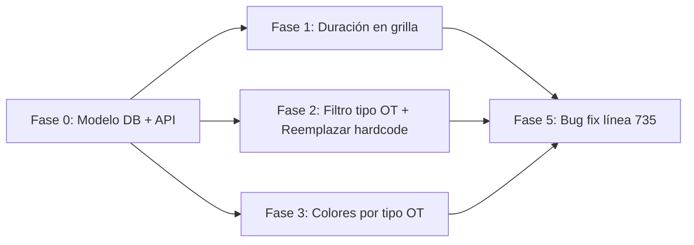
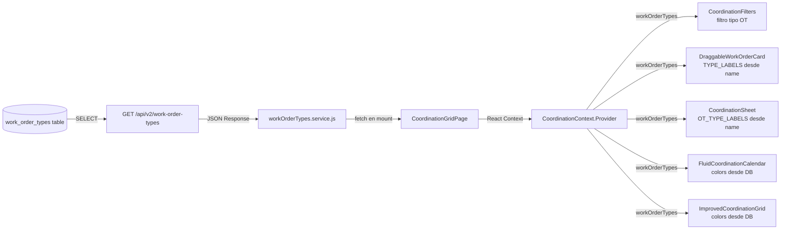

# 🎯 Plan de Implementación — Mejoras del Módulo de Coordinación

## Resumen

Implementar 5 cambios en el módulo de coordinación según solicitud del usuario:

1. Mostrar duración de OT en **esquina inferior derecha** de etiquetas en grilla (el backlog ya lo muestra)
2. Agregar filtro de tipo de OT en el backlog (solo sidebar), leyendo labels desde DB
3. Colores de fondo diferenciados por tipo de OT
4. Analizar factibilidad de guardar ubicación de OT (separada, solo análisis)
5. Análisis y recomendaciones de optimización

Adicionalmente, como req. transversal:

6. **Migrar labels de WorkOrderType de hardcode a DB**: Crear modelo `WorkOrderTypeConfig` en BD con labels en español, servir vía API, reemplazar todos los diccionarios hardcodeados en frontend.

---

## 📐 Arquitectura Actual del Módulo

```
CoordinationGridPage
├── FluidCoordinationCalendar (Vista calendario)
│   └── EventComponent — typeConfig hardcodeado inline
│
├── CoordinationSidebar (Panel lateral)
│   ├── CoordinationFilters
│   │   └── OT_TYPES hardcodeado: solo repair, install
│   └── DraggableWorkOrderCard (Backlog)
│       ├── TYPE_ICONS / TYPE_LABELS hardcodeados
│       └── PRIORITY_CONFIG
│
├── ImprovedCoordinationGrid (Vista grilla)
│   ├── Tarjetas OT con bg COLOR FIJO: bg-amber-600/80
│   └── Duración SOLO durante resize (timeDisplay)
│
├── CoordinationSheet (Panel detalle)
│   └── OT_TYPE_LABELS / OT_TYPE_COLORS hardcodeados
│
└── Hooks: useCoordinationSync, useOptimisticUpdates, useTicketFilters
```

**Backend:**
- [`WorkOrderType` enum](backend/src/models/tickets.py:117-123): solo valores (`repair`, `install`, `pickup`, `infrastructure`) — sin labels
- [`WorkOrderUpdate` schema](backend/src/schemas/tickets.py:137): incluye `custom_data`
- [`PATCH /v2/work-orders/{id}`](backend/src/routers/work_orders.py:556): endpoint existente
- [`_wo_to_list_response()`](backend/src/routers/work_orders.py:962): incluye `ot_type` como string en response

---

## 🔧 Correcciones a la primera versión del plan

### Corrección 1: Posición de la duración en grilla

**Antes**: "rincón superior derecho" → **Ahora**: "**esquina inferior derecha**" para:
- Evitar solapamiento con el handle de resize (que está en borde inferior)
- El backlog (DraggableWorkOrderCard) ya muestra duración en badge superior derecho — ese patrón está bien, no hay que replicarlo
- En la grilla los cards **cambian de tamaño** al hacer resize, por lo que el contenido debe ser responsive y **nunca salir de los límites** del contenedor
- Usar `className="truncate"` + `overflow-hidden` + `text-[9px]` para garantizar que el texto nunca desborde
- Ej: `60min` o `1h 30min` en fuente monoespaciada pequeña

```jsx
{/* Duración - esquina inferior derecha, siempre visible */}
<div className="absolute bottom-0.5 right-1 text-[9px] font-mono text-zinc-400 truncate max-w-[60px] text-right">
  {timeDisplay || `${wo.estimated_duration || 60}min`}
</div>
```

### Corrección 2: Labels de WorkOrderType desde DB (NO hardcode)

**Problema detectado**: Hay **6 archivos frontend** con labels hardcodeadas (inglés→español) para tipos de OT:

| Archivo | Líneas | Labels hardcodeadas |
|---------|--------|---------------------|
| [`WorkOrdersPage.jsx`](frontend/src/pages/WorkOrdersPage.jsx:68) | 68-72 | TYPE_CONFIG: repair→'Soporte', install→'Instalación', pickup→'Retiro', infrastructure→'Infraestructura' |
| [`WorkOrdersPage.jsx`](frontend/src/pages/WorkOrdersPage.jsx:419) | 419-423 | Select `<option>` dropdown |
| [`WorkOrderExecutionPage.jsx`](frontend/src/pages/WorkOrderExecutionPage.jsx:42) | 42-46 | OT_TYPE_ICONS (mismos labels) |
| [`CoordinationSheet.jsx`](frontend/src/components/coordination/CoordinationSheet.jsx:52) | 52-57 | OT_TYPE_LABELS |
| [`CoordinationFilters.jsx`](frontend/src/components/coordination/CoordinationFilters.jsx:27) | 27-30 | OT_TYPES (solo 2 de 4) |
| [`DraggableWorkOrderCard.jsx`](frontend/src/components/coordination/DraggableWorkOrderCard.jsx:66) | 66-71 | TYPE_LABELS |
| [`TicketDetailPage.jsx`](frontend/src/pages/TicketDetailPage.jsx:191) | 191-195 | WorkOrder type label map |

**Ninguno** de estos lee de la base de datos.

---

## 📋 Plan Detallado de Implementación

### FASE 0: Crear modelo WorkOrderType en DB + endpoint API (prerrequisito)

#### 0a. Crear modelo [`backend/src/models/work_order_types.py`] — Tabla `work_order_types`

Siguiendo el patrón existente de [`InstallationType`](backend/src/models/installation.py:11):

```python
class WorkOrderTypeConfig(Base):
    __tablename__ = "work_order_types"
    
    id: Mapped[int] = mapped_column(Integer, primary_key=True)
    code: Mapped[str] = mapped_column(String(50), unique=True, nullable=False, index=True)
    name: Mapped[str] = mapped_column(String(100), nullable=False)  # Label en español: "Reparación"
    description: Mapped[str | None] = mapped_column(Text, nullable=True)
    color: Mapped[str] = mapped_column(String(50), default="bg-zinc-600")  # Clase CSS o hex
    icon: Mapped[str | None] = mapped_column(String(50), nullable=True)  # Nombre del icono
    is_active: Mapped[bool] = mapped_column(Boolean, default=True, index=True)
    created_at: Mapped[datetime] = mapped_column(DateTime, default=datetime.utcnow)
    updated_at: Mapped[datetime] = mapped_column(DateTime, default=datetime.utcnow, onupdate=datetime.utcnow)
```

**Seed data** (en migración o script):
```sql
INSERT INTO work_order_types (code, name, description, color, icon) VALUES
('repair', 'Reparación', 'Diagnóstico y reparación de averías', 'amber', 'Wrench'),
('install', 'Instalación', 'Nuevas instalaciones y altas', 'emerald', 'Package'),
('pickup', 'Retiro', 'Retiro de equipos y bajas', 'blue', 'ArrowUpFromLine'),
('infrastructure', 'Infraestructura', 'Trabajos en fibra, nodos y torres', 'purple', 'Building2');
```

#### 0b. Crear schema [`backend/src/schemas/work_order_types.py`]

```python
class WorkOrderTypeResponse(BaseModel):
    id: int
    code: str
    name: str
    description: Optional[str] = None
    color: Optional[str] = None
    icon: Optional[str] = None
    is_active: bool
    
    model_config = ConfigDict(from_attributes=True)
```

#### 0c. Crear router [`backend/src/routers/work_order_types.py`]

```python
@router.get("", response_model=List[WorkOrderTypeResponse])
def list_work_order_types(
    active_only: bool = True,
    db: Session = Depends(get_db),
):
    stmt = select(WorkOrderTypeConfig).order_by(WorkOrderTypeConfig.code)
    if active_only:
        stmt = stmt.where(WorkOrderTypeConfig.is_active == True)
    return db.execute(stmt).scalars().all()
```

Registrar en [`main.py`](backend/src/main.py) con prefijo `/api/v2/work-order-types`.

#### 0d. Crear servicio frontend [`frontend/src/services/workOrderTypes.service.js`]

```javascript
const BASE_URL = '/api/v2/work-order-types';

export const getWorkOrderTypes = async (activeOnly = true) => {
    const { data } = await api.get(BASE_URL, {
        params: { active_only: activeOnly }
    });
    return data;
};
```

---

### FASE 1: Mostrar duración de OT en grilla (esquina inferior derecha)

**Archivos a modificar:**

#### 1a. [`ImprovedCoordinationGrid.jsx`](frontend/src/components/coordination/ImprovedCoordinationGrid.jsx:730-740)

**Ubicación**: Líneas 730-740 (contenido de la tarjeta OT)

**Cambio**: Agregar duración en **esquina inferior derecha** de la tarjeta, **siempre visible** (no solo durante resize). Debe respetar los límites del contenedor (text truncate, overflow hidden).

```jsx
<div className="p-1.5 h-full flex flex-col text-xs text-white overflow-hidden relative">
  <p className="font-bold truncate">{wo.client_name || 'S/N'}</p>
  
  {/* Siempre visible: dirección + OT ID */}
  <p className="truncate opacity-80 text-[10px]">{wo.address || '—'}</p>
  <p className="mt-auto text-[10px] opacity-75">OT #{wo.id}</p>
  
  {/* DURACIÓN - Esquina inferior derecha, nunca desborda */}
  <div className="absolute bottom-0.5 right-1 text-[9px] font-mono text-zinc-400 truncate max-w-[55px] text-right leading-none">
    {wo.estimated_duration || 60}min
  </div>
</div>
```

**Nota**: `timeDisplay` ("HH:MM - HH:MM") se muestra solo durante resize (el coordinador necesita ver el rango horario mientras ajusta). La duración fija (e.g., "60min") se muestra **siempre**.

#### 1b. [`FluidCoordinationCalendar.jsx:187-211`](frontend/src/components/coordination/FluidCoordinationCalendar.jsx:187)

**Cambio**: Agregar duración en EventComponent, al lado del OT ID:

```jsx
<span className="text-[9px] opacity-70 mt-0.5 flex items-center gap-1">
  <span>OT #{event.id}</span>
  <span className="text-zinc-500">·</span>
  <span>{event.estimated_duration || 60}min</span>
</span>
```

---

### FASE 2: Filtro de tipo de OT en backlog + Reemplazar hardcode por DB

#### 2a. [`CoordinationFilters.jsx`](frontend/src/components/coordination/CoordinationFilters.jsx:27)

**Cambio**: Reemplazar `OT_TYPES` hardcodeado por fetch desde API:

```jsx
// ANTES:
const OT_TYPES = [
  { id: 'repair', label: 'Reparación', icon: Wrench },
  { id: 'install', label: 'Instalación', icon: Wifi },
];

// DESPUÉS: fetch desde getWorkOrderTypes() en un useEffect
const [workOrderTypes, setWorkOrderTypes] = useState([]);
useEffect(() => {
  getWorkOrderTypes().then(setWorkOrderTypes);
}, []);
```

- El filtro checkbox usa `code` como value y `name` como label
- Solo afecta al sidebar (backlog) porque `useTicketFilters` es hook propio del sidebar

#### 2b. Reemplazar hardcode en archivos del módulo coordinación

| Archivo | Cambio |
|---------|--------|
| [`DraggableWorkOrderCard.jsx:66`](frontend/src/components/coordination/DraggableWorkOrderCard.jsx:66) | `TYPE_LABELS` → lookup desde `workOrderType.name` (vía prop o contexto) |
| [`CoordinationSheet.jsx:52`](frontend/src/components/coordination/CoordinationSheet.jsx:52) | `OT_TYPE_LABELS` → lookup desde API |
| [`FluidCoordinationCalendar.jsx:188`](frontend/src/components/coordination/FluidCoordinationCalendar.jsx:188) | `typeConfig` → colores desde DB (`workOrderType.color`) |

**Estrategia**: Cargar los tipos de OT una vez en `CoordinationGridPage` y pasarlos como prop/context a los componentes hijos, o que cada componente los cargue independientemente (mejor para encapsulamiento pero más requests).

**Recomendación**: Cargar en `CoordinationGridPage` y pasar vía contexto React para evitar fetching duplicado.

```jsx
// CoordinationGridPage.jsx
const CoordinationContext = createContext();

export default function CoordinationGridPage() {
  const [workOrderTypes, setWorkOrderTypes] = useState([]);
  
  useEffect(() => {
    getWorkOrderTypes().then(setWorkOrderTypes);
  }, []);
  
  return (
    <CoordinationContext.Provider value={{ workOrderTypes }}>
      <FluidCoordinationCalendar ... />
      <CoordinationSidebar ... />
      <ImprovedCoordinationGrid ... />
    </CoordinationContext.Provider>
  );
}
```

#### 2c. Reemplazar hardcode en el resto de la aplicación (futuro)

| Archivo | Labels actuales | Prioridad |
|---------|----------------|-----------|
| [`WorkOrdersPage.jsx:68`](frontend/src/pages/WorkOrdersPage.jsx:68) | repair→'Soporte', install→'Instalación', pickup→'Retiro', infrastructure→'Infraestructura' | 🟡 Media (no es coordinación) |
| [`WorkOrdersPage.jsx:419`](frontend/src/pages/WorkOrdersPage.jsx:419) | Select dropdown options | 🟡 Media |
| [`WorkOrderExecutionPage.jsx:42`](frontend/src/pages/WorkOrderExecutionPage.jsx:42) | OT_TYPE_ICONS | 🟡 Media |
| [`TicketDetailPage.jsx:191`](frontend/src/pages/TicketDetailPage.jsx:191) | work order type labels | 🟡 Media |

> **Nota**: Estos archivos están fuera del módulo de coordinación. Se pueden migrar en una fase posterior. Para esta iteración, enfocarse solo en el módulo de coordinación.

---

### FASE 3: Colores de fondo diferenciados por tipo de OT

#### 3a. [`ImprovedCoordinationGrid.jsx:714`](frontend/src/components/coordination/ImprovedCoordinationGrid.jsx:714)

**Cambio**: Reemplazar `bg-amber-600/80` fijo por función que devuelva el color según `wo.ot_type` (mapeado desde DB cuando esté disponible, o fallback hardcodeado temporal):

```jsx
const getTypeBg = (ot_type) => {
  const typeBg = {
    repair: 'bg-amber-600/80',
    install: 'bg-emerald-600/80',
    pickup: 'bg-blue-600/80',
    infrastructure: 'bg-purple-600/80',
  };
  return typeBg[ot_type] || 'bg-amber-600/80';
};
```

**Ideal**: Cuando la Fase 2 esté completa, los colores vienen de `workOrderType.color` desde DB.

**Mantener prioridad**: Los bordes/glow de criticidad se aplican **encima** del color de tipo:
```jsx
const getPriorityBorder = (priority) => ({
  critical: 'ring-2 ring-red-500',
  high: 'ring-1 ring-orange-500',
  medium: '',
  low: 'opacity-70',
});
```

#### 3b. [`DraggableWorkOrderCard.jsx:160`](frontend/src/components/coordination/DraggableWorkOrderCard.jsx:160)

**Cambio**: Agregar **barra izquierda de 3px** del color del tipo, manteniendo el gradiente de prioridad:

```jsx
style={{
  borderLeft: `3px solid ${
    wo.ot_type === 'install' ? '#10b981' :
    wo.ot_type === 'pickup' ? '#3b82f6' :
    wo.ot_type === 'infrastructure' ? '#8b5cf6' :
    '#f59e0b' // repair
  }`,
}}
```

#### 3c. [`FluidCoordinationCalendar.jsx:188`](frontend/src/components/coordination/FluidCoordinationCalendar.jsx:188)

**No requiere cambios funcionales** — ya tiene `typeConfig` con colores. Opcionalmente refactorizar para usar valores desde DB cuando esté disponible.

---

### FASE 4: Análisis de factibilidad — Guardar ubicación de OT

**Estado: Solo documentación, no implementación.**

Ver análisis en sección dedicada del documento original. Resumen:
- [`WorkOrderUpdate`](backend/src/schemas/tickets.py:167) ya soporta `custom_data: Optional[Dict]`
- Usar `custom_data.location = { lat, lng, address, source, updated_at }`
- No requiere migración de BD
- Pendiente para futuro sprint

---

### FASE 5: Bug fixes y optimizaciones

#### 🔴 Bug: [`ImprovedCoordinationGrid.jsx:735`](frontend/src/components/coordination/ImprovedCoordinationGrid.jsx:735)

```jsx
// MAL (siempre false):
{!isResizing?.workOrderId === wo.id && (...)}

// BIEN:
{isResizing?.workOrderId !== wo.id && (...)}
```

#### 🟡 Optimizaciones (documentadas, priorizar según tiempo):
1. Extraer `OT_TYPE_COLORS` y configs a consulta DB (cubierto en Fase 2)
2. Agregar skeleton loader en `CoordinationSheet` mientras carga detalle
3. Reemplazar `JSON.parse(JSON.stringify())` con `structuredClone()` en `useOptimisticUpdates`

---

## 📊 Resumen de Cambios por Archivo

| # | Archivo | Cambio | Fase |
|---|---------|--------|------|
| 1 | **NUEVO** [`backend/src/models/work_order_types.py`](backend/src/models) | Modelo WorkOrderTypeConfig | 0a |
| 2 | **NUEVO** [`backend/src/schemas/work_order_types.py`](backend/src/schemas) | Schema WorkOrderTypeResponse | 0b |
| 3 | **NUEVO** [`backend/src/routers/work_order_types.py`](backend/src/routers) | Endpoint GET /v2/work-order-types | 0c |
| 4 | **MODIFICAR** [`backend/src/main.py`](backend/src/main.py:100) | Registrar nuevo router | 0c |
| 5 | **NUEVO** [`frontend/src/services/workOrderTypes.service.js`](frontend/src/services) | Servicio frontend para tipos OT | 0d |
| 6 | **MODIFICAR** [`ImprovedCoordinationGrid.jsx:730`](frontend/src/components/coordination/ImprovedCoordinationGrid.jsx:730) | Duración esquina inf. der. + color tipo + bug fix línea 735 | 1a, 3a, 5 |
| 7 | **MODIFICAR** [`FluidCoordinationCalendar.jsx:187`](frontend/src/components/coordination/FluidCoordinationCalendar.jsx:187) | Duración en EventComponent | 1b |
| 8 | **MODIFICAR** [`CoordinationFilters.jsx:27`](frontend/src/components/coordination/CoordinationFilters.jsx:27) | Reemplazar OT_TYPES hardcode por fetch API + filtro UI | 2a, 2b |
| 9 | **MODIFICAR** [`CoordinationGridPage.jsx`](frontend/src/pages/coordination/CoordinationGridPage.jsx) | Cargar workOrderTypes y pasar vía contexto | 2b |
| 10 | **MODIFICAR** [`DraggableWorkOrderCard.jsx:66`](frontend/src/components/coordination/DraggableWorkOrderCard.jsx:66) | TYPE_LABELS → lookup desde contexto + left-border color | 2b, 3b |
| 11 | **MODIFICAR** [`CoordinationSheet.jsx:52`](frontend/src/components/coordination/CoordinationSheet.jsx:52) | OT_TYPE_LABELS → lookup desde contexto | 2b |

---

## 🔄 Orden de Implementación Recomendado



1. **Fase 0** (prerrequisito): Modelo DB + endpoint + servicio frontend
2. **Fase 1a + 3a + 5**: ImprovedCoordinationGrid (duración + color + bug fix) — un solo archivo
3. **Fase 1b**: FluidCoordinationCalendar (duración)
4. **Fase 2b**: CoordinationGridPage (contexto) + CoordinationFilters (fetch + UI) + DraggableWorkOrderCard (labels) + CoordinationSheet (labels)
5. **Fase 3b**: DraggableWorkOrderCard (left-border color)

---

## 📐 Diagrama: Flujo de datos de WorkOrderType desde DB


