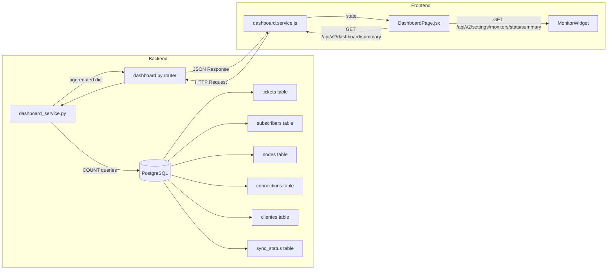

# Plan: Refactor DashboardPage — Eliminar Mock Data

## 1. Resumen Ejecutivo

El [`DashboardPage.jsx`](frontend/src/pages/DashboardPage.jsx) actual tiene **100% datos mock**: los 4 KPIs (`metrics` array) y la tabla de alertas (`integrations` array) son valores hardcodeados. El único componente real es [`MonitorWidget`](frontend/src/components/dashboard/MonitorWidget.jsx), que ya consulta APIs reales (`getMonitors()`, `getMonitorStats()`).

**Objetivo:** Reemplazar todo dato mock con llamadas a APIs reales, manteniendo la misma UI y agregando valor real.

---

## 2. Análisis de Datos Mock Actuales

| Sección | Líneas | Qué muestra | Problema |
|---------|--------|-------------|----------|
| KPI: Tickets activos | 5-13 | `value: '18'`, `trend: '+3 hoy'` | Hardcodeado |
| KPI: Clientes conectados | 14-21 | `value: '7.9k'`, `trend: '+124 sync'` | Hardcodeado |
| KPI: Nodos operativos | 22-29 | `value: '9/9'`, `trend: 'Todos OK'` | Hardcodeado |
| KPI: ONUs online | 30-37 | `value: '4.7k'`, `trend: '96.2%'` | Hardcodeado |
| Tabla Alertas Recientes | 40-62 | SmartOLT, ISPCube, Beholder | Hardcodeado |
| "Actualizado hace 2 min" | 164-169 | Timestamp estático | Hardcodeado |
| Botón "Ver monitoreo completo" | 81-88 | Sin handler | No funcional |
| Botones "Ver log" | 239-247 | Sin handler | No funcional |

---

## 3. Fuentes de Datos Reales Disponibles

### 3.1 Endpoints existentes (sin cambios en backend)

| Endpoint | Frontend Service | Datos que provee |
|----------|-----------------|-------------------|
| `GET /api/v2/tickets/` | [`ticketsService.getAll()`](frontend/src/services/tickets.service.js:16-24) | Tickets con filtros por status. Podemos contar abiertos, en progreso, pendientes |
| `GET /api/v2/settings/monitors/stats/summary` | [`getMonitorStats()`](frontend/src/services/settings.service.js:209-217) | `{total, active, down, critical_down, up, unknown}` — **ya usado por MonitorWidget** |
| `GET /api/v2/settings/sync-status` | [`getSyncStatus()`](frontend/src/services/settings.service.js:226-234) | Historial de ejecuciones de sync (ISPCube, SmartOLT) con estado y timestamp |
| `GET /api/v2/settings/scheduled-tasks` | [`getScheduledTasks()`](frontend/src/services/settings.service.js:244-252) | Tareas programadas con su configuración |

### 3.2 Datos en DB que requieren nuevo endpoint en backend

| Modelo | Tabla | Dato disponible | Para qué KPI |
|--------|-------|-----------------|-------------|
| [`Subscriber`](backend/src/models/beholder.py:12-30) | `subscribers` | Total ONUs registradas | "ONUs online" |
| [`Node`](backend/src/models/beholder.py:32-38) | `nodes` | Total nodos (OLTs) | "Nodos operativos" |
| [`Connection`](backend/src/models/beholder.py:49-63) | `connections` | Total conexiones activas | "Clientes conectados" |
| [`Cliente`](backend/src/models/beholder.py:67-79) | `clientes` | Total clientes | "Clientes conectados" |
| [`SyncStatus`](backend/src/models/beholder.py:113-119) | `sync_status` | Última sync por fuente | Tabla de alertas/integraciones |

---

## 4. Estrategia Recomendada: Dos Fases

### Fase 1 — Frontend-only (sin cambios en backend)
**Reemplazar mock data usando SOLO endpoints existentes.**

| KPI Mock | Reemplazo Real | Fuente |
|----------|---------------|--------|
| Tickets activos: 18 | `ticketsService.getAll({limit:1})` → leer `total` del response | API existente |
| Clientes conectados: 7.9k | Se omite temporalmente o se deja con placeholder "Cargando..." hasta Fase 2 | Requiere backend |
| Nodos operativos: 9/9 | Se omite temporalmente hasta Fase 2 | Requiere backend |
| ONUs online: 4.7k | Se omite temporalmente hasta Fase 2 | Requiere backend |
| Tabla integraciones | `getSyncStatus()` → mapear a filas con nombre, estado, timestamp | API existente |
| Timestamp "Actualizado" | `new Date().toLocaleTimeString()` en cada carga | Frontend |
| Botones no funcionales | Ocultar o redirigir a páginas reales | Frontend |

**Riesgo:** Perdemos 3 de 4 KPIs hasta la Fase 2.

### Fase 2 — Nuevo endpoint backend `GET /api/v2/dashboard/summary` (RECOMENDADO)
Crear un endpoint dedicado que aggregate datos de múltiples tablas en UNA sola request.

**Endpoint propuesto:**
```
GET /api/v2/dashboard/summary
Response:
{
  "tickets": {
    "total_activos": 18,
    "abiertos": 5,
    "en_progreso": 8,
    "pendientes": 5,
    "creados_hoy": 3
  },
  "clientes": {
    "total_conexiones": 8234,
    "total_clientes": 5120
  },
  "nodos": {
    "total": 9,
    "con_subscribers": 9
  },
  "onus": {
    "total": 5100,
    "conectadas": 4700  // estimado desde subscribers con pppoe_username no null
  },
  "sync": {
    "ultima_ejecucion": "2026-05-25T03:00:00Z",
    "estado": "success",
    "por_fuente": [
      {"fuente": "SmartOLT", "ultima_sync": "...", "estado": "ok"},
      {"fuente": "ISPCube", "ultima_sync": "...", "estado": "ok"}
    ]
  }
}
```

**Backend:**
- Nuevo router: [`backend/src/routers/dashboard.py`](backend/src/routers)
- Nuevo servicio: [`backend/src/services/dashboard_service.py`](backend/src/services)
- Usa `SQLAlchemy COUNT` queries (sin carga de filas, eficiente)
- Cacheable (los datos no cambian cada segundo)

**Frontend:**
- Nuevo service: [`frontend/src/services/dashboard.service.js`](frontend/src/services)
- Modificar: [`DashboardPage.jsx`](frontend/src/pages/DashboardPage.jsx) — usar `useEffect` + `useState`

---

## 5. Arquitectura de Datos del Dashboard



---

## 6. Plan de Implementación Detallado

### Paso 1: Commit y Push del trabajo actual
- Archivos a commitear:
  - [`frontend/src/components/ui/ImageViewer.jsx`](frontend/src/components/ui/ImageViewer.jsx) — NUEVO
  - [`frontend/src/pages/TicketDetailPage.jsx`](frontend/src/pages/TicketDetailPage.jsx) — MODIFICADO
  - [`plans/PLAN_IMAGE_VIEWER.md`](plans/PLAN_IMAGE_VIEWER.md) — NUEVO
- Mensaje de commit sugerido: `feat: fix timeline hooks, add ImageViewer with zoom/pan/fullscreen`

### Paso 2: Backend — Crear endpoint `/api/v2/dashboard/summary`
- **Nuevo archivo:** [`backend/src/services/dashboard_service.py`](backend/src/services)
  - Función `get_dashboard_summary(db: Session) -> dict`
  - Contar tickets activos (status != 'closed')
  - Contar conexiones (total desde tabla `connections`)
  - Contar nodos (total desde tabla `nodes`)
  - Contar subscribers (total desde tabla `subscribers`)
  - Obtener último sync_status de cada fuente
- **Nuevo archivo:** [`backend/src/routers/dashboard.py`](backend/src/routers)
  - `@router.get("/summary")` — endpoint protegido con JWT
  - Response model Pydantic con todos los campos
- **Modificar:** [`backend/src/main.py`](backend/src/main.py) — incluir `dashboard.router`
  - `app.include_router(dashboard.router, prefix="/api/v2/dashboard", tags=["Dashboard"])`

### Paso 3: Frontend — Crear service de dashboard
- **Nuevo archivo:** [`frontend/src/services/dashboard.service.js`](frontend/src/services)
  - `getDashboardSummary()` → `GET /api/v2/dashboard/summary`

### Paso 4: Frontend — Refactorizar DashboardPage.jsx
- **Modificar:** [`frontend/src/pages/DashboardPage.jsx`](frontend/src/pages/DashboardPage.jsx)
  - Agregar imports: `useState, useEffect`, nuevo service, `RefreshCw` icon
  - Reemplazar `metrics` array estático con `useState` + `useEffect` + `getDashboardSummary()`
  - Reemplazar `integrations` array estático con datos de `getSyncStatus()`
  - Agregar auto-refresh cada 60 segundos
  - Agregar botón de refresh manual
  - Agregar estado de loading con skeleton
  - Agregar estado de error con retry
  - Eliminar/redirigir botones no funcionales

### Paso 5: Frontend — Mejoras adicionales (opcional)
- Mostrar breakdown de tickets por status (abiertos, en progreso, pendientes)
- Mostrar última sync de cada integración como tabla
- Timeline de actividades recientes
- Auto-refresh cada 60s

---

## 7. Posibles Métricas Adicionales para el Dashboard

Basado en los modelos disponibles, estas son métricas que podrían agregarse en el futuro:

| Métrica | Fuente | Consulta SQL | Utilidad |
|---------|--------|-------------|----------|
| Tickets por técnico | `Ticket.assigned_to` | `GROUP BY assigned_to_id` | Carga laboral |
| Tickets por categoría | `TicketCategory` | `JOIN categories` | Análisis de incidentes |
| Work Orders pendientes | `WorkOrder.status` | `COUNT WHERE status='pending'` | Backlog operativo |
| Work Orders completadas hoy | `WorkOrder.completed_at` | `COUNT WHERE date=today` | Productividad diaria |
| Conexiones por nodo | `Connection.node_id` | `GROUP BY node_id` | Distribución geográfica |
| ONUs por OLT | `Subscriber.olt_name` | `GROUP BY olt_name` | Carga por OLT |
| Última sync por fuente | `SyncStatus` | `ORDER BY ultima_actualizacion DESC` | Salud de integraciones |
| Tiempo promedio resolución | `Ticket.updated_at - created_at` | `AVG` para tickets cerrados | SLA |
| Alertas activas (monitores DOWN) | `ServiceMonitor.last_status` | Ya disponible via `getMonitorStats()` | Salud infraestructura |

---

## 8. Futuro: Detección de Cortes de Fibra (Conceptual)

El usuario mencionó: *"crear un proceso que evalúe y alerte sobre posibles cortes de fibra (por ejemplo, si los clientes de un mismo PON se desloguean a la vez)"*.

**Análisis conceptual:**

**Datos disponibles:**
- Tabla [`Subscriber`](backend/src/models/beholder.py:12-30): tiene `olt_name`, `board`, `port`, `pppoe_username` — el par `(olt_name, board, port)` identifica un PON único
- Tabla [`PPPSecret`](backend/src/models/beholder.py:97-110): tiene `last_caller_id`, `last_logged_out` — registros de sesión PPPoE
- Tabla [`Connection`](backend/src/models/beholder.py:49-63): mapea `pppoe_username` a `customer_id`

**Lógica de detección:**
1. Agrupar subscribers por `(olt_name, board, port)` → cada grupo es un PON
2. Monitorear cambios en `PPPSecret.last_logged_out` — si N subscribers del mismo PON se desloguean en una ventana de tiempo T (ej: 5 min), es alta probabilidad de corte de fibra
3. Alarma: si `>80%` de subscribers de un PON se desloguean simultáneamente

**Implementación futura requeriría:**
- Nuevo worker Celery que ejecute cada N minutos
- Nueva tabla `fiber_cut_alerts` para registrar eventos
- Webhook/notificación al dashboard

No se incluye en el scope actual.

---

## 9. Archivos a Modificar/Crear

### Backend (3 archivos)
| Archivo | Acción | Estimación |
|---------|--------|------------|
| [`backend/src/services/dashboard_service.py`](backend/src/services) | **CREAR** — Lógica de agregación de datos | ~40 líneas |
| [`backend/src/routers/dashboard.py`](backend/src/routers) | **CREAR** — Endpoint REST | ~50 líneas |
| [`backend/src/main.py`](backend/src/main.py) | **MODIFICAR** — Registrar router | +3 líneas |

### Frontend (2 archivos)
| Archivo | Acción | Estimación |
|---------|--------|------------|
| [`frontend/src/services/dashboard.service.js`](frontend/src/services) | **CREAR** — API wrapper | ~15 líneas |
| [`frontend/src/pages/DashboardPage.jsx`](frontend/src/pages/DashboardPage.jsx) | **MODIFICAR** — Reemplazar mock data con llamadas reales | ~100 líneas modificadas |

---

## 10. Principios de Diseño

1. **No romper nada existente** — `MonitorWidget` sigue igual
2. **Loading primero** — Mostrar skeleton mientras carga
3. **Error gracefully** — Si falla API, mostrar error con retry, no pantalla en blanco
4. **Auto-refresh** — 60 segundos (como MonitorWidget hace cada 30s)
5. **Sin dependencias externas** — Solo React + Tailwind + lucide-react (ya disponibles)
6. **Backend liviano** — Solo COUNT queries, sin carga de filas
