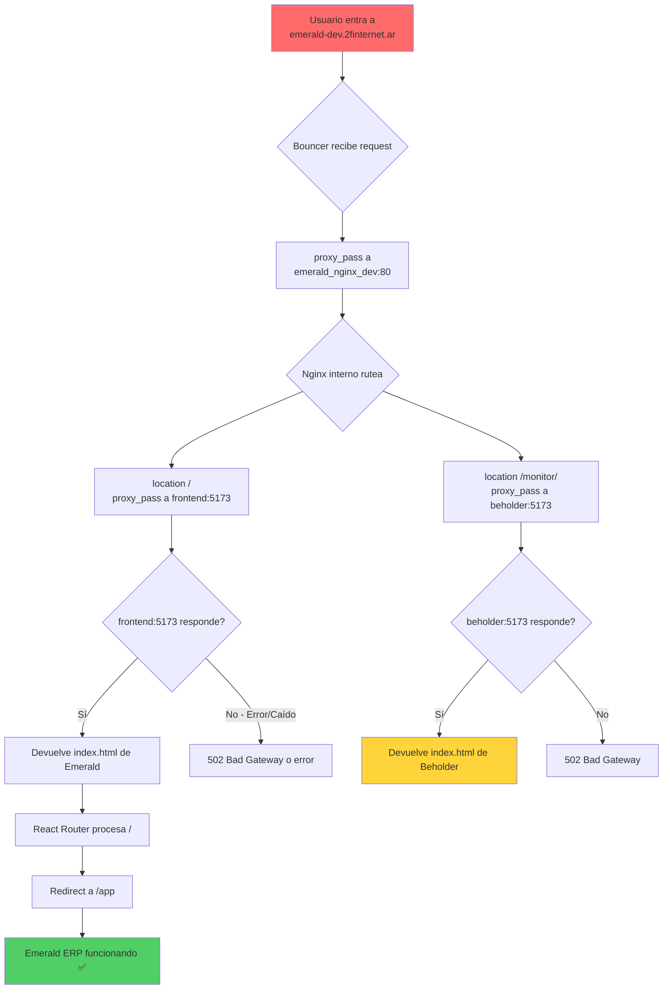

# 🔍 Plan de Diagnóstico: Redirect a `/monitor/` en Desarrollo

## Resumen del Problema

Al acceder a `https://emerald-dev.2finternet.ar/`, el navegador **redirige automáticamente** a `https://emerald-dev.2finternet.ar/monitor/` (Beholder), impidiendo el acceso al frontend de Emerald ERP en el entorno de desarrollo.

---

## 🏗️ Arquitectura Relevante

### 3 Entornos, 3 Stacks Aislados

```
Dominio                    → Proxy Global (Bouncer) → Contenedor Nginx Interno → Servicio
────────────────────────────────────────────────────────────────────────────────────────
emerald.2finternet.ar      → emerald_global_proxy   → emerald_nginx          → frontend:5173
emerald-test.2finternet.ar → emerald_global_proxy   → emerald_nginx_staging  → frontend:5173
emerald-dev.2finternet.ar  → emerald_global_proxy   → emerald_nginx_dev      → frontend:5173
```

### Proxy Global (`/opt/emerald-proxy`)

El [`/opt/emerald-proxy/nginx/default.conf`](/opt/emerald-proxy/nginx/default.conf:74-84) define:

```nginx
# DESARROLLO - Rutero correcto
server {
    listen 443 ssl;
    server_name emerald-dev.2finternet.ar;
    
    location / {
        proxy_pass http://emerald_nginx_dev:80;  # ✅ Apunta al nginx interno de dev
        ...
    }
}
```

### Nginx Interno (`nginx/default.conf`)

El mismo archivo se monta en los 3 entornos:

```nginx
location / {
    proxy_pass http://frontend:5173;   # Emerald ERP (React)
}

location /monitor/ {
    proxy_pass http://beholder:5173;   # Beholder Oracle
}
```

### Ambos Frontends en Puerto 5173

| Servicio | Container | Puerto | Vite `base` |
|----------|-----------|--------|-------------|
| [`frontend`](frontend/Dockerfile) | `emerald_frontend_dev` | 5173 | `/` (default) |
| [`beholder`](beholder_frontend/Dockerfile) | `emerald_beholder_dev` | 5173 | [`/monitor/`](beholder_frontend/vite.config.ts:7) |

---

## 🧐 Hipótesis de Causa Raíz

### Hipótesis 1 (MÁS PROBABLE): El frontend de Emerald está caído o con error de compilación

Si el Vite del Emerald frontend (`frontend:5173`) está caído o tirando error, Nginx podría estar:
- Devolviendo 502/503 → El navegador muestra error (no redirige)
- **O bien, el contenedor `frontend` no está corriendo y Nginx proxy_pasa a un servicio que no existe**

**Pero el usuario describe un redirect, no un error.** Esto apunta más a un redirect activo.

### Hipótesis 2: Conflicto de `COMPOSE_FILE` o proyecto Docker

El `.env` define `COMPOSE_FILE=docker-compose.dev.yml`, pero si se ejecutó:
```bash
docker compose -f docker-compose.staging.yml up -d
# o
docker compose -f docker-compose.yml up -d
```
...se estarían levantando los containers de otro entorno con los nombres de dev, o viceversa.

### Hipótesis 3: Redirección desde el frontend de Emerald

El [`App.jsx`](frontend/src/App.jsx:98) tiene:
```jsx
<Route path="/" element={<Navigate to="/app" replace />} />
```

Pero esto redirige a `/app`, NO a `/monitor/`. Revisar si hay lógica condicional en [`AuthContext.jsx`](frontend/src/context/AuthContext.jsx) o algún otro lado que redirija a monitor.

### Hipótesis 4 (MENOS PROBABLE): Algo en el Bouncer

El [`default.conf` del proxy global](/opt/emerald-proxy/nginx/default.conf) no tiene reglas de rewrite o redirect a `/monitor/`. Solo hace `proxy_pass`. Sin embargo, un cambio reciente no documentado podría agregar una regla.

---

## 📋 Plan de Diagnóstico (Pasos)

### Paso 1: Verificar estado real de los contenedores

```bash
# 1. Listar TODOS los contenedores del ecosistema
docker ps -a --format 'table {{.Names}}\t{{.Status}}\t{{.Ports}}' | grep -E "emerald"

# 2. Ver específicamente el stack de desarrollo
cd /opt/emerald-dev
docker compose ps

# 3. Ver logs del frontend dev
docker logs emerald_frontend_dev --tail 50

# 4. Ver logs del nginx dev
docker logs emerald_nginx_dev --tail 50
```

**Qué buscar:**
- ¿`emerald_frontend_dev` está `Up` o `Exited`?
- ¿Hay errores de compilación en los logs del frontend?
- ¿Hay errores de conexión en los logs de nginx?

### Paso 2: Verificar a qué stack apunta el `.env`

```bash
cd /opt/emerald-dev
cat .env | grep COMPOSE_FILE
# Debe mostrar: COMPOSE_FILE=docker-compose.dev.yml
```

### Paso 3: Probar conectividad interna de Docker

```bash
# Test de conectividad desde nginx_dev a frontend
docker exec emerald_nginx_dev curl -sv http://frontend:5173/ 2>&1 | head -20

# Test de conectividad desde nginx_dev a beholder
docker exec emerald_nginx_dev curl -sv http://beholder:5173/ 2>&1 | head -20
```

**Qué buscar:**
- ¿Responde `frontend:5173` correctamente con el HTML de Emerald?
- ¿Devuelve un redirect (301/302) a `/monitor/`?

### Paso 4: Test directo desde el navegador (proxy bypass)

```bash
# Test del frontend directamente (si tiene puerto expuesto)
curl -sv http://localhost:8502/ 2>&1 | head -30
# Esto testea el backend, no el frontend...
```

### Paso 5: Verificar si hay redirect desde Vite

El Vite dev server del [Beholder](beholder_frontend/vite.config.ts) tiene `base: '/monitor/'`. Si alguien accede a `beholder:5173/` (sin `/monitor/`), Vite podría responder con un redirect a `/monitor/`.

**Hipótesis a testear:** ¿El nginx está enviando tráfico de `/` al contenedor equivocado? Es decir, ¿el service name `frontend` resuelve a la IP de `beholder` en lugar de `frontend`?

### Paso 6: Verificar la red Docker

```bash
# Ver contenedores en la red emerald_gateway
docker network inspect emerald_gateway

# Ver la red default del proyecto dev
docker network ls | grep emerald-dev
docker network inspect emerald-dev_default
```

**Qué buscar:**
- ¿`frontend` y `beholder` están en la misma red?
- ¿Hay conflictos de nombres entre stacks?

---

## 🔧 Plan de Acción (Según Resultados)

### Escenario A: `emerald_frontend_dev` caído o con error

**Solución:** Reconstruir y reiniciar

```bash
cd /opt/emerald-dev
docker compose build frontend
docker compose up -d frontend
docker logs -f emerald_frontend_dev
```

### Escenario B: Conflicto de proyecto Docker (stacks mezclados)

**Solución:** Detener todo y levantar solo dev

```bash
# Detener todos los stacks
cd /opt/emerald-dev && docker compose down
cd /opt/emerald-staging && docker compose down
cd /opt/emerald-erp && docker compose down

# Levantar solo dev
cd /opt/emerald-dev
docker compose up -d
```

### Escenario C: Nginx ruteando al contenedor equivocado

**Solución:** Revisar resolución DNS interna de Docker

```bash
# Verificar IPs
docker inspect emerald_frontend_dev --format '{{.Name}} {{range .NetworkSettings.Networks}}{{.IPAddress}}{{end}}'
docker inspect emerald_beholder_dev --format '{{.Name}} {{range .NetworkSettings.Networks}}{{.IPAddress}}{{end}}'

# Hacer ping desde nginx
docker exec emerald_nginx_dev ping -c 2 frontend
docker exec emerald_nginx_dev ping -c 2 beholder
```

### Escenario D: Redirect desde el frontend de Emerald por auth

**Solución:** Revisar [`AuthContext.jsx`](frontend/src/context/AuthContext.jsx) y flujo de login

```bash
# Ver si hay redirect condicional
grep -rn "monitor\|/monitor" frontend/src/ --include="*.{jsx,js}"
```

---

## 📊 Diagrama de Flujo del Diagnóstico



---

## 📝 Checklist de Verificación Rápida

- [ ] Revisar estado de `docker ps | grep emerald_frontend_dev`
- [ ] Revisar logs: `docker logs emerald_frontend_dev --tail 30`
- [ ] Confirmar `COMPOSE_FILE` en `.env`
- [ ] Test conectividad: `docker exec emerald_nginx_dev curl -s http://frontend:5173/ | head -5`
- [ ] Test respuesta directa: `curl -sk https://emerald-dev.2finternet.ar/ | head -5`
- [ ] Buscar redirects en código: `grep -rn "monitor" frontend/src/`

---

## 📚 Referencias

| Archivo | Propósito |
|---------|-----------|
| [`docs/ENTORNOS.md`](/docs/ENTORNOS.md) | Documentación de los 3 entornos |
| [`docs/PROXY.md`](/docs/PROXY.md) | Arquitectura de Proxy Global (Bouncer) |
| [`/opt/emerald-proxy/nginx/default.conf`](/opt/emerald-proxy/nginx/default.conf) | Config del Bouncer |
| [`nginx/default.conf`](nginx/default.conf) | Config de Nginx interno |
| [`docker-compose.dev.yml`](docker-compose.dev.yml) | Stack de desarrollo |
| [`frontend/src/App.jsx`](frontend/src/App.jsx) | Routing del frontend Emerald |
| [`beholder_frontend/vite.config.ts`](beholder_frontend/vite.config.ts) | Config Vite de Beholder (base: /monitor/) |
| [`.env`](.env) | Variables de entorno actuales |
