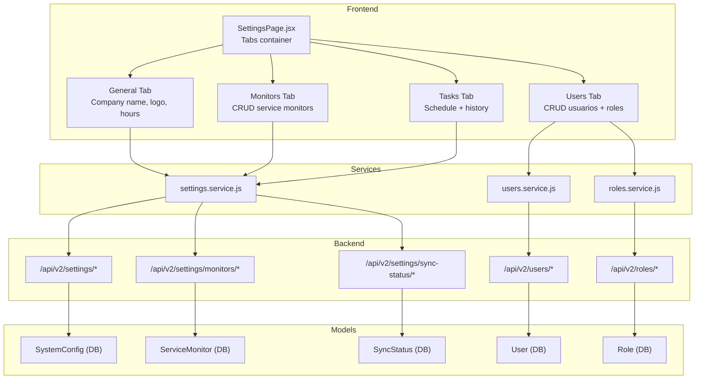

# Plan de Expansión del Módulo de Configuración (Settings)

## 1. Árbol Estructurado Propuesto

```
Configuración (/app/settings)
│
├── General
│   ├── Nombre de la empresa (editable)
│   ├── Logo (URL / upload)
│   ├── Horario laboral (mañana: 8-13, tarde: 15-19)
│   ├── Zona horaria
│   └── (Futuro: más configuraciones)
│
├── Usuarios
│   ├── CRUD de usuarios (reutilizar UsersPage existente)
│   ├── Roles (CRUD con asignación de permisos por módulo)
│   └── Integración con RBAC matrix (permissions.js)
│
├── Tareas Programadas
│   ├── Vista del schedule de Celery Beat
│   ├── Historial de ejecuciones (SyncStatus table)
│   ├── Estado actual de cada tarea
│   ├── Botón de ejecución manual
│   └── (Futuro: ticket review, tech perf, KPI generation)
│
└── Monitores de Servicio (Service Monitors)
    ├── CRUD completo de endpoints monitoreados
    ├── Campos: URL, credenciales (hasheadas), etiqueta,
    │   índice de criticidad, color de alerta
    ├── Estado (up/down) para mostrar en Dashboard
    └── Ej: WAN de internet, herramientas de facturación, etc.
```

### Propuesta de Nomenclatura Profesional

| Término Original | Propuesta | Razón |
|---|---|---|
| "Punteros" | **Monitores de Servicio** | Describe claramente la función |
| "Tareas Programadas" | **Programación de Tareas** (o mantener) | Ya es profesional |
| "Mi Equipo" → mover a Usuarios | **Usuarios** | Más estándar |

---

## 2. Estado Actual (Antes de la Expansión)

| Aspecto | Estado |
|---------|--------|
| [`SettingsPage.jsx`](frontend/src/pages/SettingsPage.jsx) | Página con 2 tabs ("Mi Equipo" y "General"), datos mock |
| [`UsersPage.jsx`](frontend/src/pages/UsersPage.jsx) | CRUD completo con API real, ruta separada `/app/users` |
| [`AppSidebar.jsx`](frontend/src/components/AppSidebar.jsx) | Menús separados: "Configuración" + "Usuarios" |
| [`App.jsx`](frontend/src/App.jsx) | Rutas separadas: `/app/settings` + `/app/users` |
| [`backend/src/models/user.py`](backend/src/models/user.py) | Modelos `User` y `Role` existentes |
| [`backend/src/routers/v1/admin.py`](backend/src/routers/v1/admin.py) | Endpoints admin (unlock user, rate limit) |
| [`backend/src/celery_app.py`](backend/src/celery_app.py) | Schedule Celery Beat (nightly sync, cleanup) |
| [`backend/src/jobs/sync.py`](backend/src/jobs/sync.py) | Implementación nightly sync (6 pasos) |
| [`frontend/src/utils/permissions.js`](frontend/src/utils/permissions.js) | RBAC matrix con resources: settings, users, etc. |
| **Backend Settings API** | **NO EXISTE** — no hay models/endpoints para general settings |
| **Backend Service Monitors** | **NO EXISTE** — no hay modelos ni endpoints |
| **Sync execution history API** | **NO EXISTE** — SyncStatus existe pero sin endpoints expuestos |

---

## 3. Nuevos Modelos Backend Necesarios

### 3.1 `SystemConfig` (Configuración General)

```
backend/src/models/settings.py
```

```python
class SystemConfig(Base, TimestampMixin):
    __tablename__ = "system_config"

    id: int (PK)
    key: str (unique)  # company_name, logo_url, work_hours, timezone, etc.
    value: JSONB       # Flexible para guardar strings, objetos, arrays
    description: str   # Descripción legible de la config
    updated_by: int (FK -> users.id)
```

### 3.2 `ServiceMonitor` (Monitores de Servicio)

```python
class ServiceMonitor(Base, TimestampMixin):
    __tablename__ = "service_monitors"

    id: int (PK)
    label: str                # "WAN Principal", "Sistema de Facturación"
    url: str                  # Endpoint a monitorear
    monitor_type: str         # http, ping, tcp, etc.
    auth_username: str (nullable)
    auth_password_hash: str (nullable)  # Hasheado
    criticality_index: int    # 1-5 (5 = crítico)
    alert_color: str          # hex color #FF0000
    check_interval_seconds: int (default: 300)
    is_active: bool
    last_status: str          # up, down, unknown
    last_checked_at: datetime (nullable)
    tags: JSONB               # Etiquetas adicionales
```

### 3.3 Endpoints REST

| Método | Endpoint | Descripción |
|--------|----------|-------------|
| `GET` | `/api/v2/settings` | Obtener todas las configuraciones generales |
| `PUT` | `/api/v2/settings` | Actualizar configuraciones (batch) |
| `GET` | `/api/v2/settings/monitors` | Listar monitores |
| `POST` | `/api/v2/settings/monitors` | Crear monitor |
| `PUT` | `/api/v2/settings/monitors/{id}` | Actualizar monitor |
| `DELETE` | `/api/v2/settings/monitors/{id}` | Eliminar monitor |
| `POST` | `/api/v2/settings/monitors/{id}/check` | Forzar verificación |
| `GET` | `/api/v2/settings/sync-status` | Historial de sincronización |
| `POST` | `/api/v2/settings/sync-tasks/{task_name}/trigger` | Ejecutar tarea manualmente |

---

## 4. Plan de Implementación por Fases

### Fase 1: Backend — Modelos y Endpoints de Configuración

**Qué se crea:**
- [`backend/src/models/settings.py`](backend/src/models/settings.py): Modelos `SystemConfig`, `ServiceMonitor`
- [`backend/src/schemas/settings.py`](backend/src/schemas/settings.py): Pydantic schemas
- [`backend/src/routers/settings.py`](backend/src/routers/settings.py): Router con CRUD de settings + monitores
- [`backend/src/services/settings_service.py`](backend/src/services/settings_service.py): Lógica de negocio
- Migración Alembic para las nuevas tablas
- Registro del router en [`backend/src/main.py`](backend/src/main.py)

**Dependencias:** Ninguna
**Duración estimada:** Sin estimación

### Fase 2: Frontend — Refactor SettingsPage + General Tab

**Qué se modifica:**
- [`frontend/src/pages/SettingsPage.jsx`](frontend/src/pages/SettingsPage.jsx): 
  - Refactor completo con 4 tabs usando shadcn/ui Tabs
  - Tab "General": formulario editable conectado a API
  - Work hours editor (rango de horas mañana/tarde)
  - Company name + logo upload
  - Remover datos mock, conectar a backend
- [`frontend/src/services/settings.service.js`](frontend/src/services/settings.service.js): Nuevo service
- Mantener el diseño visual existente (mismo theme, mismos componentes UI)

**Dependencias:** Fase 1 (backend settings endpoints)

### Fase 3: Frontend — Integración de Usuarios en Settings

**Qué se modifica:**
- [`frontend/src/pages/SettingsPage.jsx`](frontend/src/pages/SettingsPage.jsx):
  - Tab "Usuarios" que reutiliza la lógica de UsersPage
  - Refactor para compartir el componente de tabla de usuarios
  - Integrar roles CRUD (selector de roles con permisos)
- [`frontend/src/pages/UsersPage.jsx`](frontend/src/pages/UsersPage.jsx): 
  - Opcional: mantener como ruta independiente o redirect a settings
- [`frontend/src/App.jsx`](frontend/src/App.jsx): 
  - Decidir si `/app/users` redirige a `/app/settings?tab=users`
- [`frontend/src/components/AppSidebar.jsx`](frontend/src/components/AppSidebar.jsx):
  - Simplificar sidebar: un solo item "Configuración" en vez de "Configuración" + "Usuarios"
  - O mantener ambos pero que apunten al mismo lugar

**Dependencias:** Fase 2

### Fase 4: Frontend + Backend — Monitores de Servicio

**Qué se crea/modifica:**
- [`frontend/src/pages/settings/MonitorsTab.jsx`](frontend/src/pages/settings/MonitorsTab.jsx): Tab CRUD de monitores
- Tabla con: etiqueta, URL, tipo, criticidad, color, estado, última verificación
- Diálogo de creación/edición con campos del modelo
- Integración con Dashboard para mostrar estado de monitores
- Widget en DashboardPage para mostrar tarjetas de estado

**Dependencias:** Fase 1 (backend monitors endpoints)

### Fase 5: Frontend — Tareas Programadas (Read-Only)

**Qué se crea:**
- [`frontend/src/pages/settings/ScheduledTasksTab.jsx`](frontend/src/pages/settings/ScheduledTasksTab.jsx):
  - Tabla con schedule de Celery Beat (nombre, cron, descripción)
  - Historial de ejecuciones desde SyncStatus
  - Estado actual (última ejecución, próxima ejecución)
  - Botón "Ejecutar ahora" para trigger manual
  - Indicadores de éxito/fallo

**Dependencias:** Fase 1 (sync-status endpoints)

### Fase 6 (Futuro): Roles & Permissions UI + Dashboard Widgets

- Editor visual de permisos por rol
- Widgets en Dashboard para Service Monitors
- Ticket review, tech performance, KPI generation tasks

---

## 5. Diagrama de Arquitectura



---

## 6. Decisiones de Arquitectura

### 6.1 Ruta `/app/users` vs integración en Settings
**Decisión:** Mantener `/app/users` como ruta independiente para acceso directo, PERO también mostrar users dentro de Settings como tab. La sidebar puede tener ambos accesos o simplificarse. Propongo simplificar la sidebar a un solo ítem "Configuración" que muestre todos los tabs.

### 6.2 Almacenamiento de configuraciones
**Decisión:** Usar key-value store (`SystemConfig`) en lugar de tabla con columnas fijas. Esto permite agregar nuevas configuraciones sin migraciones. Cada config tiene un `key` único y `value` JSONB.

### 6.3 Hash de credenciales en Monitores de Servicio
**Decisión:** Usar el mismo mecanismo de `APIKeyService.hash_key()` para almacenar contraseñas. Nunca almacenar texto plano.

### 6.4 Logo de empresa
**Decisión:** Almacenar como URL (campo texto en SystemConfig). Para upload, reutilizar mecanismo existente de file upload (similar a ticket attachments).

### 6.5 Work hours storage
**Decisión:** Guardar como JSON estructurado:
```json
{
  "morning_start": "08:00",
  "morning_end": "13:00",
  "afternoon_start": "15:00",
  "afternoon_end": "19:00"
}
```

---

## 7. Resumen de Archivos a Crear/Modificar

### Nuevos Archivos
| Archivo | Propósito |
|---------|-----------|
| `backend/src/models/settings.py` | Modelos SystemConfig + ServiceMonitor |
| `backend/src/schemas/settings.py` | Pydantic schemas |
| `backend/src/routers/settings.py` | API endpoints |
| `backend/src/services/settings_service.py` | Business logic |
| `frontend/src/services/settings.service.js` | Frontend API client |
| `frontend/src/pages/settings/MonitorsTab.jsx` | Monitores CRUD tab |
| `frontend/src/pages/settings/ScheduledTasksTab.jsx` | Scheduled tasks tab |
| `backend/alembic/versions/..._create_settings_tables.py` | Migration |

### Archivos a Modificar
| Archivo | Cambio |
|---------|--------|
| `frontend/src/pages/SettingsPage.jsx` | Refactor completo con 4 tabs reales |
| `frontend/src/pages/UsersPage.jsx` | Opcional: extraer componentes reutilizables |
| `frontend/src/components/AppSidebar.jsx` | Simplificar ítems de sistema |
| `frontend/src/App.jsx` | Opcional: redirect /app/users → /app/settings |
| `frontend/src/pages/DashboardPage.jsx` | Agregar widget de monitores |
| `backend/src/main.py` | Registrar nuevo router de settings |

---

## 8. Orden de Implementación Sugerido

```
Fase 1 ──► Backend: Modelos + Endpoints
   │
   ▼
Fase 2 ──► Frontend: SettingsPage refactor + General tab
   │
   ▼
Fase 3 ──► Frontend: Users integration in Settings
   │
   ▼
Fase 4 ──► Frontend + Backend: Monitores de Servicio
   │
   ▼
Fase 5 ──► Frontend: Tareas Programadas viewer
   │
   ▼
Fase 6 ──► Futuro: Dashboard widgets + Roles editor
```

Cada fase es independiente y puede ser implementada sin saturar el contexto. Las dependencias son únicamente: Fase 1 → Fase 2 → Fase 3 (en ese orden); Fase 4 y 5 dependen de Fase 1 pero son paralelas entre sí.
