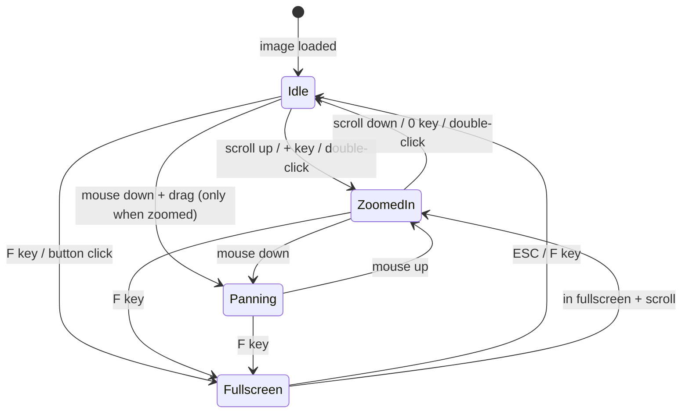

# Plan: Full-Featured Image Viewer Component

## 1. Problem

The current image viewer in [`TicketDetailPage.jsx`](frontend/src/pages/TicketDetailPage.jsx:533-579) is a bare-bones inline modal:
- No zoom capabilities
- No fullscreen support
- No keyboard shortcuts
- No loading/error states
- Tightly coupled to `TimelineItem` (not reusable)
- No touch support for mobile

## 2. Solution

Create a standalone, reusable [`ImageViewer`](frontend/src/components/ui/ImageViewer.jsx) component that provides:
- Zoom in/out via scroll wheel, buttons, and keyboard (+/-)
- Pan when zoomed (mouse drag)
- Fullscreen API toggle
- Double-click to zoom / reset
- Touch gestures (pinch-to-zoom, drag-to-pan)
- Keyboard shortcuts (ESC, +/-, 0, F)
- Loading skeleton & error boundary
- GPU-accelerated transforms (CSS `transform` + `transition`)

## 3. Architecture

```mermaid
flowchart TD
    A[ImageViewer] --> B[Props: image, onClose]
    A --> C[State]
    C --> D[zoom: float 0.25-5]
    C --> E[pan: {x, y}]
    C --> F[isFullscreen: bool]
    C --> G[loadState: loading|loaded|error]
    
    A --> H[useRef: imageRef, containerRef]
    A --> I[useCallback: Handlers]
    
    I --> J[handleWheel]
    I --> K[handleMouseDown/Up/Move]
    I --> L[handleDoubleClick]
    I --> M[handleKeyDown]
    I --> N[handleTouchStart/Move/End]
    I --> O[handleFullscreenToggle]
```

### State diagram for zoom/pan



## 4. Component API

```jsx
ImageViewer({
  image: {
    url: string,        // Image URL (required)
    name: string,       // Display name (required)
    size: number,       // File size in bytes (optional)
    type: string,        // MIME type (optional)
  },
  onClose: () => void,  // Called when user requests close
})
```

## 5. Implementation Details

### Zoom System
- Base zoom: 1.0 (fit to container)
- Range: 0.25 to 5.0
- Step: 0.1 per scroll tick, 0.25 per button/key press
- Applied via CSS `transform: scale(${zoom}) translate(${pan.x}px, ${pan.y}px)`
- Transform origin: center of container
- Smooth CSS `transition: transform 0.15s ease-out`

### Pan System
- Only active when `zoom > 1.0`
- Track mouse/touch delta
- Apply via `translate()` in the same CSS transform
- Clamp to prevent image from going off-screen

### Fullscreen
- Use Fullscreen API: `element.requestFullscreen()` / `document.exitFullscreen()`
- Toggle button in toolbar
- F key shortcut
- Listen for `fullscreenchange` event to sync state
- Show fullscreen hint on hover

### Keyboard Shortcuts
| Key | Action |
|-----|--------|
| ESC | Close viewer |
| + / = | Zoom in |
| - / _ | Zoom out |
| 0 | Reset zoom |
| F | Toggle fullscreen |
| Arrow keys | Pan (when zoomed) |

### Touch Support
- Two-finger pinch to zoom
- Single-finger drag to pan (when zoomed)
- Double-tap to zoom in / reset

### Loading & Error States
- Show animated skeleton/spinner while image loads
- Show error message with retry button on failure
- Use native `onLoad` / `onError` events on ``

### Performance
- CSS `transform` and `opacity` only (GPU composited)
- `will-change: transform` on the image element
- Debounced scroll handler (requestAnimationFrame)
- No DOM mutations during zoom/pan
- Cleanup all event listeners on unmount

## 6. Integration in TicketDetailPage

Replace the inline modal (lines 533-579) in [`TicketDetailPage.jsx`](frontend/src/pages/TicketDetailPage.jsx:533) with:

```jsx
{showImageModal && selectedImage && (
  <ImageViewer
    image={{
      url: selectedImage.url || filePath,
      name: selectedImage.name || fileName,
      size: selectedImage.size,
      type: event.meta_data?.content_type,
    }}
    onClose={() => {
      setSelectedImage(null);
      setShowImageModal(false);
    }}
  />
)}
```

## 7. Files to Create/Modify

| File | Action | Description |
|------|--------|-------------|
| [`frontend/src/components/ui/ImageViewer.jsx`](frontend/src/components/ui/ImageViewer.jsx) | **CREATE** | New standalone image viewer component (~200 lines) |
| [`frontend/src/pages/TicketDetailPage.jsx`](frontend/src/pages/TicketDetailPage.jsx) | **MODIFY** | Replace inline modal with new ImageViewer component (~45 lines removed, ~10 lines added) |

No CSS file needed — all styling via Tailwind utility classes.

## 8. Future Considerations

- Gallery mode (swipe between multiple images in same ticket)
- Download progress indicator for large files
- Image rotation (exif-aware)
- Batch download (zip all images)
