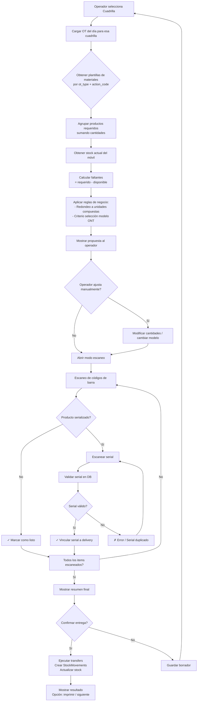

# Plan de Implementación — Logística y Productos V2

## Resumen Ejecutivo

Este plan aborda 4 áreas clave de mejora en el módulo de logística/productos:

1. **Fraccionamiento de productos compuestos** — Productos que se compran como unidad (bobina, blister) pero se consumen fraccionadamente (metros, unidades).
2. **Agrupación de productos y especificaciones técnicas** — Productos del mismo rubro (ONU/ONT, routers) con atributos enriquecidos.
3. **Módulo de Entrega de Materiales a Cuadrillas** — Transferencia inteligente desde depósito central a móviles con propuesta basada en OT programadas + wizard con lector de códigos.
4. **Mejora en flujo de Compra de Productos** — Wizard guiado con validación de códigos de barra y seriales.

---

## 1. Productos Compuestos y Fraccionamiento

### Problema actual
Hoy `Product` distingue solo `SERIALIZED` vs `BULK`. Un producto "Bobina de drop 300m" se compra como 1 unidad, pero su consumo real es en metros. No hay concepto de "tamaño de unidad" ni unidad de medida.

### Cambios necesarios

#### 1.1 Modelo `Product` — nuevos campos

| Campo | Tipo | Descripción |
|-------|------|-------------|
| `unit_size` | `Float, nullable` | Tamaño de 1 unidad compuesta (ej: 300 para bobina drop, 10 para blister conectores) |
| `unit_measure` | `String, nullable` | Unidad de medida (m, units, pcs) |
| `is_composite` | `Boolean, default=false` | True si es un producto que se compra entero pero se consume fraccionadamente |
| `composite_unit_label` | `String, nullable` | Etiqueta de la unidad compuesta (ej: "Bobina", "Blister", "Cajita") |

#### 1.2 Modelo `ProductGroup` (nuevo)

```
product_groups
├── id: int PK
├── name: string (unique) — ej: "ONU/ONT", "Router Domiciliario", "Conectores", "Cableado"
├── description: text nullable
├── is_active: boolean
├── created_at, updated_at
```

- `Product` se relaciona con `ProductGroup` via `group_id` FK nullable.
- Se crea endpoint CRUD para `ProductGroup` (usado en settings de configuración).

#### 1.3 Modelo `ProductSpec` (nuevo) — Especificaciones técnicas dinámicas

```json
{
  "product_id": int FK,
  "specs": {
    "is_dual_band": true,
    "wifi_version": "6",
    "mode": "router_bridge",  // router | bridge | pure_bridge
    "is_mesh": false,
    "ports": "4xGE",
    "extra_notes": "..."
  }
}
```

- Tabla `product_specs` con `product_id` PK + `specs JSONB`.
- Diferentes rubros tienen diferentes campos esperados.
- Se valida por `group_id`:
  - Si grupo = "ONU/ONT": espera `wifi_version`, `mode`, `is_dual_band`
  - Si grupo = "Router Domiciliario": espera `is_mesh`, `is_dual_band`, `extra_notes`
- Frontend: formulario dinámico que renderiza campos según el grupo seleccionado.

#### 1.4 Lógica de fraccionamiento en consumo

**Compra:** Si `is_composite=true`, se multiplica `cantidad * unit_size` al ingresar a `StockBulk`.
- Ej: "1 Bobina drop 300m" → `StockBulk.quantity += 300.0` (en metros)

**Transferencia a móvil:** Igual que compra — se transfiere en la unidad de medida base (metros).

**Consumo en OT:** El técnico ingresa el consumo en la unidad de medida base (metros, unidades).
- El wizard de materiales en el `CloseWorkOrderDialog` debe mostrar:
  - Si `is_composite`: mostrar campo en unidad base y opcionalmente en "unidades compuestas"
  - Ej: "Usar 150m (0.5 bobinas) de drop"

**Stock actual en móvil:** Siempre se muestra en unidad base con conversión opcional.
- Ej: drop: "150m (0.5 bobinas)" si `unit_size=300`

---

## 2. Agrupación de Productos y Especificaciones Técnicas

### Modelo de datos

```
ProductGroup (NUEVA)
├── id, name, description, is_active, created_at, updated_at

Product (MODIFICAR)
├── ...campos existentes...
├── group_id -> FK ProductGroup.id (nullable)
├── unit_size, unit_measure, is_composite, composite_unit_label (nuevos)

ProductSpec (NUEVA)
├── product_id -> PK, FK Product.id
├── specs: JSONB
├── created_at, updated_at
```

### En backend

- CRUD completo para `ProductGroup` en [`backend/src/models/inventory.py`](backend/src/models/inventory.py) y [`backend/src/routers/inventory.py`](backend/src/routers/inventory.py).
- Endpoint `POST /v2/inventory/products/{id}/specs` y `PUT /v2/inventory/products/{id}/specs` para gestionar specs.
- En la respuesta de `ProductResponse`, incluir `group_name` y `specs`.
- Las plantillas `WOTemplate` se benefician porque ahora se puede filtrar productos por grupo.

### En frontend

- Formulario de creación/edición de producto en [`frontend/src/pages/inventory/ProductCatalog.jsx`](frontend/src/pages/inventory/ProductCatalog.jsx) debe incluir:
  - Selector de `ProductGroup`
  - Campos `unit_size`, `unit_measure`, `is_composite` (visibles condicionalmente)
  - Sección de especificaciones dinámicas según grupo seleccionado
- Nueva página/sección en Settings para administrar `ProductGroup` (CRUD).
- En [`frontend/src/pages/settings/WOTemplatesTab.jsx`](frontend/src/pages/settings/WOTemplatesTab.jsx): mejorar filtros por grupo.

---

## 3. Módulo de Entrega de Materiales a Cuadrillas

Este es el módulo más grande. Se organiza en sub-componentes.

### 3.1 Modelo de datos

```
MaterialDelivery (NUEVA)
├── id: int PK
├── team_id: FK teams.id
├── warehouse_from_id: FK warehouses.id (CENTRAL)
├── warehouse_to_id: FK warehouses.id (MOBILE del vehículo)
├── status: enum (DRAFT, IN_PROGRESS, COMPLETED, CANCELLED)
├── proposal_generated_at: datetime (timestamp de última propuesta)
├── delivered_at: datetime nullable
├── delivered_by_user_id: FK users.id
├── notes: text nullable
├── created_at, updated_at

MaterialDeliveryItem (NUEVA)
├── id: int PK
├── delivery_id: FK material_deliveries.id
├── product_id: FK products.id
├── quantity_proposed: float (cantidad sugerida por el sistema)
├── quantity_delivered: float (cantidad real entregada, puede diferir)
├── is_serialized: boolean
├── serial_item_id: FK serial_items.id nullable
├── serial_number: string nullable (redundancia)
├── source: enum (PROPOSAL, MANUAL) — si lo sugirió el sistema o lo agregó el operador
├── notes: text nullable
├── created_at

MaterialReceipt (NUEVA) — Recepción de materiales devueltos
├── id: int PK
├── team_id: FK teams.id
├── warehouse_from_id: FK warehouses.id (MOBILE origen)
├── warehouse_to_id: FK warehouses.id (CENTRAL destino)
├── received_at: datetime
├── received_by_user_id: FK users.id
├── notes: text nullable
├── created_at

MaterialReceiptItem (NUEVA)
├── id: int PK
├── receipt_id: FK material_receipts.id
├── product_id: FK products.id
├── quantity: float
├── serial_item_id: FK serial_items.id nullable
├── serial_number: string nullable
├── condition: enum (GOOD, DEFECTIVE, DAMAGED)
├── notes: text nullable
├── created_at
```

### 3.2 Lógica de Propuesta Inteligente de Materiales

Servicio [`backend/src/services/material_delivery_service.py`] (nuevo):

```
fn generate_proposal(team_id, vehicle_id):
    1. Obtener OT del día para el team (SCHEDULED / IN_PROGRESS)
    2. Para cada OT, obtener su WOTemplate según ot_type + action_code
    3. Agrupar productos y sumar cantidades requeridas
    4. Obtener stock actual del vehicle.warehouse (MOBILE)
    5. Calcular faltante = requerido - disponible (por producto)
    6. Para productos SERIALIZED: determinar cuántos seriales faltan
    7. Para productos BULK compuestos: convertir a unidades compuestas
       (ej: faltan 350m de drop → 1 bobina + 50m, redondea a 2 bobinas)
    8. Devolver lista de MaterialDeliveryItem con quantity_proposed
    9. Aplicar criterio de selección de modelo para ont:
       - Si hay múltiples modelos en el mismo grupo (ONU/ONT)
       - Priorizar por regla configurable (stock más antiguo, más nuevo, preferido)
       - Permitir override manual
```

### 3.3 API Endpoints

```
# Material Delivery
GET    /v2/logistics/deliveries                    → Listar entregas (filtro por team, fecha, status)
POST   /v2/logistics/deliveries                    → Crear nueva entrega en DRAFT
GET    /v2/logistics/deliveries/{id}               → Detalle de entrega con items
POST   /v2/logistics/deliveries/{id}/proposal      → Generar/regenerar propuesta
PATCH  /v2/logistics/deliveries/{id}/items/{item_id} → Ajustar item manualmente
POST   /v2/logistics/deliveries/{id}/items         → Agregar item manual
DELETE /v2/logistics/deliveries/{id}/items/{item_id} → Quitar item
POST   /v2/logistics/deliveries/{id}/scan          → Escanear código de barra
POST   /v2/logistics/deliveries/{id}/scan-serial   → Escanear serial
POST   /v2/logistics/deliveries/{id}/confirm       → Confirmar y ejecutar transferencia
POST   /v2/logistics/deliveries/{id}/cancel        → Cancelar entrega

# Material Receipt
GET    /v2/logistics/receipts                      → Listar recepciones
POST   /v2/logistics/receipts                      → Crear recepción
POST   /v2/logistics/receipts/{id}/scan            → Escanear producto
POST   /v2/logistics/receipts/{id}/confirm         → Confirmar recepción
```

### 3.4 Frontend — Páginas y Componentes

Nuevas páginas en [`frontend/src/pages/logistics/`](frontend/src/pages/logistics/):

```
pages/logistics/
├── MaterialDeliveryDashboard.jsx    → Dashboard general de entregas
├── MaterialDeliveryWizard.jsx       → Wizard de entrega paso a paso
├── MaterialReceiptWizard.jsx        → Wizard de recepción
├── TeamDeliveryHistory.jsx          → Historial de entregas por cuadrilla
```

Nuevos componentes en [`frontend/src/components/logistics/`](frontend/src/components/logistics/):

```
components/logistics/
├── DeliveryTeamSelector.jsx         → Selector de cuadrilla/vehículo
├── DeliveryProposalView.jsx         → Vista de propuesta de materiales
├── DeliveryItemEditor.jsx           → Editor de item (cantidad, serial)
├── BarcodeScannerStep.jsx           → Paso de escaneo de código de barra
├── SerialScannerStep.jsx            → Paso de escaneo de seriales
├── DeliverySummary.jsx              → Resumen de entrega antes de confirmar
├── ReceiptProductScanner.jsx        → Escaneo de productos para recepción
├── ReceiptConditionSelector.jsx     → Selector de condición (bueno, defectuoso, dañado)
```

### 3.5 Wizard de Entrega — Flujo paso a paso

```
Paso 1: Seleccionar Cuadrilla
  - Muestra lista de cuadrillas activas con su vehículo asignado
  - Muestra último delivery del día si existe (reanudar)

Paso 2: Propuesta de Materiales
  - Botón "Generar/Actualizar Propuesta"
  - Muestra tabla comparativa:
    | Producto | En Móvil | Requerido (OT) | Faltante | A Entregar |
  - Permite ajustes manuales (cantidad, producto, modelo)
  - Filtro por grupo de producto

Paso 3: Escaneo de Códigos de Barra
  - Modo escaneo activo
  - Al escanear código de producto:
    - Si es BULK: se marca como listo (cantidad restante--)
    - Si es SERIALIZED: pide escaneo del serial
  - Feedback visual inmediato (check verde, error rojo)
  - Si producto no está en propuesta: preguntar si agregar manual

Paso 4: Revisión y Confirmación
  - Resumen de todos los items pendientes vs escaneados
  - Items faltantes resaltados
  - Botón "Confirmar Entrega"
  - Al confirmar: ejecuta transferencia de stock (CENTRAL → MOBILE)
  - Crea StockMovement por cada item

Paso 5: Resultado
  - Resumen de lo transferido
  - Opción de imprimir remito (opcional)
  - Botón para siguiente cuadrilla
```

### 3.6 Integración con Sidebar

Agregar en [`frontend/src/components/AppSidebar.jsx`](frontend/src/components/AppSidebar.jsx) dentro de la sección "Inventario":

```javascript
{
  title: 'Entregas a Cuadrillas',
  icon: Truck,
  href: '/app/logistics/deliveries',
  description: 'Transferencia de materiales a móviles',
  resource: 'inventory_admin',
}
```

Y en sección de "Operaciones" o "Inventario", subítems para recepción e historial.

---

## 4. Mejora en Flujo de Compra de Productos

### 4.1 Modelo `Purchase` (nuevo)

```
Purchase (NUEVA)
├── id: int PK
├── warehouse_id: FK warehouses.id (CENTRAL destino)
├── supplier: string nullable
├── invoice_number: string nullable
├── status: enum (DRAFT, IN_PROGRESS, COMPLETED, CANCELLED)
├── notes: text nullable
├── completed_by_user_id: FK users.id
├── completed_at: datetime nullable
├── created_at, updated_at

PurchaseItem (NUEVA)
├── id: int PK
├── purchase_id: FK purchases.id
├── product_id: FK products.id
├── quantity: float
├── unit_cost: decimal nullable
├── serial_item_id: FK serial_items.id nullable (para SERIALIZED)
├── serial_number: string nullable
├── created_at
```

### 4.2 Endpoints API

```
GET    /v2/logistics/purchases                    → Listar compras
POST   /v2/logistics/purchases                    → Crear compra DRAFT
GET    /v2/logistics/purchases/{id}               → Detalle
POST   /v2/logistics/purchases/{id}/scan          → Escanear producto
POST   /v2/logistics/purchases/{id}/scan-serial   → Escanear serial
POST   /v2/logistics/purchases/{id}/confirm       → Confirmar y ejecutar ingreso
```

### 4.3 Wizard de Compra — Flujo

```
Paso 1: Escanear / Seleccionar Producto
  - Escanear código de barra → autoselecciona producto
  - Si no existe: opción "Nuevo Producto Rápido"
  - Para BULK: ingresar cantidad (y aplicar unit_size si compuesto)
  - Para SERIALIZED: pasar a paso 2

Paso 2: Escanear Seriales (solo SERIALIZED)
  - Escanear seriales uno por uno
  - Validar duplicados (contra DB y contra mismo lote)
  - Validar formato según producto
  - Feedback visual: verde OK, rojo error
  - Mostrar listado de seriales escaneados

Paso 3: Datos de Compra
  - Proveedor (autocomplete opcional)
  - Número de factura/remito
  - Costo unitario (opcional)

Paso 4: Confirmación
  - Resumen de productos y seriales
  - Botón Confirmar → ejecuta ingreso a StockBulk/SerialItems
  - Crea StockMovement por cada item
```

---

## 5. Nuevos Servicios Backend

| Archivo | Propósito |
|---------|-----------|
| [`backend/src/services/material_delivery_service.py`](backend/src/services/material_delivery_service.py) | Lógica de propuesta, cálculo de faltantes, criterio de selección de modelos |
| [`backend/src/services/purchase_service.py`](backend/src/services/purchase_service.py) | Validación de compras, creación de seriales masivos, wizard |
| [`backend/src/services/product_spec_service.py`](backend/src/services/product_spec_service.py) | Validación de specs por grupo, CRUD |

## 6. Nuevos Routers

| Archivo | Endpoints |
|---------|-----------|
| [`backend/src/routers/logistics.py`](backend/src/routers/logistics.py) | `/v2/logistics/deliveries`, `/v2/logistics/receipts`, `/v2/logistics/purchases` |
| [`backend/src/routers/inventory.py`](backend/src/routers/inventory.py) | Ampliar con `/product-groups`, `/products/{id}/specs` |

## 7. Nuevos Schemas

| Archivo | Schemas nuevos |
|---------|----------------|
| [`backend/src/schemas/inventory.py`](backend/src/schemas/inventory.py) | `ProductGroupCreate/Response`, `ProductSpecUpdate/Response`, `ProductGroupSummary` |
| [`backend/src/schemas/logistics.py`](backend/src/schemas/logistics.py) (nuevo) | `MaterialDeliveryCreate/Response`, `MaterialDeliveryItemCreate/Response`, `MaterialReceiptCreate/Response`, `PurchaseCreate/Response`, `PurchaseItemCreate/Response` |

## 8. Migraciones de Base de Datos

Orden sugerido para los scripts en [`backend/alembic/versions/`](backend/alembic/versions/):

| # | Archivo | Cambios |
|---|---------|---------|
| 1 | `2026_06_08_001_add_product_groups.py` | Crear tabla `product_groups`, agregar `group_id` a `products` |
| 2 | `2026_06_08_002_add_product_composite_fields.py` | Agregar `unit_size`, `unit_measure`, `is_composite`, `composite_unit_label` a `products` |
| 3 | `2026_06_08_003_add_product_specs.py` | Crear tabla `product_specs` |
| 4 | `2026_06_08_004_create_material_delivery_tables.py` | Crear `material_deliveries`, `material_delivery_items`, `material_receipts`, `material_receipt_items` |
| 5 | `2026_06_08_005_create_purchase_tables.py` | Crear `purchases`, `purchase_items` |

## 9. Nuevo Servicio Frontend

| Archivo | Propósito |
|---------|-----------|
| [`frontend/src/services/logistics.service.js`](frontend/src/services/logistics.service.js) | Cliente API para todos los endpoints de logística |

## 10. Diagrama de Flujo — Entrega de Materiales



## 11. Diagrama de Datos — Nuevas Entidades

```mermaid
erDiagram
    ProductGroup ||--o{ Product : "pertenece a"
    Product ||--o| ProductSpec : "tiene specs"
    Product ||--o{ MaterialDeliveryItem : "entregado en"
    Product ||--o{ PurchaseItem : "comprado en"
    MaterialDelivery ||--o{ MaterialDeliveryItem : "contiene"
    MaterialDelivery ||--|| Team : "entregado a"
    MaterialDelivery ||--|| Warehouse : "desde central"
    MaterialDelivery ||--|| Warehouse : "hacia móvil"
    MaterialReceipt ||--o{ MaterialReceiptItem : "contiene"
    MaterialReceipt ||--|| Team : "devuelto por"
    Purchase ||--o{ PurchaseItem : "contiene"
    Purchase ||--|| Warehouse : "ingresa a"

    ProductGroup {
        int id PK
        string name
        string description
        boolean is_active
    }

    Product {
        int id PK
        int group_id FK
        float unit_size
        string unit_measure
        boolean is_composite
        string composite_unit_label
    }

    ProductSpec {
        int product_id PK FK
        jsonb specs
    }

    MaterialDelivery {
        int id PK
        int team_id FK
        int warehouse_from_id FK
        int warehouse_to_id FK
        string status
        datetime proposal_generated_at
        datetime delivered_at
    }

    MaterialDeliveryItem {
        int id PK
        int delivery_id FK
        int product_id FK
        float quantity_proposed
        float quantity_delivered
        int serial_item_id FK
        string source
    }

    MaterialReceipt {
        int id PK
        int team_id FK
        int warehouse_from_id FK
        int warehouse_to_id FK
        datetime received_at
    }

    Purchase {
        int id PK
        int warehouse_id FK
        string supplier
        string invoice_number
        string status
    }
```

## 12. Orden de Implementación Sugerido

### Fase 1 — Base de datos y modelos (Backend primero)
1. Migración: `product_groups` + `group_id` en products
2. Migración: `unit_size`, `unit_measure`, `is_composite`, `composite_unit_label` en products
3. Migración: `product_specs`
4. Modelos Python actualizados
5. CRUD de `ProductGroup` (router + service)
6. CRUD de `ProductSpec` (router + service)

### Fase 2 — Frontend: catálogo enriquecido
7. Formulario de producto ampliado (grupo, composite, specs dinámicas)
8. CRUD de grupos en Settings

### Fase 3 — Entrega de materiales (Backend)
9. Migración: tablas de delivery y receipt
10. Modelos Python: `MaterialDelivery`, `MaterialDeliveryItem`, `MaterialReceipt`, `MaterialReceiptItem`
11. Servicio `material_delivery_service.py` con lógica de propuesta
12. Router `logistics.py` — endpoints de delivery

### Fase 4 — Entrega de materiales (Frontend)
13. Servicio `logistics.service.js`
14. Componentes de wizard de entrega
15. Página `MaterialDeliveryDashboard.jsx` + wizard
16. Integración en sidebar

### Fase 5 — Recepción de materiales (Backend + Frontend)
17. Endpoints de recepción
18. Wizard de recepción

### Fase 6 — Compra mejorada (Backend + Frontend)
19. Migración: tablas de purchase
20. Modelos + servicio + router
21. Wizard de compra con escaneo

### Fase 7 — Pulido y ajustes
22. Pruebas de integración
23. Ajustes de UI/UX
24. Documentación

---

**Nota:** Este plan asume la estructura actual del código base. Los nombres de archivos y rutas son referenciales y pueden ajustarse durante la implementación según decisiones técnicas que surjan.
