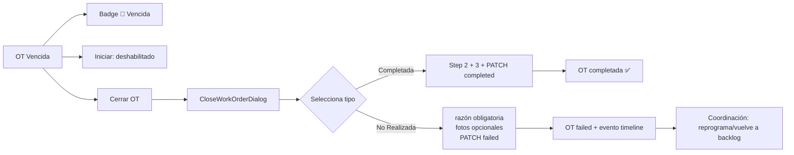

# Plan: Manejo de OTs Vencidas — Integración en Wizard de Cierre

## Análisis

El botón "No Realizada" independiente es incorrecto porque:
1. No captura el **motivo** (requerido para auditoría y coordinación)
2. No pasa por el flujo de coordinación post-cierre (reprogramar, backlog, etc.)
3. Genera un evento en timeline sin contexto

La solución correcta es integrarlo **dentro del wizard** [`CloseWorkOrderDialog`](frontend/src/components/work-orders/CloseWorkOrderDialog.jsx) que ya existe.

## Flujo Propuesto

```
OT Vencida → [Cerrar OT] → Abre CloseWorkOrderDialog
                                    ↓
                           Step 1: Seleccionar tipo de resolución
                                    ↓
                            ┌── Completada (existing)
                            ├── Infraestructura
                            ├── Equipamiento
                            ├── Configuración
                            ├── Otra
                            └── 🟠 No Realizada (NUEVO)
                                    ↓
                    Si "No Realizada" → reason obligatorio (mín 10 chars)
                                      → fotos opcionales
                                      → payload: status: 'failed'
                                    ↓
                           Step 2: Materiales (opcional)
                                    ↓
                           Step 3: Fotos (opcional si "No Realizada")
                                    ↓
                           PATCH → status: completed | failed
```

## Cambios

### 1. CloseWorkOrderDialog.jsx

**Categoría nueva:**
```javascript
{
  value: 'incomplete',
  label: 'No Realizada',
  desc: 'No se pudo completar (cliente ausente, equipo dañado, etc.)',
  color: 'bg-rose-600',
}
```

**Lógica de validación:**
```javascript
const isIncomplete = selectedCategory === 'incomplete';
// Si es "No Realizada", las fotos no son obligatorias
const isStep3Valid = isIncomplete ? true : (requiresPhotoEvidence ? uploadedPhotos.length > 0 : true);
```

**Payload dinámico en handleComplete:**
```javascript
const payload = {
  status: isIncomplete ? 'failed' : 'completed',
  completed_at: new Date().toISOString(),
  resolution_category: selectedCategory,
  resolution_notes: resolutionNotes,
  photo_urls: uploadedPhotos,
};
```

**Título del wizard dinámico:**
- Si es "No Realizada": "Cerrar OT - No Realizada"
- Si no: "Completar Orden de Trabajo"

### 2. WorkOrderExecutionPage.jsx

**Eliminar botón separado "No Realizada":**
- Reemplazar los 3 botones actuales ([Iniciar], [Cerrar OT], [No Realizada]) por solo:
  - [Iniciar] → deshabilitado si vencida
  - [Cerrar OT] → abre CloseWorkOrderDialog (incluye opción "No Realizada")

**Actualizar tooltip:**
```
"OT vencida. Use 'Cerrar OT' para completarla o marcarla como no realizada."
```

## Diagrama



## Checklist

- [ ] Agregar categoría "No Realizada" en CloseWorkOrderDialog
- [ ] Ajustar validación de fotos (opcional si "No Realizada")
- [ ] Ajustar payload (status: failed si "No Realizada")
- [ ] Ajustar título del wizard
- [ ] Eliminar botón "No Realizada" separado de WorkOrderExecutionPage
- [ ] Mantener Badge 🔴 y [Iniciar] deshabilitado
- [ ] Mantener solo [Cerrar OT] para vencidas
