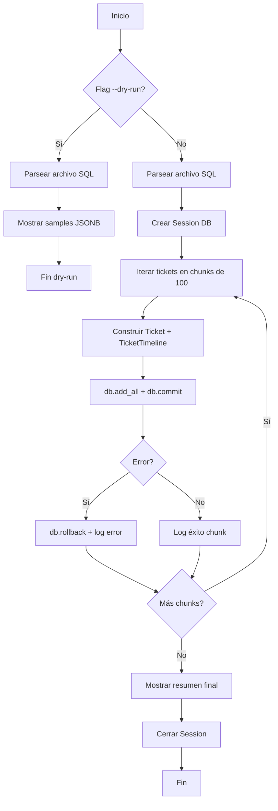
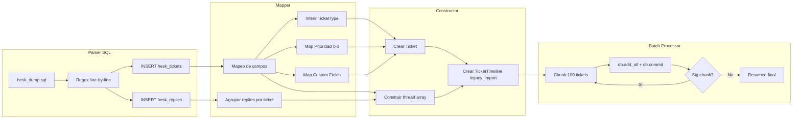

# Plan de Migración Legacy: Hesk → Emerald ERP

## 1. Objetivo

Migrar el historial completo de tickets (~32MB dump) desde el sistema legacy **Hesk** (MySQL/MariaDB) hacia la base de datos PostgreSQL de **Emerald ERP**, preservando toda la información original dentro de estructuras JSONB en la línea de tiempo del ticket.

## 2. Estrategia "Modo Cápsula"

Cada ticket legacy se convierte en **exactamente 2 registros** en Emerald:

| Registro | Descripción |
|----------|-------------|
| `Ticket` | 1 fila con datos mapeados del legacy + estado `closed` |
| `TicketTimeline` | 1 fila con `event_type = "legacy_import"` y `meta_data` JSONB conteniendo toda la data original |

No se crean eventos de timeline individuales por cada reply. Todo el hilo conversacional se empaqueta dentro del JSONB del único evento `legacy_import`.

## 3. Mapeo de Datos

### 3.1 Ticket → Ticket

| Campo Legacy (hesk_tickets) | Campo Emerald (Ticket) | Notas |
|---|---|---|
| `subject` | `subject` | Directo |
| `message` | `description` | Directo |
| `dt` | `created_at` | TimestampMixin lo maneja automáticamente al crear |
| — | `updated_at` | Se setea igual que `created_at` (TimestampMixin) |
| — | `status` | **Siempre `"closed"`** |
| `priority` (0/1/2/3) | `priority` | Mapeo: 0→critical, 1→high, 2→medium, 3→low |
| — | `ticket_type` | Inferido del `subject` y `category` |
| — | `connection_details` | JSONB con datos de contacto |

### 3.2 Mapeo de Prioridad

| Hesk | Emerald |
|------|---------|
| `0` (Critical) | `critical` |
| `1` (High) | `high` |
| `2` (Medium) | `medium` |
| `3` (Low/Normal) | `low` |

### 3.3 Inferencia de TicketType

Se infiere desde el `subject` (mayúsculas sostenidas en los datos reales):

| Palabra clave en subject | TicketType |
|---|---|
| `INSTALACION`, `ALTA`, `NUEVA INSTALACION` | `installation` |
| `BAJA`, `CANCELACION` | `withdrawal` |
| `TRASLADO`, `MUDANZA` | `relocation` |
| `RECLAMO`, `SIN SERVICIO`, `ROTO`, `FALLA`, `LENTITUD` | `technical` |
| `CAMBITO DE TITULAR`, `FACTURA`, `ADMINISTRATIVO` | `administrative` |
| Default | `technical` |

### 3.4 Custom Fields → connection_details

| Campo Legacy | Mapping | Campo connection_details |
|---|---|---|
| `custom1` | Domicilio | `address` |
| `custom2` | Teléfono | `phone` |
| `custom3` | D.N.I. | `client_dni` |
| `custom4` | Barrio | `neighborhood` |
| `custom7` | Localidad | `city` |

### 3.5 Timeline → meta_data JSONB

```jsonc
{
  "legacy_ticket_id": 20,
  "legacy_trackid": "36Z-1WE-49HN",
  "legacy_category": 27,
  "legacy_priority": 3,
  "legacy_status": 3,
  "client_info": {
    "name": "ANDINO IVANA DANIELA",
    "email": "daniandino147@gmail.com",
    "address": "MANUEL CUESTAS",
    "phone": "3544625626 3544629134",
    "dni": "31979872",
    "neighborhood": "BROCHERO LOTEO MORETA",
    "city": "SAN PEDRO"
  },
  "thread": [
    {
      "type": "original",
      "author": "ANDINO IVANA DANIELA",
      "date": "2023-01-20 12:56:14",
      "body": "CLIENTE SOLICTA PLAN DE 50MBPS <br />\nABONA EN EFECTIVO $3000 <br />\nONU EN COMODATO"
    },
    {
      "type": "reply",
      "author": "Agustina",
      "date": "2023-01-24 21:17:44",
      "body": "ONU ENTREGADA<br />\nCUENTA AL DIA.",
      "staff_id": 6
    }
  ],
  "reply_count": 1,
  "staff_reply_count": 1,
  "opened_by": 0,
  "closed_by": null,
  "closed_at": null,
  "time_worked": "00:00:00",
  "history_html": "<!- HTML audit trail ->",
  "legacy_attachments": "file1.jpg,file2.pdf"
}
```

El `thread` se construye así:
1. **Primer elemento**: mensaje original del ticket (`hesk_tickets.message`, `type: "original"`)
2. **Siguientes elementos**: todas las replies de `hesk_replies` donde `replyto = hesk_tickets.id`, ordenadas por `dt` ascendente (`type: "reply"`)

## 4. Arquitectura del Script

### 4.1 Archivo

`scripts/migrate_legacy_tickets.py`

### 4.2 Dependencias

| Módulo | Propósito |
|--------|-----------|
| `sys`, `os`, `re` | Base: CLI args, archivos, regex |
| `argparse` | CLI flags (`--dry-run`, `--apply`, `--chunk-size`) |
| `json` | Construir JSONB para meta_data |
| `typing` | Type hints |
| `sqlalchemy` | Engine, Session, text() |
| `backend.src.database.session` | `SessionLocal` factory |
| `backend.src.models` | `Ticket`, `TicketTimeline` |
| `backend.src.models.tickets` | Enums: `TicketStatus`, `TicketPriority`, `TicketType`, `TicketTimelineEventType` |

### 4.3 Parseador SQL (INSERT line-by-line)

Dado que el dump tiene formato:
```sql
INSERT INTO `hesk_tickets` (col1, col2, ...) VALUES
(val1a, val2a, ...),
(val1b, val2b, ...),
(val1c, val2c, ...);
```

**Estrategia de parsing:**
1. Escanear el archivo línea por línea (32MB, evita cargar todo en memoria)
2. Detectar líneas que comienzan con `INSERT INTO \`hesk_tickets\``
3. Extraer los nombres de columna del primer `(...)`
4. Para cada línea subsiguiente que sea un tuple `(...),` o `(...);`:
   - Parsear usando un tokenizador custom que maneje comillas escapadas, NULLs, y HTML
   - Mapear cada valor a su columna por posición

**El tokenizador debe manejar:**
- Strings entre comillas simples con `\'` escapado
- `NULL` como valor nulo
- Números sin comillas
- Comas dentro de strings (ej: `"ONU ENTREGADA<br />\nCUENTA AL DIA."`)
- Líneas con `),` (continuación) y `);` (fin de INSERT)

Para `hesk_replies` se usa el mismo mecanismo pero detectando `INSERT INTO \`hesk_replies\``.

### 4.4 Chunked Batch Processing

```python
CHUNK_SIZE = 100  # default, configurable via --chunk-size

parsed_tickets = parse_hesk_inserts(filepath)  # generator, no carga todo
chunk = []
for ticket_data in parsed_tickets:
    chunk.append(ticket_data)
    if len(chunk) >= CHUNK_SIZE:
        process_chunk(db, chunk)  # db.add_all + db.commit
        chunk.clear()
if chunk:
    process_chunk(db, chunk)  # último chunk parcial
```

Cada chunk:
1. Crea los objetos `Ticket` y `TicketTimeline` en memoria
2. `db.add_all(tickets + timelines)`
3. `db.commit()`
4. Si hay error: `db.rollback()` + log del error + continúa con el siguiente chunk

### 4.5 Interfaz CLI

```bash
# Modo dry-run: parsea SQL, muestra sample de JSONB, NO inserta
python scripts/migrate_legacy_tickets.py --dry-run

# Modo apply: ejecuta la migración completa
python scripts/migrate_legacy_tickets.py --apply

# Modo apply con chunk size custom
python scripts/migrate_legacy_tickets.py --apply --chunk-size 50

# Modo dry-run con cantidad de samples
python scripts/migrate_legacy_tickets.py --dry-run --samples 5
```

### 4.6 Output Esperado

**Dry-run:**
```
=== MIGRACIÓN LEGACY HESK → EMERALD (DRY-RUN) ===
Archivo fuente: scripts/legacy_data/hesk_dump.sql
Modo: DRY RUN (no se insertarán datos)

Parseando INSERTS...
  ✓ hesk_tickets: 1250 tickets encontrados
  ✓ hesk_replies: 3400 replies encontrados

Muestras de meta_data generado:
--- Ticket #20 (TrackID: 36Z-1WE-49HN) ---
  Subject: INSTALACION TVHD + EXTENSIÓN
  Tipo inferido: installation
  Prioridad mapeada: low
  Thread: 1 original + 1 replies
  JSONB meta_data: (ver snippet abajo)

{
  "legacy_ticket_id": 20,
  "client_info": {
    "name": "ANDINO IVANA DANIELA",
    ...
  },
  "thread": [...]
}

=== RESUMEN DRY-RUN ===
Total tickets a migrar: 1250
Total replies a asociar: 3400
Chunk size: 100 → ~13 batches
¿Desea ejecutar con --apply para proceder?
```

**Apply:**
```
=== MIGRACIÓN LEGACY HESK → EMERALD ===
Modo: APPLY

Chunk 1/13: tickets 1-100... ✓ (commit exitoso)
Chunk 2/13: tickets 101-200... ✓ (commit exitoso)
...
Chunk 13/13: tickets 1201-1250... ✓ (commit exitoso)

=== RESUMEN ===
Total tickets migrados: 1250
Total replies asociadas: 3400
Errores: 0
Duración total: 12.3 segundos
```

## 5. Prerrequisito: Agregar "legacy_import" al Enum

El enum `TicketTimelineEventType` actualmente solo tiene:
```python
class TicketTimelineEventType(StrEnum):
    note = "note"
    alert = "alert"
    ot_event = "ot_event"
    status_change = "status_change"
    file = "file"
```

**Se debe agregar:**
```python
class TicketTimelineEventType(StrEnum):
    note = "note"
    alert = "alert"
    ot_event = "ot_event"
    status_change = "status_change"
    file = "file"
    legacy_import = "legacy_import"  # NUEVO
```

Esto requiere:
1. Editar `backend/src/models/tickets.py` (agregar el valor al enum)
2. Generar una migración de Alembic para reflejar el cambio en la BD:
   ```bash
   cd backend
   alembic revision --autogenerate -m "add_legacy_import_to_timeline_event_type"
   alembic upgrade head
   ```

## 6. Manejo de Errores

Cada chunk se envuelve en try/except:

```python
def process_chunk(db: Session, tickets_data: list) -> dict:
    """Procesa un chunk de tickets. Retorna {ok, count, error}."""
    try:
        tickets = []
        timelines = []
        for data in tickets_data:
            ticket = Ticket(**data["ticket_fields"])
            timeline = TicketTimeline(**data["timeline_fields"])
            tickets.append(ticket)
            timelines.append(timeline)
        db.add_all(tickets + timelines)
        db.commit()
        return {"ok": True, "count": len(tickets_data)}
    except Exception as e:
        db.rollback()
        logger.error(f"Error en chunk: {e}")
        return {"ok": False, "count": 0, "error": str(e)}
```

Casos especiales:
- **Duplicados**: Si un ticket ya fue migrado (mismo legacy_ticket_id en meta_data), se saltea
- **Replies huérfanas**: Si una reply referencia un ticket que no existe en el dump, se omite con log
- **NULLs**: Campos NULL en INSERTs se manejan como Python `None`
- **Strings vacíos**: Se preservan como strings vacíos

## 7. Archivos a Modificar/Crear

| Archivo | Acción | Descripción |
|---------|--------|-------------|
| `scripts/migrate_legacy_tickets.py` | **CREAR** | Script principal ETL |
| `backend/src/models/tickets.py` | **MODIFICAR** | Agregar `legacy_import` al enum |
| `backend/alembic/versions/` | **CREAR** | Migración auto-generada para el nuevo enum value |

## 8. Diagrama de Flujo





## 9. Checklist de Implementación

- [ ] Agregar `legacy_import = "legacy_import"` al enum `TicketTimelineEventType`
- [ ] Generar migración Alembic + `alembic upgrade head`
- [ ] Crear `scripts/migrate_legacy_tickets.py` con:
  - [ ] CLI argparse (--dry-run, --apply, --chunk-size, --samples)
  - [ ] Tokenizador custom para INSERTs single-line
  - [ ] Parseador de hesk_tickets
  - [ ] Parseador de hesk_replies
  - [ ] Mapper hesk → Emerald (campos, prioridad, TicketType, custom fields)
  - [ ] Constructor de thread cronológico
  - [ ] Chunked batch processor con try/except
  - [ ] Logger con progreso
  - [ ] Detector de duplicados (skipea si ya migrado)
- [ ] Probar con `--dry-run` y verificar samples
- [ ] Ejecutar `--apply` en entorno de desarrollo
- [ ] Verificar data migrada en DB
