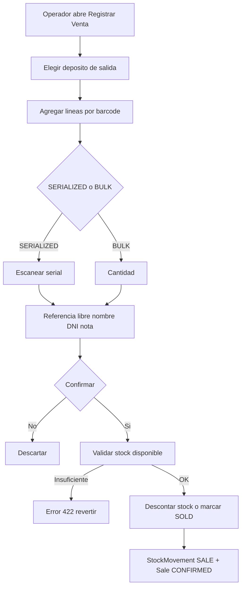

# Plan — Salida de stock por Venta (Punto de Venta, MVP)

## 1. Contexto y alcance (acordado)

El flujo de inventario actual contempla salidas por **CONSUMPTION** (OT),
**TRANSFER** (depósitos), **RECOVERY** y **ADJUSTMENT**. Falta el evento comercial:
**vender un item al público en el local**, que es una salida de stock a cambio de
dinero.

**Alcance de esta etapa (confirmado por el negocio):**

- Solo nos importa la **acción de stock**: si se vende un router inventariado, ese
  router **deja de contar como disponible**.
- **Facturación, ticket, cliente formal, precios y pagos NO son parte de esta etapa.**
  Se manejan en otra herramienta y se incorporarán a Emerald en el futuro.

Por lo tanto el MVP es una **salida de stock por venta**, dejando la puerta abierta
para que mañana se cuelguen factura/cliente/precio sin remodelar.

## 2. Cómo lo manejan los carrier-class

La venta de mostrador es un **goods issue** (salida de mercadería) con un documento
comercial que la respalda. El inventario descuenta stock y queda trazado. La
factura/pago/cliente son capas comerciales que se agregan por encima de ese
movimiento de stock.

## 3. Diseño propuesto

### 3.1 Movimientos de stock

Extender [`MovementType`](../backend/src/models/inventory.py:47):

```text
SALE        = "SALE"          # salida por venta al público
SALE_RETURN = "SALE_RETURN"   # reingreso por devolución (fase 2, barato de dejar listo)
```

### 3.2 Estado de serial vendido

Extender [`SerialItemStatus`](../backend/src/models/inventory.py:37):

```text
SOLD = "SOLD"   # vendido al público, ya no está disponible
```

Con esto, un router SERIALIZED vendido se marca `SOLD` y queda excluido del stock
disponible (hay que asegurar que las consultas de "disponibles" filtren este estado).

### 3.3 Entidades mínimas (ancla para el futuro)

**Sale** — encabezado liviano, SIN precio ni pago ni cliente formal:

```text
id, sale_number        # VTA-YYYY-00001 (para trazabilidad y futura factura)
warehouse_id           # depósito que descuenta (default CENTRAL, elegible)
status                 # CONFIRMED / CANCELLED
reference              # texto libre: nombre/DNI del comprador, ticket externo, etc.
notes
seller_user_id, created_at, updated_at
```

**SaleItem** — línea:

```text
id, sale_id
product_id             # FK -> products
quantity
serial_item_id         # FK nullable -> serial_items (obligatorio si SERIALIZED)
notes
```

### 3.4 Impacto en stock al confirmar una venta

```text
BULK        -> decrementa StockBulk.quantity en warehouse_id
SERIALIZED  -> SerialItem.status = SOLD
Ambos       -> crea StockMovement(movement_type=SALE, from_warehouse=warehouse_id, to_warehouse=NULL)
```

### 3.5 Devolución (fase 2, ya diseñada para no remodelar)

```text
SaleReturn + SaleReturnItem (condición GOOD/DEFECTIVE)
BULK        -> incrementa StockBulk
SERIALIZED  -> SerialItem.status vuelve a NEW/IN_VEHICLE según destino
Ambos       -> StockMovement(movement_type=SALE_RETURN)
```

## 4. Flujo



## 5. Ubicación en la app

- **Sidebar:** nueva entrada **"Ventas"** (o una acción "Salida por venta" dentro de
  Inventario). Recomendado: sección propia "Ventas" para crecer a futuro.
- **Backend:** `routers/sales.py`, `models/sales.py`, `schemas/sales.py`,
  `services/sales_service.py`. Reutiliza `Product`, `Warehouse`, `StockBulk`,
  `SerialItem`, `StockMovement` y `BarcodeScannerEngine`.
- **Frontend:** `pages/sales/SalesPage.jsx` (listado) + `SaleWizard.jsx` (registrar
  venta, reutilizando `BarcodeScanner` y `SerialScanner`).
- **RBAC:** recurso `sales` con acciones `view`/`create`.

**Compatibilidad:** agregado sobre inventario, sin tocar entregas/recepciones/OT.

## 6. Fases

**MVP (ahora):** salida de stock por venta (BULK + SERIALIZED), estado `SOLD`,
movimiento `SALE`, referencia libre, listado de ventas.

**Fase 2 (futuro):** devolución con reembolso, precio por producto + override,
cliente formal (CRM o comercial), pago/caja, comprobante PDF, factura AFIP.

## 7. Puntos a confirmar

1. ¿Creamos la entidad `Sale` liviana desde ya (recomendado, ancla para factura
   futura), o solo el `StockMovement SALE` sin encabezado?
2. ¿La salida es siempre de `CENTRAL`, o dejamos elegir depósito (`CENTRAL`/`AUXILIAR`)?
