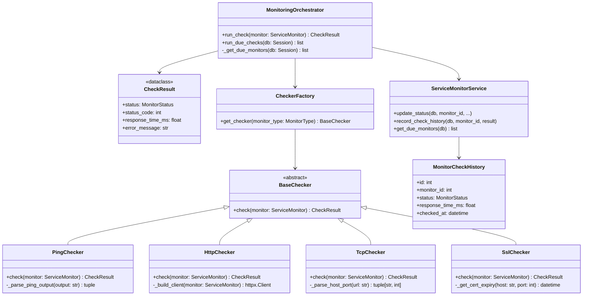

# Plan: Motor de Monitoreo Interno (Monitoring Engine)

## 1. Diagnóstico del Estado Actual

### Lo que existe hoy:
| Componente | Archivo | Estado |
|---|---|---|
| Modelo `ServiceMonitor` | [`backend/src/models/settings.py`](backend/src/models/settings.py:109) | ✅ Completo (todos los campos necesarios) |
| Schemas CRUD | [`backend/src/schemas/settings.py`](backend/src/schemas/settings.py:123) | ✅ Completo |
| CRUD Service | [`backend/src/services/settings_service.py`](backend/src/services/settings_service.py:132) | ✅ Completo (incluye `update_status`) |
| Endpoints REST | [`backend/src/routers/settings.py`](backend/src/routers/settings.py:175) | ✅ CRUD completo |
| Check manual | [`backend/src/routers/settings.py`](backend/src/routers/settings.py:254) | ⚠️ Solo implementa HTTP |
| Frontend UI | [`frontend/src/pages/settings/MonitorsTab.jsx`](frontend/src/pages/settings/MonitorsTab.jsx) | ✅ CRUD + botón "Verificar ahora" |
| Tipos frontend | [`frontend/src/pages/settings/MonitorsTab.jsx`](frontend/src/pages/settings/MonitorsTab.jsx:56) | 🔧 Corregido: `PING`, `HTTP`, `TCP` |

### Lo que falta:
1. **Motor de verificación real** para PING (ICMP) y TCP (socket)
2. **Tarea Celery periódica** que ejecute verificaciones automáticas según `check_interval_seconds`
3. **Verificación SSL** (certificate expiry check)
4. **Historial de checks** para tendencias y gráficos
5. **Indicador de ping en el frontend** — la opción aparece correctamente pero puede requerir hard-refresh

---

## 2. Arquitectura Propuesta

```
┌─────────────────────────────────────────────────────────────┐
│                    Celery Beat (30s tick)                    │
│  monitor_periodic_check_task                                │
└─────────────────────────┬───────────────────────────────────┘
                          │
                          ▼
┌─────────────────────────────────────────────────────────────┐
│              MonitoringOrchestrator                          │
│  get_due_monitors() → for each: run_check()                 │
└─────────────────────────┬───────────────────────────────────┘
                          │
          ┌───────────────┼───────────────┐
          ▼               ▼               ▼
┌─────────────────┐ ┌──────────┐ ┌──────────────┐
│  PingChecker    │ │HttpChecker│ │ TcpChecker   │
│  (subprocess    │ │ (httpx)   │ │ (socket)     │
│   ping -c 1)    │ │           │ │              │
└────────┬────────┘ └────┬─────┘ └──────┬───────┘
         │               │              │
         ▼               ▼              ▼
┌─────────────────────────────────────────────────────────────┐
│              ServiceMonitorService.update_status()          │
│              + MonitorHistoryService.record_check()         │
└─────────────────────────────────────────────────────────────┘
```

### Patrón: Strategy + Factory

Cada tipo de verificación implementa una interfaz común `BaseChecker`:

```python
class BaseChecker(ABC):
    @abstractmethod
    def check(self, monitor: ServiceMonitor) -> CheckResult: ...
```

Un `CheckerFactory` mapea `MonitorType` → `CheckerClass`:

```python
CHECKER_MAP = {
    MonitorType.PING: PingChecker,
    MonitorType.HTTP: HttpChecker,
    MonitorType.TCP: TcpChecker,
    MonitorType.SSL: SslChecker,
}
```

---

## 3. Archivos a Crear

### 3.1 `backend/src/services/monitoring_engine.py`
**Core del motor de monitoreo.** Contiene:

```python
# ─── Data Classes ──────────────────────────────────────────
@dataclass
class CheckResult:
    status: MonitorStatus
    status_code: Optional[int] = None
    response_time_ms: Optional[float] = None
    error_message: Optional[str] = None

# ─── Abstract Base ─────────────────────────────────────────
class BaseChecker(ABC):
    """Interfaz común para todos los checkers."""
    @abstractmethod
    def check(self, monitor: ServiceMonitor) -> CheckResult: ...

# ─── Concrete Checkers ─────────────────────────────────────
class PingChecker(BaseChecker):
    """
    Verificación ICMP Ping.
    Usa subprocess para ejecutar `ping -c 1 -W 5 <host>`.
    Parsea la salida para extraer tiempo de respuesta y estado.
    
    Args:
        monitor.url: IP o hostname (ej: 8.8.8.8, google.com)
    
    Returns:
        UP si packet loss = 0%, DOWN si error o timeout
    """
    ...

class HttpChecker(BaseChecker):
    """
    Verificación HTTP/HTTPS.
    Usa httpx con timeout configurable.
    
    Args:
        monitor.url: URL completa (ej: https://ejemplo.com/health)
        monitor.auth_username / auth_password: Basic Auth opcional
    
    Returns:
        UP si 200 <= status_code < 500
        DEGRADED si 500 <= status_code < 600
        DOWN si timeout, conexión rechazada, etc.
    """
    ...

class TcpChecker(BaseChecker):
    """
    Verificación de puerto TCP.
    Usa socket para intentar conexión TCP al host:puerto.
    
    Args:
        monitor.url: IP:puerto (ej: 192.168.1.1:22)
        Si no tiene puerto, usa puerto por defecto según tipo.
    
    Returns:
        UP si conexión exitosa, DOWN si timeout/rechazado
    """
    ...

class SslChecker(BaseChecker):
    """
    Verificación de certificado SSL.
    Obtiene el certificado via SSL handshake y verifica:
    - Fecha de expiración
    - Cadena de confianza (opcional)
    
    Args:
        monitor.url: hostname:puerto (ej: ejemplo.com:443)
    
    Returns:
        UP si válido y expira en > 30 días
        DEGRADED si expira en <= 30 días
        DOWN si expirado o error de conexión
    """
    ...

# ─── Factory ───────────────────────────────────────────────
CHECKER_REGISTRY: dict[MonitorType, type[BaseChecker]] = {
    MonitorType.PING: PingChecker,
    MonitorType.HTTP: HttpChecker,
    MonitorType.TCP: TcpChecker,
    MonitorType.SSL: SslChecker,
}

def get_checker(monitor_type: MonitorType) -> BaseChecker:
    """Obtiene el checker apropiado para el tipo de monitor."""
    checker_cls = CHECKER_REGISTRY.get(monitor_type)
    if not checker_cls:
        raise ValueError(f"Tipo de monitor no soportado: {monitor_type}")
    return checker_cls()

# ─── Orchestrator ──────────────────────────────────────────
class MonitoringOrchestrator:
    """
    Orquestador central de monitoreo.
    
    Responsabilidades:
    1. Consultar DB por monitores activos que necesitan verificación
    2. Ejecutar el checker apropiado para cada uno
    3. Actualizar estado en DB via ServiceMonitorService
    4. Registrar resultados en MonitorHistory (si existe)
    """
    
    @staticmethod
    def get_due_monitors(db: Session) -> list[ServiceMonitor]:
        """
        Retorna monitores activos cuyo check_interval haya vencido.
        
        SQL: WHERE is_active = true 
             AND (last_checked_at IS NULL 
                  OR last_checked_at + interval 'X seconds' <= NOW())
        """
        ...
    
    @staticmethod
    def run_check(monitor: ServiceMonitor) -> CheckResult:
        """Ejecuta la verificación para un monitor."""
        ...
    
    @classmethod
    def run_due_checks(cls, db: Session) -> list[tuple[ServiceMonitor, CheckResult]]:
        """Ejecuta verificaciones para todos los monitores pendientes."""
        ...
```

### 3.2 `backend/src/jobs/monitoring.py`
**Tarea Celery para monitoreo periódico.**

```python
@celery_app.task(name="monitoring.periodic_check", bind=True)
def monitor_periodic_check(self):
    """
    Tarea periódica de Celery Beat.
    Se ejecuta cada 30 segundos.
    
    Flujo:
    1. Obtiene DB session
    2. Llama a MonitoringOrchestrator.run_due_checks()
    3. Para cada resultado, actualiza estado en DB
    4. Registra en log los cambios de estado (UP→DOWN, DOWN→UP)
    """
    ...
```

### 3.3 `backend/src/models/monitor_history.py`
**Modelo opcional para historial de checks.**

```python
class MonitorCheckHistory(Base):
    """
    Historial de verificaciones de monitores.
    
    Permite:
    - Ver tendencias de tiempo de respuesta
    - Calcular uptime/downtime %
    - Generar gráficos históricos
    - Auditoría de cambios de estado
    
    Retención sugerida: 90 días (configurable)
    Se limpia via tarea periódica.
    """
    __tablename__ = "monitor_check_history"
    
    id: int
    monitor_id: int (FK → service_monitors.id)
    status: MonitorStatus
    status_code: Optional[int]
    response_time_ms: Optional[float]
    error_message: Optional[str]
    checked_at: datetime (indexado)
    
    # Relationship
    monitor: relationship → ServiceMonitor
```

---

## 4. Archivos a Modificar

### 4.1 `backend/src/routers/settings.py`
**Refactor del endpoint `/monitors/{id}/check`**

**Antes:** Lógica de verificación directa en el router (solo HTTP, código duplicado)

**Después:** Router delega en `MonitoringOrchestrator.run_check()`:
```python
@router.post("/monitors/{monitor_id}/check", response_model=MonitorCheckResult)
def check_monitor(...):
    monitor = ServiceMonitorService.get_by_id(db, monitor_id)
    if not monitor:
        raise 404
    
    result = MonitoringOrchestrator.run_check(monitor)
    ServiceMonitorService.update_status(
        db, monitor_id, result.status,
        status_code=result.status_code,
        response_time_ms=result.response_time_ms,
        error_message=result.error_message,
    )
    db.refresh(monitor)
    return MonitorCheckResult(
        monitor_id=monitor.id,
        label=monitor.label,
        status=monitor.last_status,
        ...
    )
```

### 4.2 `backend/src/celery_app.py`
**Agregar tarea de monitoreo al beat schedule.**

```python
# Incluir el módulo de monitoreo
celery_app = Celery(
    ...,
    include=[
        "src.jobs.sync",
        "src.jobs.api_key_rotation",
        "src.jobs.work_order_cleanup",
        "src.jobs.monitoring",  # 👈 NUEVO
    ]
)

# La tarea periódica se agrega al beat_schedule dinámico
# O se agrega al STATIC_BEAT_SCHEDULE como fallback
```

### 4.3 `backend/src/services/settings_service.py`
**Agregar `ServiceMonitorService.get_due_monitors()`**

```python
@staticmethod
def get_due_monitors(db: Session) -> list[ServiceMonitor]:
    """
    Retorna monitores activos cuya verificación esté vencida.
    
    Usa SQL directo para la comparación temporal:
    last_checked_at IS NULL 
    OR (last_checked_at + make_interval(secs => check_interval_seconds)) <= NOW()
    """
    cutoff = datetime.now(timezone.utc)
    stmt = select(ServiceMonitor).where(
        ServiceMonitor.is_active == True,
        or_(
            ServiceMonitor.last_checked_at == None,
            ServiceMonitor.last_checked_at + text(
                "make_interval(secs => :interval)"
            ).bindparams(interval=...)...  ← Ver sintaxis PostgreSQL
        )
    )
```

### 4.4 `backend/requirements.txt`
**Agregar dependencias (si es necesario):**

Actualmente no se requieren nuevas dependencias:
- **Ping:** Usa `subprocess` con `ping -c 1` (comando del sistema)
- **HTTP:** `httpx` ya está instalado
- **TCP:** `socket` es parte de la stdlib de Python
- **SSL:** `ssl` es parte de la stdlib de Python

---

## 5. Migración de Base de Datos

### 5.1 Nueva migración: `add_monitor_check_history`

```python
revision = "2026_05_23_003"
down_revision = "2026_05_23_002"

def upgrade():
    op.create_table(
        "monitor_check_history",
        sa.Column("id", sa.Integer, primary_key=True),
        sa.Column("monitor_id", sa.Integer, 
                  sa.ForeignKey("service_monitors.id", ondelete="CASCADE"),
                  nullable=False, index=True),
        sa.Column("status", sa.Enum(MonitorStatus), nullable=False),
        sa.Column("status_code", sa.Integer, nullable=True),
        sa.Column("response_time_ms", sa.Float, nullable=True),
        sa.Column("error_message", sa.Text, nullable=True),
        sa.Column("checked_at", sa.DateTime(timezone=True), 
                  nullable=False, index=True),
    )
    op.create_index(
        "idx_monitor_history_lookup",
        "monitor_check_history",
        ["monitor_id", "checked_at"],
    )

def downgrade():
    op.drop_table("monitor_check_history")
```

### 5.2 Tarea de limpieza (opcional)
Agregar a la tabla `scheduled_tasks` una tarea que limpie registros > 90 días.

---

## 6. Flujo Completo

```
┌─────────────┐     ┌──────────────────┐     ┌──────────────────┐
│   Usuario   │     │  Frontend UI     │     │  Backend API     │
│             │     │  MonitorsTab     │     │  /settings       │
└──────┬──────┘     └────────┬─────────┘     └────────┬─────────┘
       │                     │                        │
       │  Crea monitor       │                        │
       │  (PING, 8.8.8.8)   │                        │
       ├────────────────────►│                        │
       │                     │  POST /monitors        │
       │                     ├───────────────────────►│
       │                     │                        │
       │                     │    201 Created         │
       │                     │◄───────────────────────┤
       │  Ver monitor creado │◄───────────────────────┤
       │◄────────────────────┤                        │
       │                     │                        │
       │                     │                        │
       │  ═══ Celery Beat cada 30s ═══               │
       │                     │                        │
       │                     │          ┌─────────────┴──────────┐
       │                     │          │ MonitoringOrchestrator │
       │                     │          │ get_due_monitors()     │
       │                     │          │ → [monitor PING]       │
       │                     │          │ PingChecker.check()    │
       │                     │          │ → "ping -c 1 8.8.8.8" │
       │                     │          │ → UP, 12.3ms           │
       │                     │          │ update_status(UP)      │
       │                     │          └────────────────────────┘
       │                     │                        │
       │  ═══ Manual check ═══                        │
       │                     │                        │
       │  Click "Verificar"   │                        │
       ├────────────────────►│                        │
       │                     │  POST /monitors/1/check│
       │                     ├───────────────────────►│
       │                     │  MonitoringOrchestrator│
       │                     │  .run_check(monitor)   │
       │                     │  → PingChecker.check() │
       │                     │  → UP, 10.5ms          │
       │                     │  update_status(UP, 10.5)│
       │                     │◄───────────────────────┤
       │  ✅ Estado actualizado│◄──────────────────────┤
       │◄────────────────────┤                        │
```

---

## 7. Mockup del Frontend (mejoras)

### Estado actual después de correcciones:
```
┌─────────────────────────────────────────────────────────┐
│ [Nuevo Monitor]                                          │
│                                                          │
│ Etiqueta: [                          ]                   │
│                                                          │
│ URL: [8.8.8.8                    ] Tipo: [Ping ▼]        │
│                                                          │
│ Criticidad: [2 - Media ▼]  Intervalo: [300s ▼]          │
│                                                          │
│ Color: #22c55e  🟢 🟡 🟠 🔴 🔵 🟣 🔵 🩷               │
│                                                          │
│ ☑ Monitor activo                                         │
│                                                          │
│ Autenticación (opcional)                                 │
│ Usuario: [    ]  Contraseña: [    ]                      │
│                                                          │
│ Notas: [                              ]                   │
│                                                          │
│              [Cancelar]  [Crear Monitor]                 │
└─────────────────────────────────────────────────────────┘
```

### Mejoras propuestas para el frontend:
1. **Visual indicator de estado** en la tabla — ya existe
2. **Columna de tendencia** (últimos N checks) — requiere historial
3. **Quick filters** por tipo/criticidad/estado
4. **Bulk actions** (activar/desactivar varios)

---

## 8. Orden de Implementación

| # | Tarea | Archivos | Dependencias |
|---|-------|----------|-------------|
| 1 | Crear `monitoring_engine.py` con BaseChecker + PingChecker + HttpChecker + TcpChecker + Factory + Orchestrator | `backend/src/services/monitoring_engine.py` | Ninguna |
| 2 | Refactor router check endpoint para usar el engine | `backend/src/routers/settings.py` | #1 |
| 3 | Crear `MonitorCheckHistory` model + migración | `backend/src/models/monitor_history.py`, migración `2026_05_23_003` | Ninguna |
| 4 | Agregar `ServiceMonitorService.record_check_history()` | `backend/src/services/settings_service.py` | #3 |
| 5 | Crear `jobs/monitoring.py` con tarea Celery periódica | `backend/src/jobs/monitoring.py` | #1, #4 |
| 6 | Registrar tarea en `celery_app.py` (include + beat_schedule) | `backend/src/celery_app.py` | #5 |
| 7 | Verificar build frontend + backend | — | #1-#6 |

---

## 9. Diagrama de Clases



---

## 10. Consideraciones

### Rendimiento
- **Pool de workers Celery**: La tarea de monitoreo debe tener `soft_time_limit` y `hard_time_limit` para evitar que un monitor colgado bloquee el worker
- **Concurrencia**: Si hay muchos monitores, la tarea puede ejecutar checks en paralelo usando `gevent` o `asyncio`
- **Timeouts**: Ping = 5s, HTTP = 30s (o `check_interval_seconds`), TCP = 5s

### Seguridad
- **Ping con subprocess**: Validar que el `url` no contenga caracteres peligrosos (shell injection). Usar `shlex.quote()` o pasar argumentos como lista
- **TCP socket**: No permite injection, solo IP+puerto
- **Contraseñas**: Ya se almacenan hasheadas con bcrypt

### Escalabilidad
- **Nuevos checkers**: Solo crear nueva clase que herede de `BaseChecker` y registrarla en `CHECKER_REGISTRY`
- **No requiere nuevas dependencias de Python** — todo usa stdlib o librerías ya instaladas

### Sobre el Ping (respuesta al usuario)
La opción **Ping** SÍ está disponible en el frontend después de la corrección. Si no se ve, puede ser necesario:
1. **Hard refresh** del navegador (Ctrl+Shift+R / Cmd+Shift+R) para limpiar cache de Vite
2. Verificar que el build se haya desplegado correctamente

---

## 11. Resumen de Cambios

### Archivos Nuevos
| Archivo | Propósito |
|---------|-----------|
| `backend/src/services/monitoring_engine.py` | Motor de verificación: checkers + orchestrator |
| `backend/src/jobs/monitoring.py` | Tarea Celery periódica |
| `backend/src/models/monitor_history.py` | Modelo de historial de checks |
| `backend/alembic/versions/2026_05_23_003_add_monitor_check_history.py` | Migración para historial |

### Archivos a Modificar
| Archivo | Cambio |
|---------|--------|
| `backend/src/routers/settings.py` | Refactor check endpoint para usar engine |
| `backend/src/services/settings_service.py` | Agregar `get_due_monitors()`, `record_check_history()` |
| `backend/src/celery_app.py` | Agregar `src.jobs.monitoring` al include y beat schedule |
| `backend/src/schemas/settings.py` | Opcional: agregar schema para historial |

### Dependencias Nuevas
Ninguna. Todo se implementa con stdlib + `httpx` (ya instalado).

---

**Nota:** El plan asume que el frontend ya está corregido para mostrar las opciones `PING`, `HTTP`, `TCP`. Si persiste el problema visual, puede requerir un hard refresh o verificar que el build de producción se haya regenerado.
