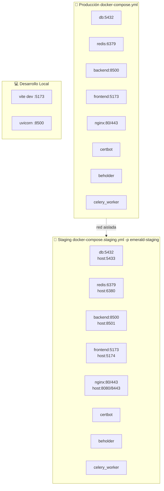
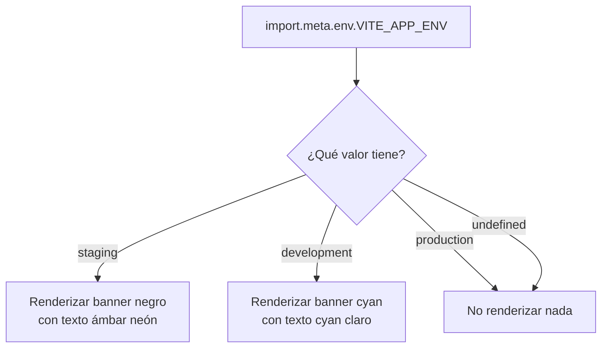
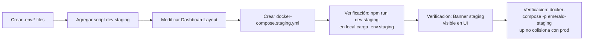

# PLAN: Infraestructura Multi-Entorno (Producción, Staging, Desarrollo)

## Objetivo

Preparar la infraestructura y la UI para soportar múltiples entornos (Producción, Staging, Desarrollo) garantizando una paridad 1:1 entre Staging y Producción.

---

## Arquitectura General



**Principio clave:** Docker Compose con flag `-p emerald-staging` crea una red Docker aislada automáticamente. Los nombres de servicio (`db`, `redis`, `backend`) se resuelven correctamente dentro de la red de staging sin colisionar con producción.

---

## 1. Variables de Entorno Frontend

### Mecanismo

Vite usa [`loadEnv(mode, process.cwd(), '')`](frontend/vite.config.js:9) que carga automáticamente `.env.{mode}` según el `mode` pasado a `defineConfig`:

| Comando | `mode` | Archivo cargado |
|---------|--------|-----------------|
| `npm run dev` | `development` | `.env.development` |
| `npm run build` | `production` | `.env.production` |
| `vite --mode staging` | `staging` | `.env.staging` |

### Archivos a crear

#### [`frontend/.env.development`](frontend/.env.development)

```bash
# Entorno: Desarrollo Local
VITE_APP_ENV=development
VITE_API_URL=http://localhost:8500/api/v2
```

#### [`frontend/.env.staging`](frontend/.env.staging)

```bash
# Entorno: Staging
VITE_APP_ENV=staging
VITE_API_URL=/api/v2
```

#### [`frontend/.env.production`](frontend/.env.production)

```bash
# Entorno: Producción
VITE_APP_ENV=production
VITE_API_URL=/api/v2
```

### Script npm para staging

Se agrega en [`frontend/package.json:7`](frontend/package.json:7):

```json
"scripts": {
  "dev": "vite",
  "dev:staging": "vite --mode staging --host",
  "build": "vite build",
  ...
}
```

---

## 2. Indicador Visual de Entorno (Banner)

### Punto de Inserción

En [`frontend/src/layouts/DashboardLayout.jsx:25`](frontend/src/layouts/DashboardLayout.jsx:25), dentro del contenedor `flex flex-col flex-1`, justo ANTES del `<header>`.

### Código Propuesto

Se agrega un componente condicional después de la apertura del `div flex flex-col flex-1` (línea 25) y antes del `<header>` (línea 27):

```jsx
{/* Environment Banner */}
{(() => {
  const env = import.meta.env.VITE_APP_ENV;
  if (env === 'staging') {
    return (
      <div className="w-full bg-black px-4 py-2 text-center">
        <span className="font-bold font-mono text-amber-500 text-sm tracking-wide">
          ⚠️ ENTORNO DE STAGING - DATOS DE PRUEBA ⚠️
        </span>
      </div>
    );
  }
  if (env === 'development') {
    return (
      <div className="w-full bg-cyan-950/80 px-4 py-2 text-center border-b border-cyan-800">
        <span className="font-bold font-mono text-cyan-400 text-sm tracking-wide">
          ⚙️ ENTORNO DE DESARROLLO (LOCAL)
        </span>
      </div>
    );
  }
  return null;
})()}
```

**Efecto visual:**
- **production** (o indefinido): No se renderiza nada → sin cambios visuales.
- **staging**: Barra negra horizontal completa con texto ámbar neón, tipografía monospace bold.
- **development**: Barra cyan oscuro translúcida con texto cyan claro.

**Por qué no rompe el layout:**
- Se inserta dentro del `flex flex-col flex-1` → ocupa su propio espacio vertical sin afectar sidebar ni topbar.
- Usa `w-full` + `text-center` → no interfiere con el header que está debajo.
- El banner empuja el contenido hacia abajo pero no superpone nada.

### Diagrama de flujo del banner



---

## 3. Infraestructura Docker Compose Staging

### Estrategia de Aislamiento

| Aspecto | Solución |
|---------|----------|
| Red Docker | Usar `docker-compose -p emerald-staging -f docker-compose.staging.yml up` → red aislada `emerald-staging_default` |
| Datos PostgreSQL | Volumen separado `postgres_data_staging` |
| Base de datos | `POSTGRES_DB=emerald_staging` |
| Puertos host | Offsets: 5433, 6380, 8501, 5174 |
| Nombres contenedor | Sufijo `_staging` |
| Nombres servicio | **Se mantienen igual** (resolución DNS funciona por red Docker aislada) |

### [`docker-compose.staging.yml`](docker-compose.staging.yml)

```yaml
services:
  # 1. Base de Datos Staging
  db:
    image: postgres:15-alpine
    container_name: emerald_db_staging
    restart: always
    environment:
      POSTGRES_USER: ${POSTGRES_USER}
      POSTGRES_PASSWORD: ${POSTGRES_PASSWORD}
      POSTGRES_DB: emerald_staging
    healthcheck:
      test: ["CMD-SHELL", "pg_isready -U $$POSTGRES_USER -d emerald_staging"]
      interval: 5s
      timeout: 5s
      retries: 5
    volumes:
      - postgres_data_staging:/var/lib/postgresql/data
    ports:
      - "127.0.0.1:5433:5432"

  # 2. Backend Staging
  backend:
    build: ./backend
    container_name: emerald_backend_staging
    restart: always
    ports:
      - "8501:8500"
    environment:
      DATABASE_URL: postgresql://${POSTGRES_USER}:${POSTGRES_PASSWORD}@db:5432/emerald_staging
      TZ: America/Argentina/Buenos_Aires
    depends_on:
      db:
        condition: service_healthy
    volumes:
      - ./backend:/app
    env_file:
      - .env

  # 3. Frontend Staging
  frontend:
    build:
      context: ./frontend
      dockerfile: Dockerfile
    container_name: emerald_frontend_staging
    restart: always
    ports:
      - "5174:5173"
    volumes:
      - ./frontend:/app
      - /app/node_modules
    environment:
      - VITE_API_URL=${VITE_API_URL:-/api}
      - INTERNAL_API_URL=http://backend:8500
      - CHOKIDAR_USEPOLLING=true
      - VITE_APP_ENV=staging
    command: ["npm", "run", "dev:staging", "--", "--host"]
    depends_on:
      - backend

  # 4. Nginx Staging
  nginx:
    image: nginx:alpine
    container_name: emerald_nginx_staging
    restart: unless-stopped
    ports:
      - "8080:80"
      - "8443:443"
    volumes:
      - ./nginx/default.conf:/etc/nginx/conf.d/default.conf
      - ./nginx/login-test.html:/etc/nginx/login-test.html
      - ./data/certbot/conf:/etc/letsencrypt
      - ./data/certbot/www:/var/www/certbot
    depends_on:
      - frontend
      - backend

  # 5. Certbot Staging
  certbot:
    image: certbot/certbot
    container_name: emerald_certbot_staging
    volumes:
      - ./data/certbot/conf:/etc/letsencrypt
      - ./data/certbot/www:/var/www/certbot
    entrypoint: "/bin/sh -c 'trap exit TERM; while :; do certbot renew --webroot -w /var/www/certbot; sleep 12h & wait $${!}; done;'"

  # 6. Beholder UI Staging
  beholder:
    build:
      context: ./beholder_frontend
      dockerfile: Dockerfile
    container_name: emerald_beholder_staging
    restart: always
    environment:
      - VITE_API_URL=${BEHOLDER_API_URL:-/api}
      - VITE_API_KEY=${BEHOLDER_API_KEY}
    volumes:
      - ./beholder_frontend:/app
      - /app/node_modules
    depends_on:
      - backend

  # 7. Redis Staging
  redis:
    image: redis:alpine
    container_name: emerald_redis_staging
    restart: always
    ports:
      - "127.0.0.1:6380:6379"
    healthcheck:
      test: ["CMD", "redis-cli", "ping"]
      interval: 5s
      timeout: 3s
      retries: 5

  # 8. Celery Worker Staging
  celery_worker:
    build: ./backend
    container_name: emerald_worker_staging
    restart: always
    command: celery -A src.celery_app worker --beat --loglevel=info
    volumes:
      - ./backend:/app
    env_file:
      - .env
    environment:
      - DATABASE_URL=postgresql://${POSTGRES_USER}:${POSTGRES_PASSWORD}@db:5432/emerald_staging
      - CELERY_BROKER_URL=redis://redis:6379/0
      - CELERY_RESULT_BACKEND=redis://redis:6379/0
      - TZ=America/Argentina/Buenos_Aires
    depends_on:
      redis:
        condition: service_healthy
      db:
        condition: service_healthy
      backend:
        condition: service_started

volumes:
  postgres_data_staging:
```

### Mapa de puertos

| Servicio | Producción | Staging | Diferencia |
|----------|-----------|---------|------------|
| PostgreSQL | `5432` | `5433` | +1 |
| Redis | `6379` | `6380` | +1 |
| Backend API | `8500` | `8501` | +1 |
| Frontend Vite | `5173` | `5174` | +1 |
| Nginx HTTP | `80` | `8080` | +8000 |
| Nginx HTTPS | `443` | `8443` | +8000 |

### Red Docker — Aislamiento automático

Al ejecutar el stack de staging con:

```bash
docker-compose -p emerald-staging -f docker-compose.staging.yml up -d
```

Docker crea:
- Red: `emerald-staging_default`
- Los servicios se resuelven por nombre: `db`, `redis`, `backend`, etc.
- **No hay colisión** con el stack de producción aunque usen los mismos nombres de servicio porque están en redes Docker diferentes.

---

## 4. Frontend Dockerfile — Modificación

El [`frontend/Dockerfile`](frontend/Dockerfile) actualmente usa `CMD ["npm", "run", "dev", "--", "--host"]`. Para staging, el `command` se overrádea en `docker-compose.staging.yml` con:

```yaml
command: ["npm", "run", "dev:staging", "--", "--host"]
```

No se requiere modificar el Dockerfile base — el `command` en docker-compose tiene prioridad sobre el `CMD` del Dockerfile.

---

## 5. Resumen de Archivos a Crear/Modificar

| Archivo | Acción | Descripción |
|---------|--------|-------------|
| [`frontend/.env.development`](frontend/.env.development) | **Crear** | `VITE_APP_ENV=development`, API local |
| [`frontend/.env.staging`](frontend/.env.staging) | **Crear** | `VITE_APP_ENV=staging`, API `/api/v2` |
| [`frontend/.env.production`](frontend/.env.production) | **Crear** | `VITE_APP_ENV=production`, API `/api/v2` |
| [`frontend/package.json`](frontend/package.json:7) | **Modificar** | Agregar script `dev:staging` |
| [`frontend/src/layouts/DashboardLayout.jsx`](frontend/src/layouts/DashboardLayout.jsx:25) | **Modificar** | Insertar banner de entorno |
| [`docker-compose.staging.yml`](docker-compose.staging.yml) | **Crear** | Réplica exacta con offsets y sufijos |

---

## 6. Verificación Post-Implementación



1. **Local:** `npm run dev` → banner "ENTORNO DE DESARROLLO (LOCAL)" visible.
2. **Local staging:** `npm run dev:staging` → banner "ENTORNO DE STAGING" visible.
3. **Docker staging:** `docker-compose -p emerald-staging -f docker-compose.staging.yml up -d` → contenedores con sufijo `_staging`, puertos offset, datos aislados.
4. **Docker producción:** `docker-compose up -d` → sin cambios, sin banner.

---

## 7. Ejecución del Stack de Staging

```bash
# Iniciar staging
docker-compose -p emerald-staging -f docker-compose.staging.yml up -d

# Ver contenedores
docker ps --filter "name=staging"

# Logs
docker-compose -p emerald-staging -f docker-compose.staging.yml logs -f

# Detener staging
docker-compose -p emerald-staging -f docker-compose.staging.yml down -v
```
