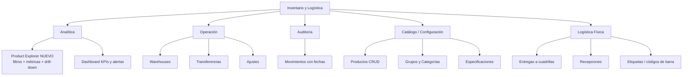

# Plan: Product Explorer + Reorganización de Pantallas de Inventario/Logística

**Objetivo:** disponer de una pantalla de exploración/analítica de productos con filtros suficientes para leer el flujo de items en cualquier dirección (consumido, en stock, comprado, por grupo, tipo, nombre), y reorganizar el módulo de inventario/logística con criterio carrier-class.

---

## 1. Diagnóstico del estado actual

### 1.1 Lo que ya existe (sólido)
- Modelo de datos rico en [`backend/src/models/inventory.py`](backend/src/models/inventory.py:1):
  - Catálogo: [`Product`](backend/src/models/inventory.py:238) (BULK/SERIALIZED, grupo, categoría, compuesto, regex de seriales), [`ProductGroup`](backend/src/models/inventory.py:129), [`ProductCategory`](backend/src/models/inventory.py:91), [`ProductSpec`](backend/src/models/inventory.py:342).
  - Stock: [`StockBulk`](backend/src/models/inventory.py:383) y [`SerialItem`](backend/src/models/inventory.py:432) (estados NEW / IN_VEHICLE / INSTALLED / DEFECTIVE / DAMAGED / DECOMMISSIONED).
  - Flujo: [`StockMovement`](backend/src/models/inventory.py:523) (PURCHASE / TRANSFER / CONSUMPTION / RECOVERY / ADJUSTMENT), [`ConsumptionLog`](backend/src/models/inventory.py:663), [`ConnectionAsset`](backend/src/models/inventory.py:878).
- Endpoints CRUD y operativos completos en [`backend/src/routers/inventory.py`](backend/src/routers/inventory.py:84) y [`backend/src/routers/logistics.py`](backend/src/routers/logistics.py:148).

### 1.2 Gaps detectados (lo que falta para analítica)
1. [`ProductResponse`](backend/src/schemas/inventory.py:100) **no incluye métricas de flujo**: no dice cuánto hay en stock, cuánto se compró, cuánto se consumió, cuántos seriales hay por estado.
2. [`list_products`](backend/src/routers/inventory.py:561) filtra por `type`, `category`, `search`, `group_id`, pero **no** por estado de flujo ni por almacén.
3. [`list_stock_movements`](backend/src/routers/inventory.py:1149) acepta `product_id`, `warehouse_id`, `movement_type`, `limit`, `offset`, pero **no acepta `start_date`/`end_date`**. El frontend [`MovementsHistory.jsx`](frontend/src/pages/inventory/MovementsHistory.jsx:68) envía esas fechas y el backend las ignora (filtro roto).
4. No existe una pantalla que cruce **producto ↔ stock ↔ movimientos** en una sola vista. Hoy hay que saltar entre [`ProductCatalog`](frontend/src/pages/inventory/ProductCatalog.jsx:26), [`WarehouseDetail`](frontend/src/pages/inventory/WarehouseDetail.jsx:1), [`MovementsHistory`](frontend/src/pages/inventory/MovementsHistory.jsx:12) y [`InventoryDashboard`](frontend/src/pages/inventory/InventoryDashboard.jsx:1).

---

## 2. Visión objetivo (Information Architecture)

Idea clave: **una pantalla "leé la base en cualquier dirección"** (Product Explorer) que pivote por producto, con columnas agregadas de flujo y drill-down a seriales/movimientos.

---

## 3. Cambios de Backend

### 3.1 Nuevo endpoint analítico
`GET /v2/inventory/products/analytics`

Query params:
- `search` (nombre o SKU)
- `type` (BULK / SERIALIZED)
- `group_id`
- `category`
- `warehouse_id` (stock en un almacén puntual)
- `flow` — estado de flujo: `in_stock`, `consumed`, `purchased`, `transferred`, `installed`, `defective`, `damaged`, `decommissioned`
- `below_min_stock` (boolean, solo productos bajo alerta)
- `limit` / `offset` / `order_by` / `order_dir`

Respuesta por producto (nuevo schema `ProductAnalyticsItem`):
- datos de catálogo: `id`, `name`, `sku`, `type`, `category`, `group_name`, `specs`, `unit_measure`
- stock bulk: `bulk_in_stock` (suma `stock_bulk.quantity`)
- seriales por estado: `serial_new`, `serial_in_vehicle`, `serial_installed`, `serial_defective`, `serial_damaged`, `serial_decommissioned`, `serial_total`
- flujo acumulado: `total_purchased`, `total_consumed`, `total_transferred`, `total_recovered`, `total_adjusted` (agregados sobre `stock_movements`)
- `min_stock_alert`, `below_min_stock`

Implementación: una sola query SQL con agregación (o SQLAlchemy `func` + subqueries), evitando el patrón N+1 documentado en [`ANALISIS_PERFORMANCE_INVENTARIO.md`](docs/ANALISIS_PERFORMANCE_INVENTARIO.md:12).

### 3.2 Arreglar filtro de fechas en movimientos
Agregar `start_date` y `end_date` a [`list_stock_movements`](backend/src/routers/inventory.py:1149), aplicando `StockMovement.date >= start_date` y `<= end_date`. Así el frontend existente deja de "ignorar" el filtro.

### 3.3 (Opcional) Drill-down
`GET /v2/inventory/products/{product_id}/flow` → seriales agrupados por estado + últimos N movimientos del producto. Alimenta el panel de detalle del explorer.

---

## 4. Cambios de Frontend

### 4.1 Nueva pantalla Product Explorer
Nuevo [`frontend/src/pages/inventory/ProductExplorer.jsx`](frontend/src/pages/inventory/ProductExplorer.jsx:1):
- Barra de filtros: búsqueda, tipo, grupo, categoría, estado de flujo (chips: En stock / Comprado / Consumido / Instalado / Defectuoso / Dañado), almacén, toggle "solo bajo alerta".
- Tabla con columnas: Producto (nombre/SKU/grupo), Tipo, En stock, Comprado, Consumido, Transferido, Instalados, Defectuosos, Alerta.
- Ordenar por cualquier columna.
- Click en fila → panel lateral / ruta de detalle con seriales y timeline de movimientos.
- Botón exportar CSV (para análisis de negocio externo).

### 4.2 Reorganizar navegación
Registrar en [`App.jsx`](frontend/src/App.jsx:91) la ruta `/app/inventory/explorer` y agrupar el menú lateral (en `DashboardLayout`) en las 5 secciones de la IA: Analítica, Operación, Auditoría, Catálogo, Logística física.

### 4.3 Ajustes menores
- [`MovementsHistory.jsx`](frontend/src/pages/inventory/MovementsHistory.jsx:68) ya envía fechas; quedará funcional al arreglar el backend.
- Mantener [`ProductCatalog`](frontend/src/pages/inventory/ProductCatalog.jsx:26) como CRUD (alta/baja/edición/especificaciones), enlazado desde el explorer.

---

## 5. Plan de implementación por fases

### Fase A — Backend analítico
- [ ] Crear schema `ProductAnalyticsItem` en [`backend/src/schemas/inventory.py`](backend/src/schemas/inventory.py:100)
- [ ] Crear endpoint `GET /v2/inventory/products/analytics` en [`backend/src/routers/inventory.py`](backend/src/routers/inventory.py:561)
- [ ] Agregar `start_date`/`end_date` a [`list_stock_movements`](backend/src/routers/inventory.py:1149)
- [ ] Tests de agregación (sin N+1, filtros correctos)

### Fase B — Product Explorer frontend
- [ ] Crear [`ProductExplorer.jsx`](frontend/src/pages/inventory/ProductExplorer.jsx:1) con filtros + tabla + orden + drill-down
- [ ] Agregar `getProductsAnalytics()` en [`inventory.service.js`](frontend/src/services/inventory.service.js:1)
- [ ] Ruta en [`App.jsx`](frontend/src/App.jsx:91)

### Fase C — Reorganización de navegación
- [ ] Agrupar menú de inventario/logística en las 5 secciones
- [ ] Enlazar explorer ↔ catálogo ↔ movimientos ↔ almacenes

### Fase D — Exportación y pulido
- [ ] Exportar CSV desde el explorer
- [ ] Validación visual con datos reales y revisión de performance

---

## 6. Criterio de éxito
- Un operador puede responder sin SQL: "¿cuánto stock tengo de X grupo?", "¿qué se consumió más este mes?", "¿qué compré y no se movió?", "¿cuántos seriales defectuosos hay por producto?".
- La pantalla responde en una sola vista, sin saltar entre 4 páginas.
