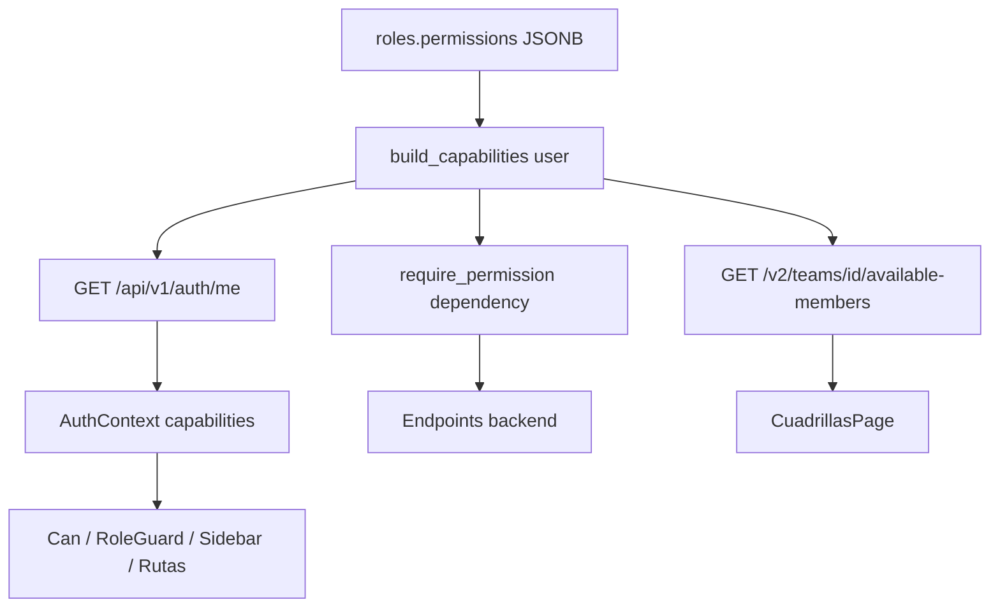

# Especificación de Implementación — RBAC centralizado en backend + Rol "Técnico Encargado / Supervisor"

**Estado:** Aprobado para implementación
**Alcance:** Backend + Frontend
**Estrategia:** transición incremental (convivencia con el esquema actual hasta Fase 4)

---

## 1. Contexto y problema

Un usuario con perfil "Técnico Encargado" necesita:
- Gestionar entregas de materiales (inventario/logística administrativa).
- Consultar la coordinación y ver las tareas de todos los técnicos.
- Tomar OTs, ejecutarlas y completarlas como cualquier técnico.
- Poder integrarse a una cuadrilla (el flujo de tareas se da por cuadrilla, no por técnico).

Hoy no existe un rol que combine esas capacidades, y además:
- El frontend decide permisos por **nombre de rol** (hardcodeado), no por identificador estable.
- La "capacidad de estar en una cuadrilla" se resuelve filtrando usuarios cuyo nombre de rol contiene `"tecnic"`.

### 1.1 Hallazgos concretos (smells)

| # | Archivo | Problema |
|---|---------|----------|
| 1 | [`permissions.js`](frontend/src/utils/permissions.js:24) | `PERMISSIONS_MATRIX` hardcodeada + [`ROLE_ALIAS`](frontend/src/utils/permissions.js:220) y [`normalizeRole`](frontend/src/utils/permissions.js:231) matchean por string de nombre. |
| 2 | [`AuthContext.jsx`](frontend/src/context/AuthContext.jsx:28) | Decodifica el JWT y expone `user.role` (string); **no** consulta permisos al backend. |
| 3 | [`RoleGuard.jsx`](frontend/src/components/auth/RoleGuard.jsx:33) / [`Can.jsx`](frontend/src/components/auth/Can.jsx:40) | Llaman [`hasPermission(user.role, ...)`](frontend/src/utils/permissions.js:263) contra la matriz local. |
| 4 | [`CuadrillasPage.jsx`](frontend/src/pages/coordination/CuadrillasPage.jsx:86) | Filtra usuarios por substring `"tecnic"` en el nombre de rol. |
| 5 | [`work_orders.py`](backend/src/routers/work_orders.py:140) | Compara `role_name == "tecnico"` / `"technician"` hardcodeado. |
| 6 | [`TeamMember`](backend/src/models/coordination.py:115) | Ya es agnóstico de rol (solo `user_id`); la restricción es 100% frontend. |
| 7 | [`auth.py`](backend/src/routers/v1/auth.py:188) | El JWT incluye `role` (nombre), no `role_id` ni `permissions`. |

### 1.2 Doble fuente de verdad
- Backend: [`Role.permissions`](backend/src/models/user.py:30) (JSONB) + [`User.has_permission()`](backend/src/models/user.py:147).
- Frontend: [`PERMISSIONS_MATRIX`](frontend/src/utils/permissions.js:24).

---

## 2. Principios de diseño (carrier class)

1. **Identificadores estables:** slugs de permiso y `role_id`; nunca nombre visible ni substring.
2. **Backend = única fuente de verdad de autorización.**
3. **Frontend = renderizador:** muestra/oculta según capabilities recibidas; no decide seguridad.
4. **Enforcement server-side:** cada endpoint autoriza con una dependency; el UI es solo UX.
5. **Fail-safe:** permiso desconocido → denegado.

---

## 3. Catálogo canónico de permisos (slugs)

Formato: `{resource}.{action}`. Coincide con los recursos/acciones actuales para minimizar fricción.

```
dashboard.view

tickets.view
tickets.create
tickets.edit
tickets.comment

coordination.view
coordination.assign
coordination.unassign
coordination.view_teams

work_orders.view
work_orders.view_all
work_orders.create
work_orders.edit
work_orders.complete

engineering.view
engineering.manage

cuadrillas.view
cuadrillas.create
cuadrillas.edit
cuadrillas.delete
cuadrillas.assign_members

inventory.view
inventory.view_all
inventory.edit
inventory.transfer
inventory.adjust

inventory_warehouses.view
inventory_admin.view
fleet_assigned.view

users.view
users.create
users.edit
users.delete
users.reset_password
users.change_role

settings.view
settings.edit
audit_logs.view

connections.view
nodes.view
clients.view

self_service.view
self_service.edit

teams.member          # NUEVO: capacidad de ser asignado a una cuadrilla
```

Notas:
- `teams.member` es una **capacidad**, no una pantalla. Se usa para filtrar quién puede ser miembro de cuadrilla.
- El superadmin (`is_superuser`) y el rol `admin` se interpretan como `["*"]` (acceso total).

---

## 4. Matriz de roles → permisos

### 4.1 Roles existentes (estado objetivo)

| Rol | Permisos |
|-----|----------|
| `admin` | `["*"]` (o lista completa equivalente) |
| `operator` | dashboard, tickets.*, coordination.*, work_orders.*, engineering.*, cuadrillas.*, inventory.* (view_all/edit/transfer/adjust), inventory_warehouses.view, inventory_admin.view, fleet_assigned.view, connections/nodes/clients.view, self_service.* |
| `coordinator` | dashboard.view, tickets.*, coordination.*, work_orders.*, cuadrillas.*, connections/nodes/clients.view, self_service.* |
| `tecnico` | tickets.view, work_orders.view + work_orders.complete, inventory.view, inventory_warehouses.view, fleet_assigned.view, self_service.*, **teams.member** |

### 4.2 Rol nuevo: `tecnico_encargado` ("Técnico Encargado")

- **slug:** `tecnico_encargado`
- **label:** `Técnico Encargado`
- **permisos:**

```
dashboard.view
tickets.view, tickets.create, tickets.edit, tickets.comment
coordination.view, coordination.assign, coordination.unassign, coordination.view_teams
work_orders.view, work_orders.view_all, work_orders.create, work_orders.edit, work_orders.complete
inventory.view, inventory.view_all, inventory.transfer, inventory.adjust
inventory_warehouses.view
inventory_admin.view
fleet_assigned.view
cuadrillas.view
connections.view, nodes.view, clients.view
self_service.view, self_service.edit
teams.member
```

Queda **fuera** (mínimo privilegio): `users.*`, `settings.*`, `audit_logs.*`, `engineering.*`, `cuadrillas.create/edit/delete/assign_members`.

---

## 5. Arquitectura objetivo



---

## 6. Especificación por fase

### Fase 0 — Backend expone capabilities (sin romper nada)

**Objetivo:** que el backend compute y devuelva la lista de permisos del usuario autenticado.

1. Nuevo helper en [`security.py`](backend/src/core/security.py:1) o servicio:
   ```python
   def build_capabilities(user) -> list[str]:
       if user.is_superuser:
           return ["*"]
       if not user.role or not user.role.permissions:
           return []
       perms = user.role.permissions
       return perms if isinstance(perms, list) else []
   ```
2. En [`GET /api/v1/auth/me`](backend/src/routers/v1/auth.py:223) agregar al response:
   - `role_id`
   - `role_name`
   - `permissions` (lista de slugs, desde `build_capabilities`)
3. Opcional: en la respuesta de login, incluir también `permissions` y `role_id` (junto al JWT) para evitar una llamada extra; el JWT puede seguir llevando `role` por compatibilidad.
4. Schema: extender `UserResponse` en [`user_schemas.py`](backend/src/schemas/user_schemas.py:1) con `permissions: Optional[List[str]]`.

**No rompe:** los consumidores actuales ignoran los campos nuevos.

---

### Fase 1 — Seed de roles con permisos canónicos

**Objetivo:** poblar `roles.permissions` con los slugs de la sección 3 y crear el rol nuevo.

1. Crear script de seed [`backend/scripts/seed_rbac_permissions.py`](backend/scripts/seed_rbac_permissions.py:1) (idempotente):
   - Para cada rol existente (`admin`, `operator`, `coordinator`, `tecnico`), setear `permissions` según la sección 4.1.
   - Crear rol `tecnico_encargado` con los permisos de la sección 4.2 (si no existe).
   - Loggear el resultado sin duplicar.
2. Alternativa válida: una migración Alembic `data` que haga el upsert (preferible en producción para reproducibilidad).
3. Decisión de implementación: usar script ejecutable + nota para ejecutarlo en deploy (como el backfill anterior). El role nuevo también se puede crear desde la UI de usuarios si se prefiere, pero el seed garantiza los permisos exactos.

**No rompe:** `Role.permissions` ya existe; solo se normaliza el contenido.

---

### Fase 2 — Frontend consume capabilities del backend

**Objetivo:** que `Can`/`RoleGuard`/menú/rutas autoricen por capabilities, no por nombre de rol.

1. [`AuthContext.jsx`](frontend/src/context/AuthContext.jsx:6):
   - Agregar estado `capabilities` (Set/array) inicializado `[]`.
   - Tras el login (o al hidratar el token), llamar a [`GET /api/v1/auth/me`](backend/src/routers/v1/auth.py:223) y guardar `permissions` + `role_id` + `role_name`.
   - Exponer `user` enriquecido: `{ ..., role_id, role_name, permissions }`.
2. Nuevo helper en [`permissions.js`](frontend/src/utils/permissions.js:1):
   ```js
   export const can = (capabilities, resource, action = 'view') => {
     if (!capabilities) return false;
     if (capabilities.includes('*')) return true;
     return capabilities.includes(`${resource}.${action}`);
   };
   ```
   Mantener `hasPermission` como **fallback temporal** a la matriz vieja mientras se migra.
3. [`Can.jsx`](frontend/src/components/auth/Can.jsx:40) y [`RoleGuard.jsx`](frontend/src/components/auth/RoleGuard.jsx:33):
   - Usar `can(user.permissions, resource, action)` si `user.permissions` está disponible; si no, caer a `hasPermission(user.role, ...)`.
4. [`AppSidebar.jsx`](frontend/src/components/AppSidebar.jsx:1) y [`App.jsx`](frontend/src/App.jsx:1):
   - Construir visibilidad de items/rutas desde `can(...)` (misma firma), de modo que el nuevo rol muestre exactamente lo que tiene permitido.

**Compatibilidad:** durante la migración, los roles viejos siguen pasando por la matriz; los nuevos usan capabilities.

---

### Fase 3 — Cuadrillas por capacidad `teams.member`

**Objetivo:** eliminar el substring `"tecnic"` del combo de miembros.

1. Backend: endpoint en [`coordination.py`](backend/src/routers/coordination.py:1):
   ```python
   @router.get("/teams/available-members")
   def available_team_members(db=Depends(get_db)):
       # usuarios activos cuyo rol tiene el permiso "teams.member"
       ...
   ```
   (o bien `GET /v2/users?capability=teams.member` en [`v2/users.py`](backend/src/routers/v2/users.py:1)).
2. Frontend [`CuadrillasPage.jsx`](frontend/src/pages/coordination/CuadrillasPage.jsx:74):
   - Reemplazar el filtro por substring por el consumo del endpoint de available-members.
   - El combo muestra usuarios con `teams.member` (tecnicos + tecnicos_encargados).

---

### Fase 4 — Endurecimiento server-side y limpieza

**Objetivo:** enforcement en backend y remover hardcodeos.

1. Dependency `require_permission(*permissions)` en [`security.py`](backend/src/core/security.py:1):
   - Si `current_user.is_superuser` o `"*"` en capabilities → OK.
   - Si falta el permiso → 403.
2. Reemplazar checks por string en [`work_orders.py`](backend/src/routers/work_orders.py:140) y [`work_orders.py`](backend/src/routers/work_orders.py:690) por capabilities (`work_orders.view_all` para "ver todas", y una capability `teams.member`/`work_orders.complete` para las reglas de técnico).
3. Migrar progresivamente endpoints a `require_permission`.
4. Limpiar [`ROLE_ALIAS`](frontend/src/utils/permissions.js:220)/`normalizeRole` y dejar la matriz como mero fallback o eliminarla cuando ya no se use.

---

## 7. Cambios por archivo (resumen)

### Backend
| Archivo | Cambio |
|---------|--------|
| [`security.py`](backend/src/core/security.py:1) | `build_capabilities`, `require_permission` |
| [`v1/auth.py`](backend/src/routers/v1/auth.py:223) | `/me` devuelve `role_id`, `role_name`, `permissions` |
| [`user_schemas.py`](backend/src/schemas/user_schemas.py:1) | `UserResponse.permissions` |
| [`coordination.py`](backend/src/routers/coordination.py:1) | `GET /teams/available-members` |
| [`work_orders.py`](backend/src/routers/work_orders.py:140) | reemplazar strings por capabilities |
| [`scripts/seed_rbac_permissions.py`](backend/scripts/seed_rbac_permissions.py:1) | seed roles + rol nuevo |

### Frontend
| Archivo | Cambio |
|---------|--------|
| [`AuthContext.jsx`](frontend/src/context/AuthContext.jsx:6) | fetch `/me`, guardar `capabilities` |
| [`permissions.js`](frontend/src/utils/permissions.js:1) | `can()` por capabilities + fallback |
| [`Can.jsx`](frontend/src/components/auth/Can.jsx:40) | usar capabilities |
| [`RoleGuard.jsx`](frontend/src/components/auth/RoleGuard.jsx:33) | usar capabilities |
| [`AppSidebar.jsx`](frontend/src/components/AppSidebar.jsx:1) | visibilidad por capabilities |
| [`App.jsx`](frontend/src/App.jsx:1) | rutas por capabilities |
| [`CuadrillasPage.jsx`](frontend/src/pages/coordination/CuadrillasPage.jsx:74) | usar available-members |

---

## 8. Validación

1. Login de un usuario con cada rol y verificar `GET /api/v1/auth/me` devuelve los `permissions` correctos.
2. Crear usuario `tecnico_encargado`: verifica que ve entregas, coordinación, todas las OTs, puede completar OTs y **aparece en el combo de miembros de cuadrilla**.
3. Verificar que `tecnico` sigue viendo solo sus OTs; que `operator`/`admin` no cambian de comportamiento.
4. Probar `require_permission` en al menos un endpoint (403 ante falta de permiso).
5. Regression manual de las pantallas gateadas (Sidebar, rutas).

---

## 9. Riesgos y rollback

- **Bajo riesgo** en Fases 0-1: solo agregan campos y normalizan `roles.permissions`.
- **Medio riesgo** en Fase 2: migrar gates de UI. Se mitiga con fallback a la matriz vieja.
- **Bajo riesgo** en Fase 3: el backend ya es agnóstico en `TeamMember`.
- Rollback: revertir `permissions` de los roles al valor previo (script idempotente puede guardar backup), y en frontend desactivar el consumo de capabilities dejando la matriz.

---

## 10. Orden de ejecución recomendado

1. Fase 0 (backend expone capabilities).
2. Fase 1 (seed roles + rol `tecnico_encargado`).
3. Fase 2 (frontend consume capabilities).
4. Fase 3 (cuadrillas por `teams.member`).
5. Fase 4 (endurecimiento server-side + limpieza).
