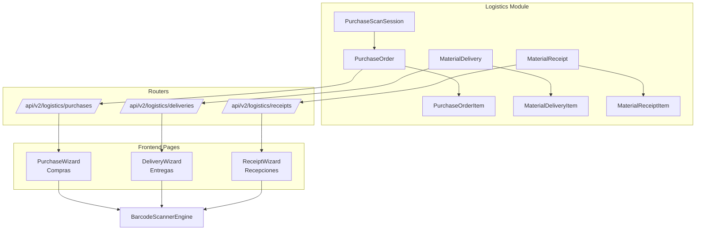
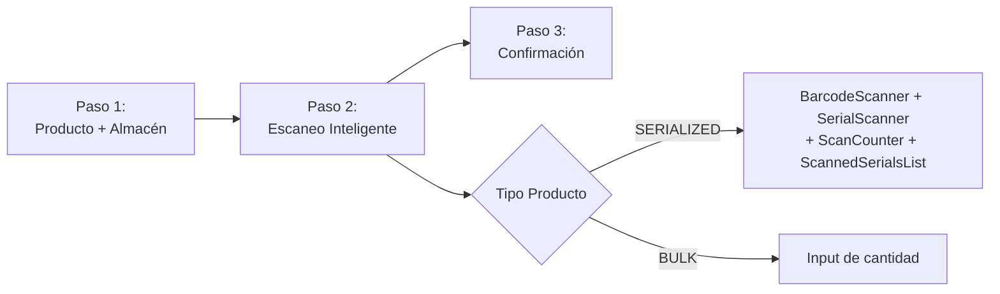

# Plan: Refactor Compras -> Módulo de Logística

## Situación Actual

| Componente | Ubicación Actual | Problema |
|-------------|------------------|----------|
| `StockAdjustments.jsx` | `pages/inventory/` | Mezcla compras + ajustes en una sola página |
| `create_stock_adjustment` | `routers/inventory.py` | Endpoint único para BULK (PURCHASE y ADJUSTMENT) |
| `PurchaseScanSession` | `models/inventory.py` | Modelo de logística en módulo incorrecto |
| Endpoints `/stock/scan*` | `routers/inventory.py` | Lógica de compra incrustada en inventario |
| Sidebar "Operaciones" | Bajo sección `Logística` | Compras no tiene entrada propia |

## Estado Deseado



---

## 1. Modelos

### Mover `PurchaseScanSession` a `models/logistics.py`

Eliminar de `models/inventory.py` y crear en `models/logistics.py`:

```python
# models/logistics.py (agregar)
class PurchaseOrderStatus(str, PyEnum):
    DRAFT = "DRAFT"
    IN_PROGRESS = "IN_PROGRESS" 
    COMPLETED = "COMPLETED"
    CANCELLED = "CANCELLED"

class PurchaseOrder(Base):
    """Orden de compra/ingreso de mercadería."""
    __tablename__ = "purchase_orders"
    
    id: int
    warehouse_id: int       # FK -> warehouses.id
    supplier: str | None    # Nombre del proveedor / remito
    status: PurchaseOrderStatus
    user_id: int            # FK -> users.id
    reference: str | None   # Número de factura/orden
    notes: str | None
    created_at: datetime
    completed_at: datetime | None
    
    # Relaciones
    warehouse: Warehouse
    items: List[PurchaseOrderItem]
    scan_sessions: List[PurchaseScanSession]

class PurchaseOrderItem(Base):
    """Item de una orden de compra."""
    __tablename__ = "purchase_order_items"
    
    id: int
    purchase_order_id: int  # FK -> purchase_orders.id
    product_id: int         # FK -> products.id
    quantity: float         # Cantidad total
    is_serialized: bool
    
    # Relaciones
    purchase_order: PurchaseOrder
    product: Product

class PurchaseScanSession(Base):
    """
    Sesión de escaneo activa para una orden de compra.
    Mantiene estado en DB mientras el operador escanea seriales.
    """
    __tablename__ = "purchase_scan_sessions"
    
    id: int
    purchase_order_id: int | None  # FK -> purchase_orders.id (nullable para sesiones sin orden)
    warehouse_id: int
    product_id: int
    scanned_sns: List[str]  # JSONB
    count: int
    is_complete: bool
    reference: str | None
    notes: str | None
    user_id: int
    created_at: datetime
    updated_at: datetime
    
    # Relaciones
    purchase_order: PurchaseOrder | None
    product: Product
    warehouse: Warehouse
```

### Migración

```python
# 2026_06_10_001_create_purchase_orders.py
# - Crear purchase_orders
# - Crear purchase_order_items
# - Agregar FK purchase_order_id a purchase_scan_sessions
# - Mover datos existentes de scan_sessions a nuevas tablas
```

---

## 2. Backend — Router

### Nuevo: `routers/purchases.py`

```python
router = APIRouter(prefix="/api/v2/logistics/purchases", tags=["Purchases"])
```

| Método | Ruta | Descripción | Origen |
|--------|------|-------------|--------|
| `GET` | `/` | Listar órdenes de compra | Nuevo |
| `POST` | `/` | Crear orden de compra | Migrado desde `StockAdjustments` |
| `GET` | `/{id}` | Detalle de orden | Nuevo |
| `POST` | `/{id}/scan` | Escanear código (usa `BarcodeScannerEngine`) | Migrado desde `inventory.py:scan_code` |
| `POST` | `/{id}/scan-serial` | Escanear serial (usa `BarcodeScannerEngine`) | Migrado desde `inventory.py:scan_serial` |
| `GET` | `/{id}/scan-session` | Estado de sesión | Migrado desde `inventory.py:get_scan_session` |
| `DELETE` | `/{id}/scan-session/serial/{serial}` | Eliminar serial de sesión | Migrado |
| `POST` | `/{id}/confirm` | Confirmar compra e ingresar stock | Migrado desde `inventory.py:confirm_scan_session` |
| `POST` | `/{id}/cancel` | Cancelar orden | Nuevo |

### Router de inventario: limpiar

Los endpoints `/stock/scan*` se **eliminan** de `routers/inventory.py` (ya no existen allí, solo en purchases).  
El endpoint `POST /stock/adjust` se mantiene para ajustes manuales (MovementType.ADJUSTMENT).

### Registro en `main.py`

```python
from src.routers import purchases as purchases_router

app.include_router(
    purchases_router.router,
    tags=["Purchases"]
)
```

---

## 3. Frontend — Páginas

### Nueva: `pages/logistics/PurchaseWizard.jsx`

Wizard de compras en 3 pasos, similar al `MaterialDeliveryWizard`:



Reutiliza los componentes:
- `BarcodeScanner` de `components/barcode-reader/`
- `SerialScanner` de `components/barcode-reader/`
- `ScanCounter` de `components/barcode-reader/`
- `ScannedSerialsList` de `components/barcode-reader/`

### Modificar: `StockAdjustments.jsx`

Se **simplifica** para manejar solo ajustes (no compras):
- Eliminar lógica de seriales escaneados
- Mantener solo BULK + cantidad + movement_type (ADJUSTMENT)
- Renombrar a "Ajustes de Inventario"

### Registrar en `App.jsx`

```jsx
// Logistics Module Routes
<Route path="logistics/purchases" element={<PurchaseDashboard />} />
<Route path="logistics/purchases/new" element={<PurchaseWizard />} />
<Route path="logistics/purchases/:id" element={<PurchaseWizard />} />
```

### Actualizar Sidebar

Agregar items bajo sección `Logística`:

```javascript
{
  title: 'Compras',
  icon: ShoppingCart,
  href: '/app/logistics/purchases',
  description: 'Ingreso de mercadería',
  resource: 'inventory_admin',
},
```

---

## 4. API Service

### Nuevo: `services/purchases.service.js`

```javascript
const BASE_URL = '/v2/logistics/purchases';

export const getPurchaseOrders = async (filters) => { ... }
export const createPurchaseOrder = async (payload) => { ... }
export const getPurchaseOrder = async (id) => { ... }
export const scanCode = async (id, payload) => { ... }      // Migrado desde inventory.service
export const scanSerial = async (id, payload) => { ... }     // Migrado desde inventory.service
export const confirmPurchase = async (id) => { ... }         // Migrado desde inventory.service
export const cancelPurchase = async (id) => { ... }
```

---

## 5. Resumen de Tareas

### Fase A: Modelos y Migración
- [ ] Mover `PurchaseScanSession` de `models/inventory.py` a `models/logistics.py`
- [ ] Crear `PurchaseOrder` + `PurchaseOrderItem` + `PurchaseOrderStatus` en `models/logistics.py`
- [ ] Agregar FK `purchase_order_id` a `PurchaseScanSession`
- [ ] Crear migración Alembic `2026_06_10_001_create_purchase_orders.py`
- [ ] Actualizar `env.py` de alembic si es necesario
- [ ] Migrar datos existentes de `purchase_scan_sessions`

### Fase B: Backend
- [ ] Crear `routers/purchases.py` con todos los endpoints
- [ ] Migrar lógica de `inventory.py:scan_code` a `purchases.py`
- [ ] Migrar lógica de `inventory.py:scan_serial` a `purchases.py`
- [ ] Migrar lógica de `inventory.py:confirm_scan_session` a `purchases.py`
- [ ] Migrar lógica de `inventory.py:get_scan_session` a `purchases.py`
- [ ] Migrar lógica de `inventory.py:remove_serial_from_session` a `purchases.py`
- [ ] Crear `services/purchase_service.py` (lógica de negocio)
- [ ] Limpiar `inventory.py`: eliminar endpoints `/stock/scan*`
- [ ] Simplificar `POST /stock/adjust` (solo ADJUSTMENT)
- [ ] Registrar nuevo router en `main.py`

### Fase C: Frontend
- [ ] Crear `services/purchases.service.js`
- [ ] Crear `pages/logistics/PurchaseDashboard.jsx`
- [ ] Crear `pages/logistics/PurchaseWizard.jsx` (3 pasos)
- [ ] Simplificar `StockAdjustments.jsx` (solo ajustes BULK)
- [ ] Registrar rutas en `App.jsx`
- [ ] Agregar items al sidebar
- [ ] Eliminar endpoints de `inventory.service.js` (migrados a purchases.service)
- [ ] Integrar componentes de `barcode-reader` en `PurchaseWizard`

### Fase D: Post-refactor
- [ ] Tests de regresión de compras con scanner
- [ ] Tests de regresión de ajustes de inventario
- [ ] Tests de regresión de delivery (sin cambios, confirmar)
- [ ] Actualizar documentación

---

## Riesgos y Mitigaciones

| Riesgo | Mitigación |
|--------|-----------|
| **Datos existentes**: `purchase_scan_sessions` con registros sin FK a purchase_orders | Migración con default/fallback: crear ordenes huérfanas o permitir NULL |
| **Frontend en producción**: StockAdjustments en uso durante el refactor | Mantener ambas rutas durante transición, con redirect |
| **RBAC**: permisos de `inventory_admin` vs nuevo recurso `purchases` | Usar mismo resource `inventory_admin` inicialmente |
| **BarcodeScannerEngine**: si hay bugs no detectados | Los tests con pistola programados para mañana cubren esto |

---

## Principios

1. **No romper lo existente**: StockAdjustments sigue funcionando para ajustes, solo se simplifica
2. **Migración gradual**: los endpoints viejos redirigen a los nuevos durante una ventana de transición
3. **Reutilización máxima**: `PurchaseWizard` usa los mismos componentes de `barcode-reader` que ya probamos en StockAdjustments y DeliveryWizard
4. **Separación de concerns**: compras con su propio router, service, schemas y páginas
