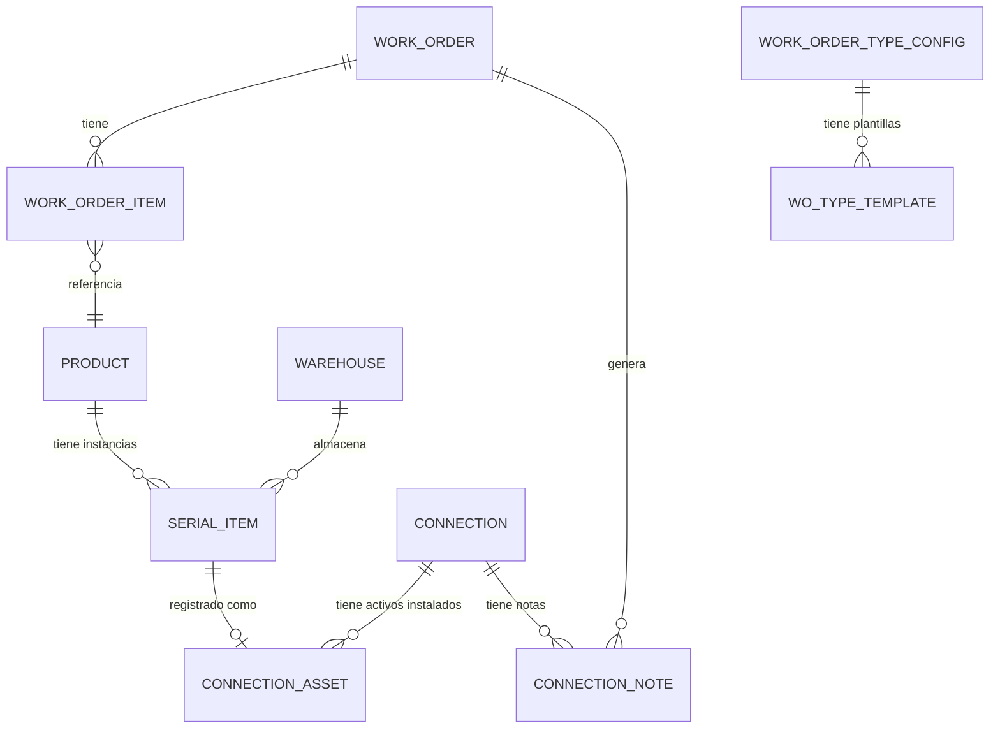
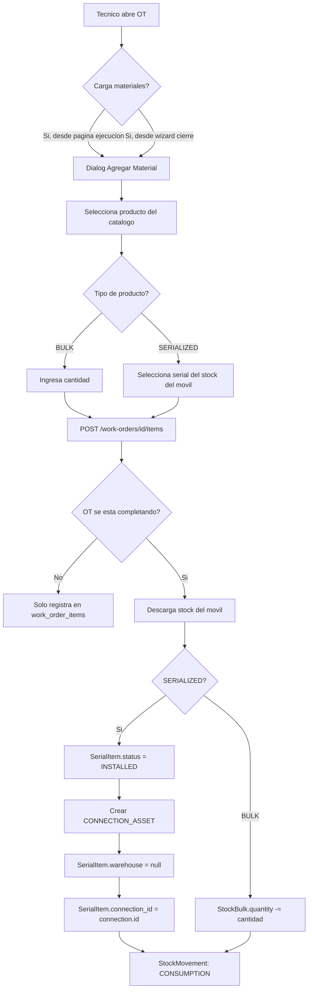
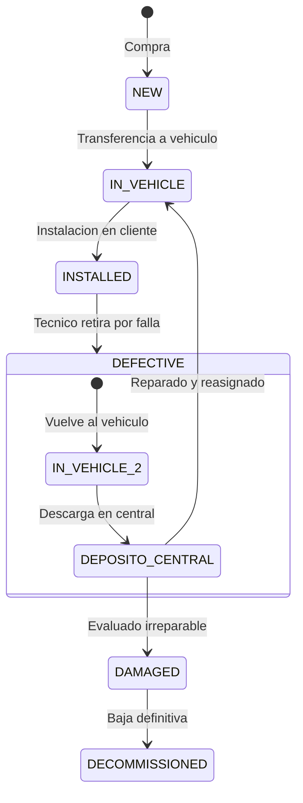
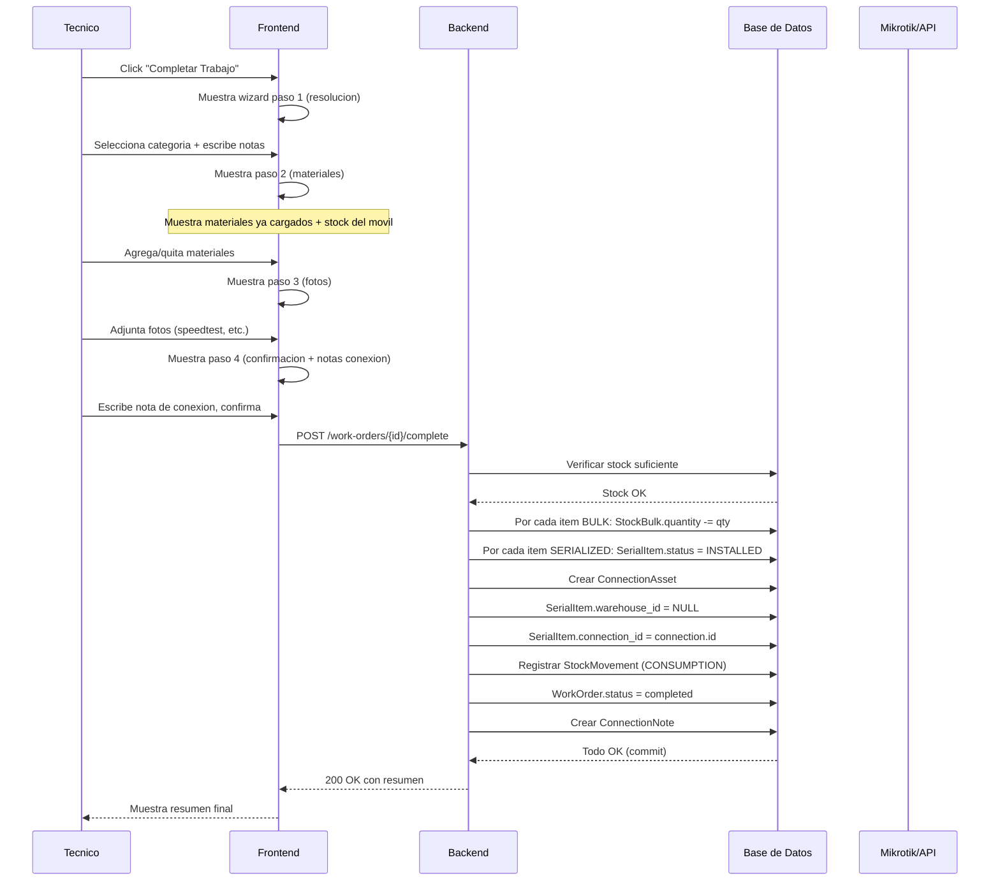

# Plan de Refurbish del Módulo de Órdenes de Trabajo (OT) ✅ COMPLETADO

> **Estado:** ✅ Implementado (06/06/2026)
> **Próximo paso:** Testing y debugging del flujo completo

> **Objetivo:** Expandir y robustecer el módulo de OT con trazabilidad de activos, flujo unificado de materiales, y wizard de cierre inteligente según tipo de visita, sin perder funcionalidades existentes.

---

## Diagnóstico de la Situación Actual

### Lo que ya funciona ✅
- Timer de ejecución
- Estados y transiciones de OT (pending_planning → assigned → in_progress → completed/failed)
- Bloqueo de agenda por OTs vencidas
- Wizard de cierre de 3 pasos (resolución, materiales, fotos)
- Agregado de materiales desde la página de ejecución Y desde el wizard
- Inspección diaria de vehículo
- Actualización de ubicación
- Auditoría de logs

### Lo que está duplicado/inconsistente ⚠️
- El agregado de materiales existe en 2 lugares (WorkOrderExecutionPage + CloseWorkOrderDialog) con lógica similar pero código separado
- No hay deducción real de stock al agregar materiales (solo se registra en `work_order_items`)
- Los seriales no se actualizan de estado ni se vinculan a conexiones/clientes

### Lo que falta ❌
- **Tabla de activos en cliente** (serializados instalados por conexión)
- **Flujo de devolución** de equipos serializados (cliente → depósito)
- **Tipos de visita predefinidos** con listas de materiales sugeridos
- **Notas de conexión** (observaciones de técnicos sobre la conexión)
- **Unificación** del componente de agregado de materiales (mismo pool, misma UI)

---

## Arquitectura Propuesta

### Modelo de Datos - Nuevas Tablas

```mermaid
erDiagram
    CONNECTION_ASSETS {
        int id PK
        int connection_id FK
        int serial_item_id FK
        int product_id FK
        string serial_number
        date installed_at
        date removed_at
        string status "installed | removed | replaced"
        int installed_by_wo_id FK
        int removed_by_wo_id FK
        text notes
    }

    CONNECTION_NOTES {
        int id PK
        int connection_id FK
        int work_order_id FK
        int author_id FK
        text note
        datetime created_at
        boolean is_pinned
    }

    WORK_ORDER_TYPE_TEMPLATES {
        int id PK
        int ot_type_config_id FK
        string name "Ej: Instalacion FTTH Minima"
        boolean is_active
        jsonb suggested_items "Lista de productos sugeridos con cantidades default"
    }

    WORK_ORDER_TYPE_TEMPLATE_ITEMS {
        int id PK
        int template_id FK
        int product_id FK
        float default_quantity
        boolean required
        int sort_order
    }

    SERIAL_ITEM {
        int id PK
        string serial_number
        int product_id FK
        int warehouse_id FK "ubicacion actual"
        string status "NEW | IN_VEHICLE | INSTALLED | DEFECTIVE | DAMAGED | DECOMMISSIONED"
        int? connection_id FK "si esta instalado en cliente"
        int? ticket_related_id FK
        text notes
    }
```

### Relaciones Clave



---

## Flujo de Materiales (Comportamiento Deseado)



### Flujo de Devolución (Equipos Dañados/Reemplazo)

```mermaid
flowchart TD
    A[Tecnico retira equipo] --> B[Marca en materiales como "Devuelto"]
    B --> C{Selecciona serial desde UI}
    C --> D[POST trabajo con serial existente + flag devuelto]
    D --> E[SerialItem.status = DAMAGED o RETURNED]
    E --> F[SerialItem.warehouse = deposito central]
    F --> G[CONNECTION_ASSET.removed_at = now]
    G --> H[StockMovement: RECOVERY]
    H --> I[Si hay equipo nuevo reemplazando]
    I --> J[Mismo flujo que instalacion]
```

---

## Plan de Implementación por Etapas

### ETAPA 1: Unificación del Componente de Materiales
**Impacto:** Frontend + Backend (cambios localizados)

| # | Tarea | Archivos | Descripción |
|---|-------|----------|-------------|
| 1.1 | Extraer componente `MaterialSelector` compartido | Nuevo: `frontend/src/components/work-orders/MaterialSelector.jsx` | Unificar el diálogo de agregar material que actualmente está duplicado en `WorkOrderExecutionPage` y `CloseWorkOrderDialog` |
| 1.2 | Refactor `WorkOrderExecutionPage` | `WorkOrderExecutionPage.jsx` | Reemplazar el material dialog inline por el nuevo `MaterialSelector` |
| 1.3 | Refactor `CloseWorkOrderDialog` paso 2 | `CloseWorkOrderDialog.jsx` | Reemplazar el bloque de materiales por el nuevo `MaterialSelector` |
| 1.4 | Sincronizar pool de materiales | `WorkOrderExecutionPage.jsx`, `CloseWorkOrderDialog.jsx` | Ambos componentes deben leer/escribir del mismo `workOrder.items` para que los materiales agregados antes del wizard aparezcan precargados |

**Criterio de éxito:** Los materiales agregados desde la página de ejecución aparecen en el wizard de cierre y viceversa.

### ETAPA 2: Trazabilidad de Activos - Modelo de Datos
**Impacto:** Backend DB + Models + Alembic migration

| # | Tarea | Archivos | Descripción |
|---|-------|----------|-------------|
| 2.1 | Migración: tabla `connection_assets` | Nueva migración Alembic | `id, connection_id FK, serial_item_id FK, product_id, serial_number, installed_at, removed_at, status, installed_by_wo_id FK, removed_by_wo_id FK, notes` |
| 2.2 | Migración: tabla `connection_notes` | Nueva migración Alembic | `id, connection_id FK, work_order_id FK, author_id FK, note TEXT, created_at, is_pinned` |
| 2.3 | Migración: extender `SerialItem.status` | Migración alter enum | Agregar estados: `IN_VEHICLE`, `RETURNED`, `DECOMMISSIONED` |
| 2.4 | Migración: agregar `connection_id` a `SerialItem` | Migración alter table | `connection_id FK nullable, warehouse_id nullable (permitir null cuando está instalado)` |
| 2.5 | Crear modelos SQLAlchemy | `backend/src/models/inventory.py` | Agregar clases `ConnectionAsset`, `ConnectionNote` |
| 2.6 | Crear schemas Pydantic | `backend/src/schemas/tickets.py` | `ConnectionAssetResponse`, `ConnectionNoteCreate/Response` |

### ETAPA 3: Backend - Lógica de Inventario al Completar OT
**Impacto:** Backend routers + services

| # | Tarea | Archivos | Descripción |
|---|-------|----------|-------------|
| 3.1 | Endpoint: PATCH `/work-orders/{id}/complete` con inventory effects | `work_orders.py` | Endpoint dedicado (separado del PATCH genérico) que orquesta: descarga de stock, creación de connection_assets, movements |
| 3.2 | Service: `complete_work_order_with_inventory()` | Nuevo: `backend/src/services/wo_completion_service.py` | Lógica de negocio: procesar cada item, descontar bulk, actualizar seriales, crear connection_assets, registrar stock_movements |
| 3.3 | Auto-creación de `ConnectionAsset` al instalar SERIALIZED | `wo_completion_service.py` | Al cerrar OT con seriales, crear automáticamente el registro en connection_assets |
| 3.4 | Auto-actualización de `SerialItem` al instalar | `wo_completion_service.py` | status → INSTALLED, warehouse_id → null, connection_id → connection.id |
| 3.5 | Endpoint: POST `/connections/{id}/notes` | Nuevo en router | Agregar nota a una conexión |
| 3.6 | Endpoint: GET `/connections/{id}/notes` | Nuevo en router | Listar notas de una conexión |
| 3.7 | Endpoint: GET `/connections/{id}/assets` | Nuevo en router | Listar activos instalados en una conexión |

### ETAPA 4: Frontend - Ampliación del Wizard de Cierre
**Impacto:** Frontend CloseWorkOrderDialog

| # | Tarea | Archivos | Descripción |
|---|-------|----------|-------------|
| 4.1 | Integrar endpoint de completion en wizard | `CloseWorkOrderDialog.jsx` | Cambiar `handleComplete` para que llame al nuevo endpoint dedicado de completion |
| 4.2 | Agregar paso de "confirmación" en wizard | `CloseWorkOrderDialog.jsx` | Nuevo paso 4 (opcional) que muestre resumen de materiales y permita notas de conexión |
| 4.3 | Input de notas de conexión | `CloseWorkOrderDialog.jsx` | Campo de texto en paso 4 para notas del técnico sobre la conexión |
| 4.4 | Manejo de devolución de equipos | `CloseWorkOrderDialog.jsx` | Si el técnico selecciona que devuelve un equipo, UI para marcar el serial como devuelto/dañado |

### ETAPA 5: Tipos de Visita y Plantillas de Material
**Impacto:** Backend + Frontend

| # | Tarea | Archivos | Descripción |
|---|-------|----------|-------------|
| 5.1 | Migración: tabla `wo_type_templates` y `wo_type_template_items` | Nueva migración | Configuración de plantillas de materiales por tipo de OT |
| 5.2 | Endpoint CRUD para plantillas | Nuevo router | CRUD de plantillas (solo admin/coord) |
| 5.3 | Frontend: selector de plantilla al cargar materiales | `MaterialSelector.jsx` | Botón "Cargar plantilla" que precarga materiales sugeridos (editables) |
| 5.4 | Seed data: plantillas por defecto | Script SQL | Instalación FTTH, Instalación Antena, Reemplazo ONU, etc. |

### ETAPA 6: Dashboard de Activos por Conexión (Tickets)
**Impacto:** Módulo Tickets

| # | Tarea | Archivos | Descripción |
|---|-------|----------|-------------|
| 6.1 | Widget "Activos Instalados" en TicketDetailPage | `TicketDetailPage.jsx` | Lista de equipos serializados instalados en la conexión del ticket |
| 6.2 | Widget "Notas de Conexión" en TicketDetailPage | `TicketDetailPage.jsx` | Historial de notas dejadas por técnicos |
| 6.3 | Timeline de activos | `TicketDetailPage.jsx` | Mostrar en la timeline los eventos de instalación/remoción de equipos |

---

## Consideraciones Técnicas

### Estados de SerialItem (Actualizados)

```python
class SerialItemStatus(StrEnum):
    NEW = "NEW"              # Depósito central, nuevo sin usar
    IN_VEHICLE = "IN_VEHICLE"  # Camioneta de técnico (stock móvil)
    INSTALLED = "INSTALLED"  # Instalado en cliente (connection_id != null)
    DEFECTIVE = "DEFECTIVE"  # Devuelto por técnico como defectuoso, en depósito central
    DAMAGED = "DAMAGED"      # Evaluado en central como dañado no reparable
    DECOMMISSIONED = "DECOMMISSIONED"  # Baja definitiva (solo en central)
```

**Reglas de negocio:**
- `DEFECTIVE` es el estado que reporta el técnico al devolver un equipo
- `DAMAGED` lo asigna el depósito central tras evaluar el equipo defectuoso
- `DECOMMISSIONED` solo se asigna en el depósito central, nunca por el técnico
- Un equipo `DEFECTIVE` puede repararse y volver a `ACTIVO` (en depósito central)

### Flujo de Transición de Estados (Completo)

**Flujo 1: Instalación exitosa**
```
COMPRA → DEPOSITO_CENTRAL (NEW) → VEHICULO (IN_VEHICLE) → CLIENTE (INSTALLED)
```

**Flujo 2: Falla + Baja**
```
COMPRA → DEPOSITO_CENTRAL (NEW) → VEHICULO (IN_VEHICLE) → CLIENTE (INSTALLED)
→ FALLA → TECNICO RETIRA (DEFECTIVE) → VEHICULO (IN_VEHICLE)
→ DEPOSITO_CENTRAL → IRREPARABLE (DAMAGED) → BAJA (DECOMMISSIONED)
```

**Flujo 3: Falla + Reparación + Reasignación**
```
COMPRA → DEPOSITO_CENTRAL (NEW) → VEHICULO (IN_VEHICLE) → CLIENTE (INSTALLED)
→ FALLA → TECNICO RETIRA (DEFECTIVE) → VEHICULO (IN_VEHICLE)
→ DEPOSITO_CENTRAL → REPARADO (ACTIVO) → VEHICULO (IN_VEHICLE) → ...
```



### Seguridad y Consistencia
- El endpoint de completion debe ser **transaccional** (todo o nada)
- Si falla la descarga de stock, no debe completarse la OT
- El frontend debe mostrar feedback claro de errores de inventario (stock insuficiente)
- Solo el técnico asignado a la OT puede completarla

---

## Diagrama de Secuencia - Cierre de OT Completo



---

## Decisiones Arquitectónicas (Definidas)

| # | Decisión | Resolución |
|---|----------|------------|
| 1 | **BULK en ConnectionAsset** | ❌ NO. Los BULK se registran en `work_order_items` con referencia a `connection_id` para consulta histórica, pero no tienen seguimiento individual como los serializados. Se agrega `connection_id` nullable a `work_order_items` como FK blanda para poder consultar "qué materiales bulk se usaron en esta conexión". |
| 2 | **Plantillas configurables** | ✅ SÍ, CRUD para admin. Debe estar en Settings, nueva solapa "Órdenes de Trabajo". Los datos semilla se cargan inicialmente para funcionar out-of-the-box. El módulo de OTs solo las LEE. |
| 3 | **Notas de conexión - visibilidad** | Solo en Tickets como vista principal. En coordinación/OT, agregar un link/info button en la sidebar derecha que navegue al detalle de conexión. |
| 4 | **Historial de activos** | No en timeline directamente. Crear un modal/página de "Detalle de Conexión" accesible tanto desde TicketDetail como desde OT execution page. Allí se muestra el historial completo de activos + notas. |
| 5 | **Estados de devolución** | Agregar estado `DEFECTIVE` (técnico devuelve como defectuoso). `DECOMMISSIONED` solo en depósito central. Los equipos defectuosos pueden repararse y volver a `IN_VEHICLE`. |

## Notas de Arquitectura Global

### Mobile-First + Modularidad
- Todos los componentes nuevos deben ser responsive (mobile-first)
- El `MaterialSelector` debe ser un componente puro, reutilizable en cualquier contexto
- La lógica de negocio (completar OT, descargar stock, crear assets) va en el **backend**, el frontend solo hace POST/GET y muestra resultados
- Separación estricta: componentes de UI en `components/`, lógica de servicio en `services/`, páginas en `pages/`

### Principio NASA-Grade (Backend-heavy)
```
Frontend (GUI) → llama a servicios → Backend (lógica de negocio) → DB
```
Ejemplo concreto: el botón "Completar Trabajo" en el frontend solo hace un POST al backend. El backend orquesta todo: validar stock, descontar inventario, crear connection_assets, registrar movimientos, cambiar estado de OT, crear timeline event, auditar.

---

## Resumen de Etapas ✅ COMPLETADAS

| Etapa | Descripción | Estado | Archivos Clave |
|-------|-------------|--------|----------------|
| **1** | Unificar componente MaterialSelector | ✅ | `useMaterialSelector.js`, `MaterialSelectorForm.jsx`, refactor WEP + CWO |
| **2** | Modelo de datos (migrations) | ✅ | `connection_assets`, `connection_notes`, SerialItem.status extendido |
| **3** | Backend completion + inventory | ✅ | `wo_completion_service.py`, `POST /work-orders/{id}/complete` |
| **4** | Wizard ampliado 4 pasos | ✅ | Paso 4 Confirmación + Nota Conexión |
| **5** | Plantillas en Settings | ✅ | `WOTemplatesTab.jsx`, CRUD admin en Settings |
| **6** | Tickets - Widgets activos + notas | ✅ | `ConnectionInfoPanel.jsx` en TicketDetailPage |
