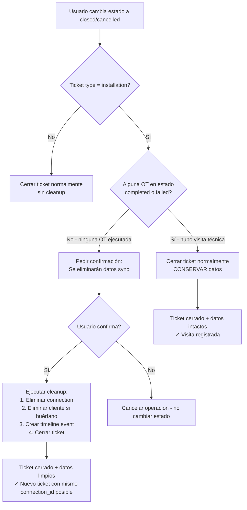

# Plan: Rollback automático al cancelar tickets de instalación

## 1. Problema actual

Cuando se crea un ticket de instalación, [`sync_installation_context()`](backend/src/services/installation_onboarding.py:34) sincroniza datos desde ISPCube a las tablas locales:

- [`connections`](backend/src/models/beholder.py:49) — conexión del cliente
- [`clientes`](backend/src/models/beholder.py:66) — datos del cliente
- [`clientes_emails`](backend/src/models/beholder.py:82) / [`clientes_telefonos`](backend/src/models/beholder.py:89) — contactos

Si el operador cancela el ticket (ej: ingresó mal la conexión en ISPCube), estos registros **no se limpian**, lo que provoca que ISPCube recicle `connection_id` y el sistema bloquee la creación de un nuevo ticket con "no hay conexiones nuevas registradas".

### Fix actual (incorrecto) en search.py

Se modificó [`external_customer_lookup_new_connections()`](backend/src/routers/search.py:120) para validar contra `tickets` en lugar de `connections`:

```python
# Actual (DEBILITA validación)
rows = db.execute(text(
    "SELECT DISTINCT connection_id FROM tickets ..."
))
```

Esto permite conexiones duplicadas y riesgos de inconsistencia. **Hay que revertirlo.**

## 2. Análisis de FKs: no hay riesgos de inconsistencia

Se verificaron todas las tablas involucradas. Las tablas de Beholder (`connections`, `clientes`, `clientes_emails`, `clientes_telefonos`) usan **relaciones blandas** — columnas sueltas sin foreign key constraints reales:

| Tabla | FK declarada | Riesgo al hacer DELETE |
|-------|-------------|------------------------|
| [`work_orders`](backend/src/models/tickets.py:640) (línea 640-645) | `ticket_id → tickets.id` con `ondelete="CASCADE"` | ✅ Seguro: CASCADE elimina OTs al eliminar ticket |
| [`connections`](backend/src/models/beholder.py:49-63) | Solo `city_id → cities.id`, `neighborhood_id → neighborhoods.id` | ✅ Seguro: no hay FK a tickets ni clientes |
| [`clientes`](backend/src/models/beholder.py:66-79) | **Ninguna FK** | ✅ Seguro: tabla independiente |
| [`clientes_emails`](backend/src/models/beholder.py:82-86) | **Ninguna FK** (`customer_id` es columna suelta) | ✅ Seguro |
| [`clientes_telefonos`](backend/src/models/beholder.py:89-93) | **Ninguna FK** (`customer_id` es columna suelta) | ✅ Seguro |

**Conclusión: No se generan inconsistencias de FK al eliminar registros de connections/clientes.** La base usa relaciones blandas deliberadamente para evitar trabas operativas.

## 3. Estrategia propuesta

### Principio rector

> Si se cancela/cierra un ticket de instalación y **ninguna OT alcanzó un estado terminal** (completed, failed), se limpian los registros sincronizados. Si alguna OT fue ejecutada (incluso si falló en sitio), los registros se conservan.

### Mapa del flujo



## 4. Cambios necesarios

### Paso 1: Revertir [`search.py`](backend/src/routers/search.py:143-166)

Volver a validar contra la tabla `connections` (original):

```python
# Reemplazar el bloque actual (líneas 143-166) por:
existing_conns = db.execute(
    select(Connection.connection_id)
).scalars().all()
used_connection_ids = {str(cid) for cid in existing_conns if cid}
```

### Paso 2: Agregar status `cancelled` al modelo

**Archivo:** [`backend/src/models/tickets.py:74`](backend/src/models/tickets.py:74)

```python
class TicketStatus(StrEnum):
    open = "open"
    in_progress = "in_progress"
    pending = "pending"
    pending_infra = "pending_infra"
    waiting_internal = "waiting_internal"
    attention_required = "attention_required"
    resolved = "resolved"
    closed = "closed"
    cancelled = "cancelled"  # ← NUEVO
```

Requiere migración Alembic para agregar el nuevo valor al enum en PostgreSQL.

**Archivos que referencian `TicketStatus` y pueden necesitar actualización:**
- [`TicketUpdate` schema](backend/src/schemas/tickets.py:78) — ya acepta cualquier valor del enum ✅
- Frontend filtros de tickets — verificar que `cancelled` sea manejado ✅

### Paso 3: Enriquecer `connection_details` con metadata de rollback

**Archivo:** [`backend/src/routers/tickets.py:618-626`](backend/src/routers/tickets.py:618)

Actualmente ya se setea `connection_details`. Agregar metadata de sync:

```python
if installation_sync_result:
    ticket.connection_id = installation_sync_result.get("connection_id")
    meta = installation_sync_result.get("timeline_event", {}).get("meta_data", {})
    ticket.connection_details = {
        "client_name": meta.get("customer_name"),
        "address": meta.get("connection_direction"),
        "pppoe_username": meta.get("pppoe_username"),
        "customer_dni": meta.get("customer_dni"),
        # NUEVO: metadata para rollback
        "_sync_customer_id": installation_sync_result.get("customer_id"),
        "_sync_connection_id": str(installation_sync_result.get("connection_id")),
        "_synced_at": datetime.utcnow().isoformat(),
    }
```

### Paso 4: Crear servicio de rollback

**Nuevo archivo:** `backend/src/services/installation_rollback.py`

```python
"""Servicio de rollback para tickets de instalación cancelados."""

from sqlalchemy import text
from sqlalchemy.orm import Session
from src.models.beholder import Connection, Cliente, ClienteEmail, ClienteTelefono

TERMINAL_WO_STATUSES = {"completed", "failed"}

def has_executed_work_orders(ticket) -> bool:
    """
    Retorna True si alguna OT del ticket fue ejecutada (completed o failed).
    Si el técnico llegó a sitio (aunque no haya podido instalar), los datos se conservan.
    """
    return any(
        wo.status.value in TERMINAL_WO_STATUSES
        for wo in ticket.work_orders
    )


def rollback_installation_sync(db: Session, ticket) -> dict:
    """
    Elimina registros sincronizados durante la creacion del ticket.
    
    Reglas:
    - Solo elimina la connection si ningun otro ticket activo la referencia.
    - Solo elimina el cliente si ninguna otra conexion ni ticket lo referencia.
    
    Retorna dict con detalle de lo eliminado (para timeline event).
    """
    details = {"connection_deleted": False, "cliente_deleted": False}
    
    conn_details = ticket.connection_details or {}
    customer_id = conn_details.get("_sync_customer_id")
    conn_id_str = conn_details.get("_sync_connection_id")
    
    # --- Eliminar connection ---
    if conn_id_str:
        conn_id = int(conn_id_str)
        other_ticket_using_conn = db.execute(
            text(
                "SELECT 1 FROM tickets WHERE id != :tid AND "
                "(connection_id = :cid OR destination_connection_id = :cid) "
                "AND status NOT IN ('closed', 'cancelled')"
            ),
            {"tid": ticket.id, "cid": conn_id},
        ).first()
        
        if not other_ticket_using_conn:
            deleted = db.query(Connection).filter_by(connection_id=conn_id).delete()
            details["connection_deleted"] = deleted > 0
    
    # --- Eliminar cliente (solo si huerfano) ---
    if customer_id:
        other_ticket_with_customer = db.execute(
            text(
                "SELECT 1 FROM tickets WHERE id != :tid AND "
                "connection_details->>'_sync_customer_id' = :cid "
                "AND status NOT IN ('closed', 'cancelled')"
            ),
            {"tid": ticket.id, "cid": str(customer_id)},
        ).first()
        
        other_conn_with_customer = db.query(Connection).filter(
            Connection.customer_id == customer_id
        ).first()
        
        if not other_ticket_with_customer and not other_conn_with_customer:
            db.query(ClienteEmail).filter_by(customer_id=customer_id).delete()
            db.query(ClienteTelefono).filter_by(customer_id=customer_id).delete()
            deleted = db.query(Cliente).filter_by(id=customer_id).delete()
            details["cliente_deleted"] = deleted > 0
    
    return details
```

### Paso 5: Integrar rollback en [`update_ticket()`](backend/src/routers/tickets.py:899)

Dentro del endpoint PATCH, al detectar cambio a `closed` o `cancelled`:

```python
if payload.status in (TicketStatus.closed, TicketStatus.cancelled):
    if ticket.ticket_type == TicketType.installation:
        from src.services.installation_rollback import (
            has_executed_work_orders, rollback_installation_sync
        )
        
        if not has_executed_work_orders(ticket):
            rollback_result = rollback_installation_sync(db, ticket)
            
            if rollback_result.get("connection_deleted") or rollback_result.get("cliente_deleted"):
                deleted_items = []
                if rollback_result["connection_deleted"]:
                    deleted_items.append("conexion eliminada")
                if rollback_result["cliente_deleted"]:
                    deleted_items.append("cliente eliminado")
                
                timeline_event = TicketTimeline(
                    ticket_id=ticket.id,
                    author_id=user_id,
                    event_type=TicketTimelineEventType.status_change,
                    content=f"Rollback de instalacion: {', '.join(deleted_items)}",
                    meta_data={"rollback": rollback_result},
                )
                db.add(timeline_event)
```

**IMPORTANTE:** El ticket no se elimina (solo cambia estado). El CASCADE de `work_orders.ticket_id` no se ejecuta porque no hacemos DELETE del ticket. Las OTs quedan en su estado actual, pero al estar el ticket cerrado/cancelado, el flujo de coordinación las ignorará.

Si se desea **también cancelar las OTs**, podemos agregar:

```python
# Opcional: cancelar OTs pendientes
if not has_executed_work_orders(ticket):
    for wo in ticket.work_orders:
        if wo.status.value not in TERMINAL_WO_STATUSES:
            wo.status = WorkOrderStatus.failed  # o un nuevo estado cancelled
```

### Paso 6: Endpoint de validación previa al cierre

**Nuevo endpoint** en [`backend/src/routers/tickets.py`](backend/src/routers/tickets.py):

```python
@router.get("/{ticket_id}/close-validations")
def get_close_validations(
    ticket_id: int,
    db: Session = Depends(get_db),
):
    """Retorna validaciones a mostrar antes de cerrar/cancelar un ticket."""
    ticket = db.get(Ticket, ticket_id)
    if not ticket:
        raise HTTPException(404)
    
    from src.services.installation_rollback import has_executed_work_orders
    
    unfinished_wo = any(
        wo.status.value not in {"completed", "failed"}
        for wo in ticket.work_orders
    )
    
    return {
        "has_unfinished_work_orders": unfinished_wo,
        "is_installation": ticket.ticket_type == TicketType.installation,
        "will_cleanup": (
            ticket.ticket_type == TicketType.installation 
            and not has_executed_work_orders(ticket)
        ),
    }
```

### Paso 7: Confirmación en frontend

Cuando el operador intenta cerrar/cancelar un ticket:

1. Frontend llama a `GET /tickets/{id}/close-validations`
2. Si `has_unfinished_work_orders == true`:
   - Si `will_cleanup == true`: "Se eliminaran los datos de conexion y cliente sincronizados. Continuar?"
   - Si `will_cleanup == false`: "El ticket tiene OT pendientes sin finalizar. Cerrar de todas formas?"
3. Solo si el operador confirma, se envía el PATCH con `status: "closed"` o `status: "cancelled"`

**Archivo frontend relevante:** El componente de detalle de ticket que tiene el botón de cerrar. Podría ser un diálogo nuevo o modificar el existente. Revisar `frontend/src/pages/tickets/`.

## 5. Resumen de archivos a modificar

| Archivo | Cambio |
|---------|--------|
| [`backend/src/models/tickets.py`](backend/src/models/tickets.py:74) | Agregar `cancelled` a `TicketStatus` enum |
| [`backend/src/routers/tickets.py`](backend/src/routers/tickets.py:618) | Enriquecer `connection_details` con `_sync_customer_id`, `_sync_connection_id` |
| [`backend/src/routers/tickets.py`](backend/src/routers/tickets.py:899) | Integrar llamada a rollback en `update_ticket()` |
| [`backend/src/routers/tickets.py`](backend/src/routers/tickets.py) (nuevo) | Endpoint `GET /{ticket_id}/close-validations` |
| [`backend/src/routers/search.py`](backend/src/routers/search.py:143) | Revertir a validacion contra `connections` |
| `backend/src/services/installation_rollback.py` (nuevo) | Servicio `rollback_installation_sync()`, helper `has_executed_work_orders()` |
| Migración Alembic | Agregar `cancelled` al enum `TicketStatus` en PostgreSQL |
| Frontend (pendiente identificar archivo exacto) | Diálogo de confirmación usando `/close-validations` |

## 6. Decisiones tomadas

| Decisión | Opción elegida |
|----------|---------------|
| Status `cancelled` o `closed`? | ✅ **`cancelled`** (con migración Alembic) |
| Cancelar OTs hijas? | ✅ **Sí, marcar OTs pendientes como `failed`** |
| Extender a withdrawal? | ❌ **No, solo `installation` por ahora** |

### Notas sobre OTs hijas

Al hacer rollback, si el ticket tiene OTs en estados pre-ejecución (`pending_planning`, `coordinated`, `scheduled`, `assigned`, `in_progress`, `pending_closure`), se marcan como `failed` para que:

- El backlog de coordinación no muestre OTs huérfanas
- El técnico no quede bloqueado (si estaba en `pending_closure`)
- Quede registro de que la OT fue cancelada por rollback del ticket

Se agrega un timeline event por cada OT cancelada.
