# Plan: Scheduled Tasks V2 — Gestión Persistente de Tareas Programadas

## 1. Diagnóstico del Estado Actual

Actualmente las tareas programadas son **100% estáticas**:

| Componente | Cómo se define | Problema |
|------------|----------------|----------|
| Schedule (cron) | Hardcodeado en [`celery_app.py:24`](/backend/src/celery_app.py:24) `beat_schedule` | No se puede cambiar sin editar código y reiniciar worker |
| Activo/inactivo | Comentar/descomentar en `beat_schedule` | No se puede togglear desde UI |
| Metadatos (nombre, descripción) | Dict `TASK_REGISTRY` hardcodeado en [`settings.py:569`](/backend/src/routers/settings.py:569) | Se duplica la info, fuera de sync con la realidad |
| Historial de ejecución | Tabla [`sync_status`](/backend/src/models/beholder.py:113) | Solo lo escribe `nightly_sync_task`, las otras tareas no registran nada |
| Ejecución forzada | Endpoint `POST /sync-tasks/{task_name}/trigger` | Funciona, pero es el único control disponible |

## 2. Propuesta de Arquitectura

### 2.1 Nuevo Modelo: `ScheduledTask`

Tabla que centraliza la configuración de cada tarea programada:

```python
class ScheduledTask(Base, TimestampMixin):
    __tablename__ = "scheduled_tasks"

    id: int = Column(Integer, primary_key=True, autoincrement=True)
    
    # Identificación
    task_name: str = Column(String(255), unique=True, nullable=False)
    # Ruta completa de Celery (ej: "src.jobs.sync.nightly_sync_task")
    celery_task_path: str = Column(String(255), nullable=False)
    
    # Display
    display_name: str = Column(String(255), nullable=False)
    description: str = Column(Text, nullable=True)
    category: str = Column(String(50), nullable=False, default="general")
    # Valores: "sync", "maintenance", "api_keys", "general"
    
    # Configuración de schedule
    cron_expression: str = Column(String(100), nullable=True)
    # Ej: "0 3 * * *" (minuto, hora, día_mes, mes, día_semana)
    is_active: bool = Column(Boolean, default=True)
    
    # Control de ejecuciones
    max_executions: int = Column(Integer, nullable=True)  # null = ilimitado
    execution_count: int = Column(Integer, default=0)
    last_execution_at: datetime = Column(DateTime(timezone=True), nullable=True)
    last_execution_status: str = Column(String(50), nullable=True)
    # "success", "failed", "running", None
    
    # Metadatos
    is_system_task: bool = Column(Boolean, default=False)
    # Si es True, se oculta de la UI principal (ej: tareas internas de API keys)
```

### 2.2 Migración y Seed Data

La migración crea la tabla y la **puebla automáticamente** con:

| task_name | display_name | categoría | visible |
|-----------|-------------|-----------|---------|
| `src.jobs.sync.nightly_sync_task` | Sincronización Nocturna | `sync` | ✅ Sí |
| `cleanup_abandoned_work_orders` | Limpieza de OTs Abandonadas | `maintenance` | ✅ Sí |
| `api_keys.cleanup_expired` | Limpieza API Keys Expiradas | `api_keys` | ❌ No (sistema) |
| `api_keys.rotate_expiring` | Rotación API Keys Próximas a Vencer | `api_keys` | ❌ No (sistema) |
| `api_keys.alert_expiring` | Alerta API Keys por Expirar | `api_keys` | ❌ No (sistema) |
| `api_keys.generate_audit_report` | Reporte Auditoría API Keys | `api_keys` | ❌ No (sistema) |

### 2.3 Nuevo Servicio: `ScheduledTaskService`

```python
class ScheduledTaskService:
    
    @staticmethod
    def get_all(db, category=None, include_system=False) -> list[ScheduledTask]
    
    @staticmethod
    def get_by_id(db, task_id) -> ScheduledTask
    
    @staticmethod
    def get_by_task_name(db, task_name) -> ScheduledTask
    
    @staticmethod
    def update_config(db, task_id, cron_expression=None, is_active=None,
                      max_executions=None) -> ScheduledTask
    
    @staticmethod
    def trigger_task(db, task_id) -> dict
    # Envía a Celery, registra execution_count++
    
    @staticmethod
    def sync_from_beat_schedule(db) -> int
    # Lee celery_app.conf.beat_schedule y sincroniza con DB
    # Útil para mantener beat_schedule como fuente de verdad
    
    @staticmethod
    def record_execution(db, task_name, status, detail=None)
    # Escribe en sync_status (tabla de log)
    
    @staticmethod
    def get_execution_log(db, task_name, limit=50, offset=0) -> tuple[list, int]
```

### 2.4 Endpoints REST

Reemplazar los endpoints actuales de sync-tasks:

| Método | Ruta | Propósito |
|--------|------|-----------|
| `GET` | `/scheduled-tasks` | Listar tareas (con filtro por categoría) |
| `GET` | `/scheduled-tasks/{task_id}` | Detalle de una tarea |
| `PUT` | `/scheduled-tasks/{task_id}` | Actualizar config (cron, active, max_executions) |
| `POST` | `/scheduled-tasks/{task_id}/trigger` | Forzar ejecución ahora |
| `GET` | `/scheduled-tasks/{task_id}/logs` | Obtener log de ejecuciones |
| `POST` | `/scheduled-tasks/sync` | Sincronizar desde Celery Beat (admin) |

### 2.5 Integración con Celery Beat

El `beat_schedule` actual **se mantiene como fuente de verdad** para Celery. Pero ahora se construye **dinámicamente** desde la DB:

```python
# En celery_app.py o un startup hook
def build_beat_schedule_from_db():
    db = SessionLocal()
    tasks = db.query(ScheduledTask).filter(ScheduledTask.is_active == True).all()
    schedule = {}
    for task in tasks:
        if task.cron_expression:
            parts = task.cron_expression.split()
            schedule[f"task-{task.id}"] = {
                "task": task.celery_task_path,
                "schedule": crontab(
                    minute=parts[0], hour=parts[1],
                    day_of_month=parts[2], month_of_year=parts[3],
                    day_of_week=parts[4]
                ),
            }
    db.close()
    return schedule
```

O más simple: mantener el `beat_schedule` actual como está, y solo usar la DB para configurar:
- Si la tarea está activa o no (el worker puede chequear antes de ejecutar)
- El schedule (cron) se puede sincronizar periódicamente

**Enfoque recomendado**: Un startup hook que lee la DB y sobreescribe `celery_app.conf.beat_schedule` al iniciar. Esto permite cambiar schedules sin reiniciar workers (solo reiniciando beat).

### 2.6 UI — ScheduledTasksTab Refactor

La UI actual es de solo lectura. La nueva versión sería:

```
┌─────────────────────────────────────────────────────────┐
│  Tareas Programadas                                      │
│                                                          │
│  [Filtrar por categoría: Todas ▼]                        │
│                                                          │
│  ┌────────┬──────────────┬──────────┬────────┬────────┐ │
│  │ Tarea  │ Schedule      │ Última   │ Estado │ Acción │ │
│  ├────────┼──────────────┼──────────┼────────┼────────┤ │
│  │ Sync   │ 0 3 * * *    │ 22/05    │ ✅ Ok  │  ⚡▶ 🗑 │ │
│  │ Nocturna│              │ 03:00    │ Activo │        │ │
│  ├────────┼──────────────┼──────────┼────────┼────────┤ │
│  │ Cleanup│ */30 * * * * │ 22/05    │ ✅ Ok  │  ⚡▶ 🗑 │ │
│  │ OTs    │              │ 20:30    │ Activo │        │ │
│  └────────┴──────────────┴──────────┴────────┴────────┘ │
│                                                          │
│  [Configurar tarea seleccionada]                         │
│  ┌─────────────────────────────────────────────────┐     │
│  │ Schedule (cron): [0 3 * * *]                     │     │
│  │ Activo: [✅ Sí / ❌ No]                           │     │
│  │ Ejecuciones máx: [___] (vacío = ilimitado)      │     │
│  │                                                   │     │
│  │ [💾 Guardar]  [⚡ Ejecutar ahora]  [📋 Ver log]   │     │
│  └─────────────────────────────────────────────────┘     │
│                                                          │
│  ── Últimas ejecuciones (Sync Nocturna) ──               │
│  📅 22/05 03:00 │ ✅ 15 min │ Nodos: 12, ONUs: 45...   │
│  📅 21/05 03:00 │ ❌ Error  │ Timeout en ISPCube       │
│  📅 20/05 03:00 │ ✅ 14 min │ Todo OK                  │
└─────────────────────────────────────────────────────────┘
```

### 2.7 Categorización de Tareas (Feedback sobre API Keys)

Coincido con tu criterio. Las tareas de API Keys:

1. **Son irrelevantes para un admin del sistema** hoy porque:
   - Las tablas `api_keys` y `api_key_audit` **no existen** en la BD
   - Están comentadas en `beat_schedule` explícitamente
   - Requieren migración Alembic para funcionar

2. **Propuesta**: Marcarlas como `is_system_task = True` y `category = "api_keys"`. Por defecto:
   - No aparecen en la lista principal de tareas
   - Se muestran bajo un acordeón "Tareas del Sistema (API Keys)" colapsado
   - O con un toggle "Mostrar tareas de sistema" en la UI

3. **Opcional**: Si en el futuro se implementa la migración, se cambia `is_system_task` a `False` y pasan a ser visibles.

## 3. Diagrama de Flujo

```mermaid
flowchart TD
    subgraph Startup
        A[Celery Beat inicia] --> B[build_beat_schedule_from_db]
        B --> C[Lee ScheduledTask DB]
        C --> D[Filtra is_active = True]
        D --> E[Construye beat_schedule dinámico]
        E --> F[Ejecuta tareas según cron]
    end

    subgraph Admin_UI
        G[Admin configura tarea] --> H[PUT /scheduled-tasks/id]
        H --> I[Actualiza ScheduledTask en DB]
        I --> J{is_active cambió?}
        J -->|Sí| K[Reconstruir beat_schedule]
        J -->|No| L[Esperar próxima ejecución]
        
        M[Admin fuerza ejecución] --> N[POST /scheduled-tasks/id/trigger]
        N --> O[celery_app.send_task]
        O --> P[Registra en sync_status]
    end

    subgraph Execution
        Q[Tarea se ejecuta] --> R[sync_status: INSERT]
        R --> S[Update execution_count++]
        S --> T[Update last_execution_at]
    end

    subgraph Cleanup_Worker
        U[Cada 30 min cleanup OTs] --> V[Query ScheduledTask]
        V --> W{is_active?}
        W -->|Sí| X[Ejecuta lógica]
        W -->|No| Y[Skip - tarea desactivada]
    end
```



## 4. Archivos a Crear/Modificar

### Nuevos archivos
| Archivo | Propósito |
|---------|-----------|
| `backend/src/models/scheduled_task.py` | Modelo SQLAlchemy `ScheduledTask` |
| `backend/src/schemas/scheduled_task.py` | Schemas Pydantic (Create, Update, Response) |
| `backend/src/services/scheduled_task_service.py` | Lógica de negocio |
| `backend/alembic/versions/XXXX_add_scheduled_tasks.py` | Migración + seed data |

### Archivos a modificar
| Archivo | Cambio |
|---------|--------|
| `backend/src/routers/settings.py` | Reemplazar endpoints `/sync-tasks*` por `/scheduled-tasks*` |
| `backend/src/services/settings_service.py` | Eliminar `SyncStatusService` (mover a `ScheduledTaskService`) |
| `backend/src/celery_app.py` | Agregar startup hook para build dinámico del beat_schedule |
| `backend/src/models/__init__.py` | Importar `ScheduledTask` |
| `backend/src/jobs/sync.py` | Hacer que registre en `ScheduledTaskService.record_execution()` |
| `backend/src/jobs/work_order_cleanup.py` | Ídem |
| `frontend/src/services/settings.service.js` | Agregar funciones para scheduled-tasks |
| `frontend/src/pages/settings/ScheduledTasksTab.jsx` | Refactor completo con edición y logs |

## 5. Orden de Implementación

1. **Modelo + Migración**: Crear `ScheduledTask`, migración Alembic, seed data con las 6 tareas
2. **Schemas Pydantic**: Request/Response para los endpoints
3. **Service**: `ScheduledTaskService` con CRUD + trigger + log
4. **Router**: Reemplazar endpoints `/sync-tasks` → `/scheduled-tasks`
5. **Celery hook**: Construir `beat_schedule` dinámicamente desde DB
6. **Sync job**: Hacer que `nightly_sync_task` y `cleanup_abandoned_work_orders` registren en la DB
7. **Frontend**: Refactor `ScheduledTasksTab.jsx`

## 6. Consideraciones

- **Backwards compatibility**: Los endpoints viejos `/sync-tasks` se mantienen como redirect o se eliminan después de migrar el frontend
- **Celery Beat reload**: Cambiar schedule requiere reiniciar el beat scheduler. Se puede hacer via `celery_app.conf.beat_schedule.update()` en runtime, pero no es recomendado. Mejor tener un endpoint que reinicia beat.
- **Seed data**: La migración incluye `op.execute()` con inserts para las 6 tareas conocidas
- **Tareas de sistema**: Las 4 de API keys se crean con `is_system_task=True` y `is_active=False`
