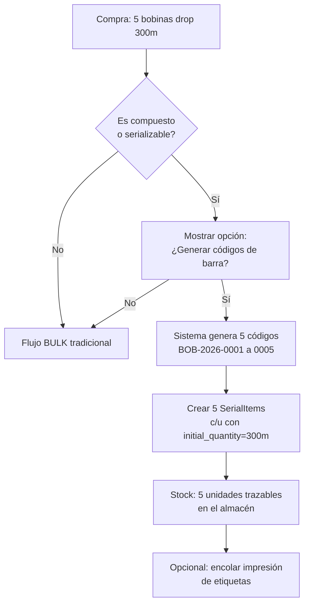
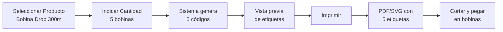
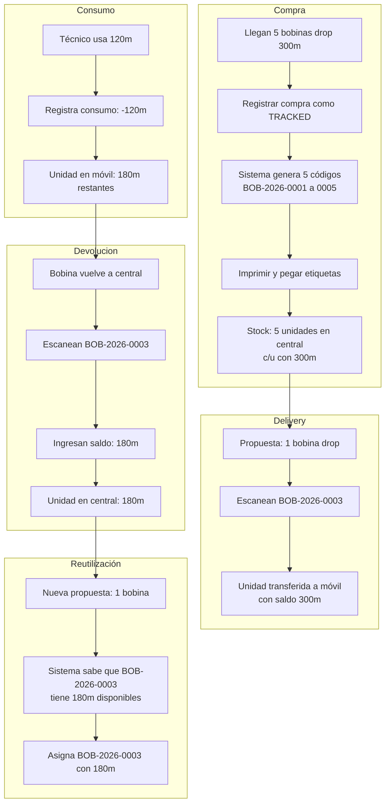

# Plan: Serialización Propia + Generador de Códigos de Barra

## Decisión de diseño (post-discusión con el líder técnico)

No se crea un nuevo `ProductType.TRACKED`. No se necesita un modelo separado.
**Un `SerialItem` es un serial, punto.** Si viene de fábrica o lo generamos
nosotros es un detalle de origen, no un tipo de producto distinto.

La lógica es:
- Producto SERIALIZED de fábrica → se ingresa con su serial OEM
- Producto BULK/COMPOSITE sin serial → en la compra, se da la opción de
  **serializarlo** → el sistema genera N códigos, crea N `SerialItem`,
  y a partir de ahí el sistema lo trata como cualquier serializado

> El `remaining_quantity` y `initial_quantity` son campos de `SerialItem`
> que solo aplican a productos `is_composite`, pero no cambian la naturaleza
> del registro: es un item serializado.

## Problema

Hoy los productos compuestos (bobinas de drop, blisters de conectores) se trackean como `StockBulk` — un total de metros/unidades por almacén. Si una bobina de 300m sale a un móvil, el técnico usa 150m y devuelve la bobina, no hay forma de saber que esa bobina específica tiene 150m restantes. La próxima vez que sale, el sistema cree que hay 300m disponibles.

Además, estos productos no traen código de barras individual de fábrica, por lo que necesitamos generarlos nosotros.

## Arquitectura

### Modelo: Extender `SerialItem`

En vez de crear un modelo nuevo, **extendemos `SerialItem`** con campos opcionales. Esto es más simple y mantiene un solo concepto de "unidad trazable" en el sistema:

```python
class SerialItem(Base):
    """
    Items con serial único o código de barra generado.
    
    Dos categorías:
    1. EQUIPOS (ONUs, routers): serial = fabricante, sin quantity
    2. UNIDADES COMPUESTAS (bobinas, blisters): barcode = generado,
       con saldo de cantidad restante
    """
    __tablename__ = "serial_items"
    
    # --- Campos existentes ---
    id: int
    serial_number: str              # Serial OEM o barcode generado
    mac_address: str | None
    product_id: int                 # FK -> products
    warehouse_id: int               # Ubicación actual
    status: SerialItemStatus        # NEW | IN_VEHICLE | INSTALLED | etc
    # ... resto de campos existentes
    
    # --- NUEVOS CAMPOS para unidades compuestas ---
    is_generated_barcode: bool = False  
    # True: el código fue generado por nosotros, no es serial OEM
    
    initial_quantity: float | None  
    # Para compuestos: cantidad inicial (ej: 300m)
    
    remaining_quantity: float | None  
    # Para compuestos: saldo actual (ej: 150m después de usar parte)
    
    # --- Relaciones existentes (se mantienen) ---
    product: Product
    warehouse: Warehouse
    movements: List[StockMovement]
```

### Nueva tabla auxiliar: `barcode_sequences`

Para generar códigos únicos sin colisiones:

```python
class BarcodeSequence(Base):
    """
    Secuencia numérica para generación de códigos de barra.
    Por prefijo de producto para que los códigos sean legibles.
    
    Ejemplo para bobina drop: BOB-2026-000428
    - BOB: prefijo del producto
    - 2026: año
    - 000428: secuencial
    """
    __tablename__ = "barcode_sequences"
    
    id: int
    product_id: int                 # FK -> products (o NULL para genérico)
    prefix: str                     # BOB, HRR, ACC, etc
    year: int                       # Año de la secuencia
    last_sequence: int              # Último número usado
    created_at: datetime
    updated_at: datetime
    
    __table_args__ = (
        UniqueConstraint("prefix", "year", name="uq_barcode_seq_prefix_year"),
    )
```

### Nueva tabla: `consumption_log`

Para registrar consumos fraccionados de unidades compuestas:

```python
class ConsumptionLog(Base):
    """
    Registro de consumo fraccionado de una unidad compuesta.
    Cada vez que un técnico usa N metros de una bobina, se registra aquí.
    """
    __tablename__ = "consumption_logs"
    
    id: int
    tracked_unit_id: int            # FK -> serial_items.id
    work_order_id: int | None       # OT donde se consumió (si aplica)
    quantity_consumed: float        # Cantidad consumida (ej: 150m)
    quantity_before: float          # Saldo antes del consumo
    quantity_after: float           # Saldo después del consumo
    user_id: int
    warehouse_id: int               # Almacén donde ocurrió el consumo
    notes: str | None
    created_at: datetime
```

---

## 2. El cambio real: "Serializar en compra"

### Flujo actual (compra de producto BULK/composite)

1. Selecciono producto + almacén + cantidad (ej: 5 bobinas)
2. Ingreso 5 en cantidad
3. Sistema crea `StockBulk.quantity += 5` y un `StockMovement`

Problema: no sé qué bobina es cuál, ni cuánto le queda a cada una.

### Flujo nuevo (con opción de serializar)

1. Selecciono producto + almacén + cantidad
2. **Opción nueva**: "¿Generar códigos de barra para tracking individual?"
3. Si elijo NO → flujo BULK tradicional (stock agregado)
4. Si elijo SÍ → sistema genera N códigos, crea N `SerialItem`, muestra para imprimir



### Lo que realmente cambia

| Capa | Cambio | Esfuerzo |
|------|--------|----------|
| `SerialItem` | +`is_generated_barcode`, +`initial_quantity`, +`remaining_quantity` | Bajo |
| `BarcodeSequence` | Nueva tabla para secuencias | Medio |
| Compra (frontend) | Checkbox "Generar códigos" al seleccionar BULK/composite | Medio |
| Compra (backend) | En `confirm_scan_session` o `create_stock_adjustment`, bifurcar: si genera códigos → crear SerialItems vs StockBulk | Medio |
| `BarcodeGeneratorService` | Nuevo servicio | Medio |
| Impresión | Feature separado (puede ser async con cola) | Alto (póstumo) |

## 3. Generador de Códigos de Barra

### Servicio: `services/barcode_generator_service.py`

```python
class BarcodeGeneratorService:
    """
    Genera códigos de barra únicos para unidades compuestas.
    
    Formato: {PREFIJO}-{AÑO}-{SECUENCIAL}
    Ejemplo: BOB-2026-000428
    
    El prefijo se obtiene del código de producto o se configura
    manualmente. La secuencia se auto-incrementa por año.
    """
    
    PREFIX_MAP = {
        "CABLE": "CBL",     # Cable de cualquier tipo
        "DROP":  "DRP",     # Drop cable
        "FIBRA": "FBR",     # Fibra óptica
        "CONECTOR": "CNT",  # Conectores
        "HERRAMIENTA": "HRR",
    }
    
    def generate_barcode(self, product_id: int, db: Session) -> str:
        """Genera un código de barra único."""
        ...
    
    def generate_batch(self, product_id: int, count: int, db: Session) -> list[str]:
        """Genera N códigos para un lote de unidades iguales."""
        ...
    
    def render_svg(self, barcode: str) -> str:
        """Renderiza el código de barra como SVG para imprimir."""
        ...
```

### Librería

Usar `python-barcode` (ya está en requirements.txt o se agrega):

```python
import barcode
from barcode.writer import SVGWriter

def render_barcode_svg(code: str) -> str:
    """Genera SVG imprimible del código de barra (CODE128)."""
    CODE128 = barcode.get_barcode_class('code128')
    writer = SVGWriter()
    svg = CODE128(code, writer=writer).render()
    return svg
```

### Endpoints

| Método | Ruta | Descripción |
|--------|------|-------------|
| `POST` | `/api/v2/logistics/tracked-units/generate` | Genera N códigos + crea unidades trazables |
| `GET` | `/api/v2/logistics/tracked-units/{id}/barcode` | Obtiene SVG del código de barra |
| `GET` | `/api/v2/logistics/tracked-units/batch/{batch_id}/labels` | Obtiene PDF/SVG con etiquetas para imprimir |
| `POST` | `/api/v2/logistics/tracked-units/{id}/consume` | Registra consumo de N metros/unidades |
| `GET` | `/api/v2/logistics/tracked-units/{barcode}` | Busca unidad por código de barra |
| `GET` | `/api/v2/logistics/warehouses/{id}/tracked-units` | Lista unidades trazables en un almacén |

### Frontend: Barcode Label Printer



---

## 3. Integración con el BarcodeScannerEngine

El motor que ya implementamos necesita un nuevo validador:

```python
# En validators.py (nuevo)
class TrackedUnitValidator:
    """
    Reconoce códigos de barra generados por nuestro sistema.
    
    Formato: {PREFIJO}-{AÑO}-{SECUENCIAL}
    Ej: BOB-2026-000428
    """
    
    name: str = "tracked_unit"
    priority: int = 15  # Entre ProductCode (10) y SerialFormat (20)
    
    def validate(self, code: str, context: ScanContext) -> ScanResult | None:
        # Si el código coincide con formato BOB-2026-000428
        # buscar en serial_items por barcode
        # retornar producto + unidad + saldo
```

### Integración en delivery

Cuando una bobina sale en una entrega:

1. **Paso 3 del wizard**: el operador escanea el código de la bobina (`BOB-2026-000428`)
2. El `BarcodeScannerEngine` lo identifica como `TRACKED_UNIT` (nuevo ScanType)
3. El sistema registra qué unidad específica se asignó a la entrega
4. **Al confirmar**: la unidad se transfiere al almacén móvil

Cuando vuelve con saldo:

1. El operador escanea la bobina en la recepción
2. Ingresa el saldo restante (ej: 150m)
3. El sistema actualiza `remaining_quantity` y transfiere la unidad de vuelta a central

---

## 4. Nueva categoría de producto: TRACKED

Para manejar esto limpiamente, se agrega un nuevo `ProductType`:

```python
class ProductType(str, PyEnum):
    SERIALIZED = "SERIALIZED"   # Equipos con serial único (ONUs, routers)
    BULK = "BULK"               # Materiales a granel (cable suelto, conectores)
    TRACKED = "TRACKED"         # Unidades compuestas trazables (bobinas, blisters)
```

Esto permite:
- `SERIALIZED`: se trackea con serial del fabricante. No tiene `remaining_quantity`
- `BULK`: stock agregado por almacén. Sin tracking individual
- `TRACKED`: se compra como BULK pero se trackea individualmente con código generado. Tiene `remaining_quantity`

### Flujo completo



---

## 5. Resumen de cambios vs refactor de compras

Este feature es **posterior al refactor** y toca:

| Capa | Archivos | Cambio |
|------|----------|--------|
| Modelos | `models/inventory.py` | Extender `SerialItem` + nuevas tablas `barcode_sequences`, `consumption_logs` |
| Modelos | `models/inventory.py` | Nuevo enum `ProductType.TRACKED` |
| Servicios | `services/barcode_generator_service.py` | Nuevo: generación + render SVG |
| Servicios | `services/tracked_unit_service.py` | Nuevo: lógica de consumo, saldo, transferencia |
| Barcode Reader | `validators.py` | Nuevo `TrackedUnitValidator` |
| Schemas | `schemas/logistics.py` | Nuevos schemas para tracked units |
| Router | `routers/logistics.py` | Nuevos endpoints o router propio |
| Frontend | `pages/logistics/BarcodeLabelPrinter.jsx` | Nuevo: generador de etiquetas |
| Frontend | `pages/logistics/TrackedUnitsDashboard.jsx` | Nuevo: dashboard de unidades trazables |
| Frontend | `MaterialDeliveryWizard.jsx` | Mostrar saldo al escanear bobina |
| Frontend | `MaterialReceiptWizard.jsx` | Permitir devolución con ingreso de saldo |
| Migración | Nueva migración Alembic | Tablas + seed data |

---

## 6. Principios de diseño

1. **`SerialItem` unificado**: NO creamos `TrackedUnit` separado. Extendemos `SerialItem` con campos nullable. Un solo modelo, una sola tabla, una sola lógica de movimiento.
2. **Códigos legibles**: El formato `{PREFIJO}-{AÑO}-{SECUENCIAL}` permite que un operador sepa de qué producto se trata solo con leer el código.
3. **Sin hardcodeo**: Los prefijos y formatos son configurables por producto.
4. **El scanner ya sabe leerlos**: El `BarcodeScannerEngine` recibe un nuevo validador y lo reconoce automáticamente.
