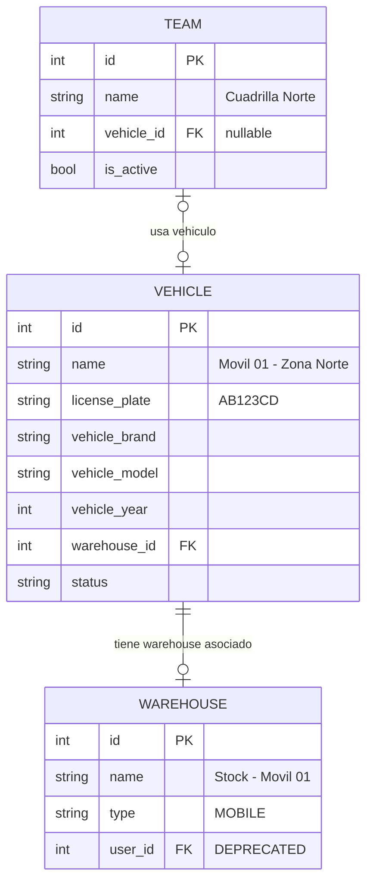
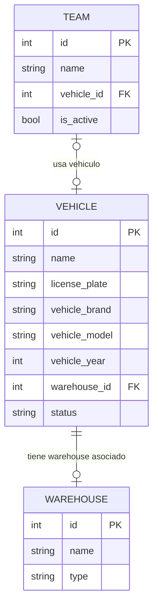
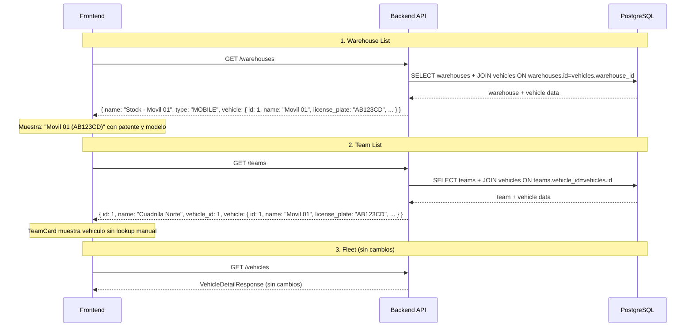

# Plan: Unificación del concepto "Móvil" en Flota, Almacenes y Cuadrillas

## Resumen

Actualmente el objeto **"móvil"** (vehículo operativo tipo camioneta) está tratado de forma inconsistente en los módulos de **Flota**, **Almacenes** y **Cuadrillas**. Aunque conceptualmente es el mismo objeto físico, cada módulo lo expone con distinta información y estructura.

**Principio rector:** Los datos del vehículo viven ÚNICAMENTE en la tabla `vehicles`. No se agrega ninguna columna a `warehouses` ni a `teams`. La solución expone los datos del vehículo como un **objeto anidado** en los schemas de respuesta, poblado exclusivamente vía **SQL JOIN** en runtime.

---

## 📐 Arquitectura Actual



### Relaciones actuales

| Tabla | FK | Hacia | Tipo |
|-------|-----|------|------|
| `vehicles.warehouse_id` | → | `warehouses.id` | One-to-One (Vehicle tiene Warehouse) |
| `teams.vehicle_id` | → | `vehicles.id` | One-to-One (Team usa Vehicle) |
| `warehouses.user_id` | → | `users.id` | [DEPRECATED] |

### Lo que expone cada módulo HOY

| Módulo | Schema | Datos del vehículo que expone |
|--------|--------|-------------------------------|
| **Flota** | [`VehicleResponse`](backend/src/schemas/fleet.py:46) | Todo + `warehouse_name` |
| **Flota** | [`VehicleDetailResponse`](backend/src/schemas/fleet.py:57) | Lo mismo + `team_id`, `team_name` |
| **Almacenes** | [`WarehouseResponse`](backend/src/schemas/inventory.py:40) | Solo `user_name`. **Nada** del vehículo |
| **Cuadrillas** | [`TeamDetailResponse`](backend/src/schemas/coordination.py:66) | Solo `vehicle_id` (int). **Nada** de name/patente |

---

## 🔍 Inconsistencias Detectadas

### 1. Almacenes: no exponen datos del vehículo asociado

La warehouse MOBILE ya tiene un Vehicle vinculado vía `vehicles.warehouse_id`, y el modelo [`Warehouse`](backend/src/models/inventory.py:105) ya define la relación inversa:
```python
vehicle: Mapped[Optional["Vehicle"]] = relationship(
    "Vehicle", back_populates="warehouse", lazy="selectin", uselist=False,
)
```

**Pero ningún endpoint la usa.** El router hace `joinedload(Warehouse.user)` pero nunca `joinedload(Warehouse.vehicle)`. En la UI, la warehouse MOBILE aparece genéricamente como `"Stock - Móvil 01"` sin patente, marca ni modelo del vehículo.

### 2. Cuadrillas: datos del vehículo resueltos en frontend (frágil)

[`TeamDetailResponse`](backend/src/schemas/coordination.py:66) solo expone `vehicle_id` (int). [`CuadrillasPage.jsx:106-131`](frontend/src/pages/coordination/CuadrillasPage.jsx:106) compensa haciendo un fetch separado de todos los vehículos, y [`TeamCard.jsx:29-32`](frontend/src/components/coordination/TeamCard.jsx:29) hace un lookup manual:

```javascript
const assignedVehicle = useMemo(() => {
  if (!team?.vehicle_id) return null;
  return vehicles.find((v) => Number(v.id) === Number(team.vehicle_id)) || null;
}, [vehicles, team]);
```

Esto es frágil porque si el fetch de vehículos falla, la info del móvil desaparece, y además duplica datos en la red.

---

## 🎯 Propuesta de Solución

### Principios

1. **Vehicle es el único origen de datos** del concepto "móvil". Warehouse es su contenedor de stock, Team es su operador.
2. **No se agregan columnas** a `warehouses` ni a `teams` — cero migraciones de schema.
3. Los datos del vehículo se exponen como un **objeto anidado `vehicle`** en los schemas de respuesta, poblado vía `joinedload` (JOIN) a la tabla `vehicles`.
4. El frontend consume estos datos directamente, sin need de fetch adicional ni lookup manual.

### Diagrama conceptual — SIN cambios en la DB



### Lo que CAMBIA (solo schemas + queries)

| Schema | Campo nuevo | Origen | Tipo |
|--------|-------------|--------|------|
| `WarehouseResponse.vehicle` | `Optional[VehicleSummary]` | JOIN `vehicles` via `Warehouse.vehicle` | Anidado |
| `TeamDetailResponse.vehicle` | `Optional[VehicleSummary]` | JOIN `vehicles` via `Team.vehicle` | Anidado |

Donde `VehicleSummary` es un schema Pydantic nuevo, minimalista:

```python
class VehicleSummary(BaseModel):
    """Resumen de vehiculo para incluir como objeto anidado en otras respuestas.
    No almacena datos, solo expone via JOIN desde la tabla vehicles."""
    id: int
    name: str
    license_plate: Optional[str] = None
    vehicle_brand: Optional[str] = None
    vehicle_model: Optional[str] = None
    full_name: Optional[str] = None
    model_config = ConfigDict(from_attributes=True)
```

---

## 📋 Plan de Implementación

### FASE 0: Backend — Schema compartido `VehicleSummary`

**Archivo nuevo:** `backend/src/schemas/common.py` (o agregar a [`backend/src/schemas/fleet.py`](backend/src/schemas/fleet.py))

```python
class VehicleSummary(BaseModel):
    """Resumen de vehiculo para incluir como objeto anidado.
    Se popula via JOIN a la tabla vehicles, NO es columna propia."""
    id: int
    name: str
    license_plate: Optional[str] = None
    vehicle_brand: Optional[str] = None
    vehicle_model: Optional[str] = None
    full_name: Optional[str] = None

    model_config = ConfigDict(from_attributes=True)
```

### FASE 1: Backend — WarehouseResponse con vehicle anidado

**Archivo:** [`backend/src/schemas/inventory.py:40-47`](backend/src/schemas/inventory.py:40)

```python
class WarehouseResponse(WarehouseBase):
    id: int
    created_at: datetime
    updated_at: datetime
    user_name: Optional[str] = None
    vehicle: Optional[VehicleSummary] = None  # Populado via JOIN, no es columna
    model_config = ConfigDict(from_attributes=True)
```

**Archivo:** [`backend/src/routers/inventory.py:122-151`](backend/src/routers/inventory.py:122)

```python
@router.get("/warehouses", response_model=List[WarehouseResponse])
def list_warehouses(
    warehouse_type: Optional[WarehouseType] = Query(None),
    user_id: Optional[int] = Query(None),
    db: Session = Depends(get_db)
):
    stmt = (
        select(Warehouse)
        .options(joinedload(Warehouse.user), joinedload(Warehouse.vehicle))
    )
    if warehouse_type:
        stmt = stmt.where(Warehouse.type == warehouse_type)
    if user_id:
        stmt = stmt.where(Warehouse.user_id == user_id)
    stmt = stmt.order_by(Warehouse.type, Warehouse.name)
    warehouses = db.execute(stmt).scalars().all()

    return [
        WarehouseResponse(
            id=w.id,
            name=w.name,
            type=w.type,
            user_id=w.user_id,
            created_at=w.created_at,
            updated_at=w.updated_at,
            user_name=_safe_user_name(w.user),
            vehicle=VehicleSummary.model_validate(w.vehicle) if w.vehicle else None,
        )
        for w in warehouses
    ]
```

### FASE 2: Backend — TeamDetailResponse con vehicle anidado

**Archivo:** [`backend/src/schemas/coordination.py:66-69`](backend/src/schemas/coordination.py:66)

```python
class TeamDetailResponse(TeamResponse):
    members: List[TeamMemberResponse] = Field(default_factory=list)
    leader_name: Optional[str] = None
    vehicle: Optional[VehicleSummary] = None  # Populado via JOIN, no es columna
```

**Archivo:** [`backend/src/services/team_service.py`](backend/src/services/team_service.py)

En `get_all_teams` y `get_team_by_id`:
1. Agregar `.options(joinedload(Team.vehicle))` a las queries existentes
2. Al construir `TeamDetailResponse`, agregar:
```python
vehicle=VehicleSummary.model_validate(team.vehicle) if team.vehicle else None,
```

### FASE 3: Frontend — WarehouseList.jsx

**Archivo:** [`frontend/src/pages/inventory/WarehouseList.jsx`](frontend/src/pages/inventory/WarehouseList.jsx)

Para warehouses MOBILE, mostrar el objeto `vehicle` anidado como info principal:

```jsx
{w.type === 'MOBILE' && w.vehicle ? (
  <div>
    <p className="font-medium text-zinc-100">{w.vehicle.full_name || w.vehicle.name}</p>
    <p className="text-xs text-zinc-500">
      {[w.vehicle.vehicle_brand, w.vehicle.vehicle_model].filter(Boolean).join(' ') || ''}
      {w.user_name ? ` · ${w.user_name}` : ''}
    </p>
    <p className="text-xs text-zinc-600">Stock: {w.name}</p>
  </div>
) : (
  <p className="font-medium text-zinc-100">{w.name}</p>
)}
```

### FASE 4: Frontend — TeamCard.jsx

**Archivo:** [`frontend/src/components/coordination/TeamCard.jsx`](frontend/src/components/coordination/TeamCard.jsx)

Eliminar el lookup manual. Leer `vehicle` directamente de `team`:

```jsx
{team.vehicle ? (
  <>
    <p className="text-sm text-zinc-100 font-medium truncate">
      {team.vehicle.full_name || team.vehicle.name}
    </p>
    <p className="text-xs text-zinc-400 truncate mt-0.5">
      {team.vehicle.vehicle_model || 'Modelo s/d'} · {team.vehicle.license_plate || 'Patente s/d'}
    </p>
  </>
) : (
  <p className="text-xs text-zinc-500">Sin vehiculo asignado</p>
)}
```

### FASE 5: Frontend — CuadrillasPage.jsx

**Archivo:** [`frontend/src/pages/coordination/CuadrillasPage.jsx`](frontend/src/pages/coordination/CuadrillasPage.jsx)

- TeamCard ya no necesita el prop `vehicles` (lee `team.vehicle` directamente)
- El fetch `loadVehicles()` puede eliminarse si no se necesita para otra cosa (como el create/edit dialog)
- Pero **el create/edit dialog** aún necesita la lista de vehículos para que el usuario pueda seleccionar uno. Mantener `loadVehicles()` solo si se usa en los dialogs.

### FASE 6: Validación — MOBILE warehouses solo desde Fleet

**Archivo:** [`backend/src/routers/inventory.py:154+`](backend/src/routers/inventory.py:154)

El endpoint `POST /warehouses` debería rechazar `type: MOBILE` con error 400:
```python
if payload.type == WarehouseType.MOBILE:
    raise HTTPException(
        status_code=400,
        detail="Los almacenes MOBILE deben crearse desde el modulo Flota al registrar un vehiculo"
    )
```

Esto previene warehouses MOBILE huérfanas sin Vehicle asociado.

---

## 📊 Resumen de Cambios por Archivo

| # | Archivo | Cambio | Tipo |
|---|---------|--------|------|
| 0 | [`backend/src/schemas/fleet.py`](backend/src/schemas/fleet.py) (o `common.py`) | Nuevo schema `VehicleSummary` | Schema |
| 1 | [`backend/src/schemas/inventory.py`](backend/src/schemas/inventory.py) | Agregar `vehicle: Optional[VehicleSummary]` a `WarehouseResponse` | Schema |
| 2 | [`backend/src/routers/inventory.py`](backend/src/routers/inventory.py) | Agregar `joinedload(Warehouse.vehicle)` + poblar campo `vehicle` + validar creación MOBILE | Router |
| 3 | [`backend/src/schemas/coordination.py`](backend/src/schemas/coordination.py) | Agregar `vehicle: Optional[VehicleSummary]` a `TeamDetailResponse` | Schema |
| 4 | [`backend/src/services/team_service.py`](backend/src/services/team_service.py) | Agregar `joinedload(Team.vehicle)` + poblar campo `vehicle` | Service |
| 5 | [`frontend/src/pages/inventory/WarehouseList.jsx`](frontend/src/pages/inventory/WarehouseList.jsx) | Mostrar `w.vehicle.full_name` + patente para MOBILE | Frontend |
| 6 | [`frontend/src/components/coordination/TeamCard.jsx`](frontend/src/components/coordination/TeamCard.jsx) | Leer `team.vehicle` directamente, eliminar lookup manual | Frontend |
| 7 | [`frontend/src/pages/coordination/CuadrillasPage.jsx`](frontend/src/pages/coordination/CuadrillasPage.jsx) | Simplificar props a TeamCard | Frontend |

---

## 🔄 Orden de Implementación Recomendado

```
FASE 0: VehicleSummary schema
    ↓
FASE 1: WarehouseResponse + list_warehouses
    ↓
FASE 2: TeamDetailResponse + TeamService
    ↓
FASE 3: WarehouseList.jsx frontend
    ↓
FASE 4: TeamCard.jsx frontend
    ↓
FASE 5: CuadrillasPage.jsx frontend
    ↓
FASE 6: Validacion create MOBILE warehouse
```

---

## 📐 Diagrama de Flujo de Datos (post-implementación)


