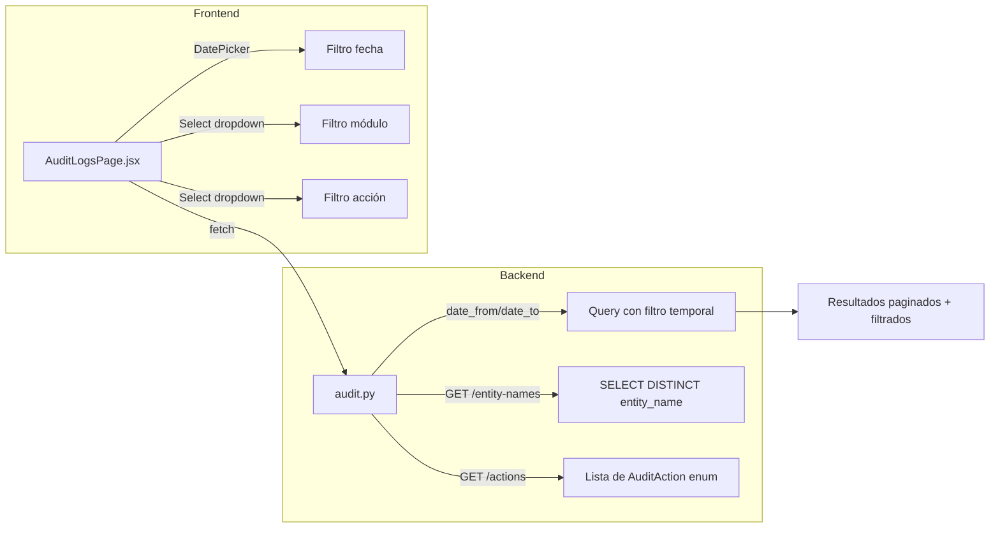
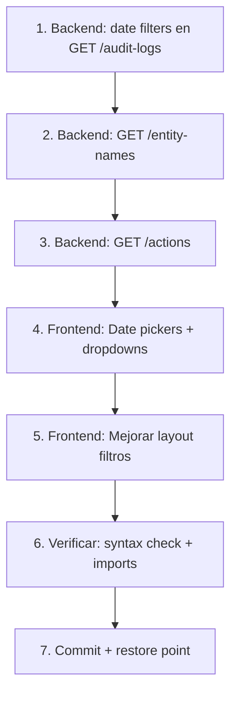

# 🎯 Plan: Vista de Auditoría en Settings

## Estado Actual

| Componente | Estado |
|---|---|
| Ruta `/app/audit` | ✅ Ya existe en [`App.jsx:96`](/frontend/src/App.jsx:96) |
| Sidebar "Auditoría" en "Sistema" | ✅ Ya existe en [`AppSidebar.jsx:231`](/frontend/src/components/AppSidebar.jsx:231) |
| Backend `GET /v2/audit-logs` | ✅ Existe en [`audit.py:26`](/backend/src/routers/audit.py:26) |
| Frontend `AuditLogsPage.jsx` | ✅ Existe en [`AuditLogsPage.jsx`](/frontend/src/pages/audit/AuditLogsPage.jsx) |
| Filtro por fecha (backend) | ❌ No implementado |
| Filtro por fecha (frontend) | ❌ No implementado |
| Dropdown de entidades (frontend) | ❌ Usa input text libre |
| Dropdown de acciones (frontend) | ❌ Usa input text libre |
| Endpoint auxiliar de entidades | ❌ No existe |
| Endpoint auxiliar de acciones | ❌ No existe |

## Arquitectura del Cambio



## Tareas Detalladas

### Backend — [`backend/src/routers/audit.py`](/backend/src/routers/audit.py)

#### 1. Agregar filtros de fecha al endpoint `GET /v2/audit-logs`

**Archivo:** [`backend/src/routers/audit.py:26-43`](/backend/src/routers/audit.py:26-43)

**Qué hacer:**
- Agregar parámetros `date_from: Optional[datetime]` y `date_to: Optional[datetime]` como Query params
- En la construcción de filtros (líneas 90-103), agregar:
  ```python
  if date_from is not None:
      filters.append(AuditLog.created_at >= date_from)
  if date_to is not None:
      filters.append(AuditLog.created_at <= date_to)
  ```
- Actualizar docstring con los nuevos parámetros

**Por qué:** Sin filtro de fecha, el usuario no puede acotar búsquedas a períodos específicos. Para investigar incidentes se necesita acotar a un día/semana.

#### 2. Endpoint auxiliar: `GET /v2/audit-logs/entity-names`

**Archivo:** Nuevo bloque en [`backend/src/routers/audit.py`](/backend/src/routers/audit.py), después del endpoint existente.

**Qué hacer:**
```python
@router.get("/entity-names", response_model=List[str])
def get_audit_entity_names(
    admin: User = Depends(require_admin),
    db: Session = Depends(get_db)
):
    """Retorna lista de nombres de entidades con registros de auditoría."""
    stmt = select(AuditLog.entity_name).distinct().order_by(AuditLog.entity_name)
    names = db.execute(stmt).scalars().all()
    return names
```

**Por qué:** El frontend necesita un dropdown con los módulos existentes. Hacer `SELECT DISTINCT` es eficiente (índice en `entity_name`).

#### 3. Endpoint auxiliar: `GET /v2/audit-logs/actions`

**Archivo:** Nuevo bloque en [`backend/src/routers/audit.py`](/backend/src/routers/audit.py)

**Qué hacer:**
```python
@router.get("/actions", response_model=List[str])
def get_audit_actions(
    admin: User = Depends(require_admin),
):
    """Retorna lista de acciones de auditoría disponibles."""
    return [action.value for action in AuditAction]
```

**Por qué:** El frontend necesita un dropdown de acciones. Este endpoint evita hardcodear el enum en el frontend.

**Importante:** La ruta `/entity-names` y `/actions` deben definirse **antes** de la ruta `/{audit_log_id}` para evitar conflictos de ruteo en FastAPI.

### Frontend — [`frontend/src/pages/audit/AuditLogsPage.jsx`](/frontend/src/pages/audit/AuditLogsPage.jsx)

#### 4. Agregar date picker de "Desde" / "Hasta"

**Estado actual (líneas 55-67):** Solo tiene `entity_name`, `action`, `user_id` como inputs de texto.

**Qué hacer:**
- Importar componente `Input` con `type="date"` (ya existe en la UI)
- Agregar al estado `filters`:
  ```javascript
  const [filters, setFilters] = useState({
    entity_name: '',
    action: '',
    user_id: '',
    date_from: '',  // NUEVO
    date_to: '',    // NUEVO
  });
  ```
- En `loadAuditLogs()`, agregar al `URLSearchParams`:
  ```javascript
  if (filters.date_from) params.append('date_from', filters.date_from);
  if (filters.date_to) params.append('date_to', filters.date_to);
  ```
- Renderizar dos inputs de fecha en el panel de filtros

#### 5. Reemplazar inputs text por dropdowns de módulo y acción

**Qué hacer:**
- En `useEffect` de montaje, cargar datos de los endpoints:
  ```javascript
  const [entityNames, setEntityNames] = useState([]);
  const [actionTypes, setActionTypes] = useState([]);
  
  useEffect(() => {
    api.get('/v2/audit-logs/entity-names').then(r => setEntityNames(r.data));
    api.get('/v2/audit-logs/actions').then(r => setActionTypes(r.data));
  }, []);
  ```
- Reemplazar `<Input>` de `entity_name` por `<Select>` con opciones de `entityNames`
- Reemplazar `<Input>` de `action` por `<Select>` con opciones de `actionTypes`
- Mantener la opción "Todas" como valor por defecto (vacío)

#### 6. Mejorar layout del panel de filtros

**Estado actual:** Los filtros están dispersos. Mejorar con:
- Input de filter text para `user_id` (mantener)
- Date range picker en una fila (de - hasta)
- Dropdown de módulo
- Dropdown de acción
- Botón "Limpiar filtros" más prominente

#### 7. Integrar en Settings

**Opcional:** Si se desea que aparezca como un tab dentro de `/app/settings` en lugar de ruta independiente:
- Agregar `AuditLogsPage` como un `TabsContent` dentro de [`SettingsPage.jsx`](/frontend/src/pages/SettingsPage.jsx)
- Pero la ruta independiente `/app/audit` ya funciona. Depende de preferencia del usuario.

## Orden de Implementación



## Archivos Afectados

| Archivo | Cambio |
|---------|--------|
| [`backend/src/routers/audit.py`](/backend/src/routers/audit.py) | +3 endpoints nuevos, modificar 1 existente |
| [`frontend/src/pages/audit/AuditLogsPage.jsx`](/frontend/src/pages/audit/AuditLogsPage.jsx) | Refactor completo del panel de filtros |

## Validación

1. `python3 -m py_compile backend/src/routers/audit.py` → syntax OK
2. Import check: `from src.routers.audit import router` → imports OK
3. Frontend build: `npm run build` en frontend/ → build OK
4. Prueba manual: `GET /v2/audit-logs?date_from=2026-05-01&date_to=2026-05-20` → filtra correctamente
5. Prueba manual: `GET /v2/audit-logs/entity-names` → retorna lista de módulos

## Notas

- La navegación ya existe en el sidebar, no necesita cambios de ruteo
- El endpoint `GET /v2/audit-logs` ya tiene protección `require_admin`, los nuevos endpoints también la heredarán
- Los filtros de fecha usan `datetime` con timezone. El frontend debe enviar fechas en ISO 8601 (ej: `2026-05-20T00:00:00Z`)
- El componente `Select` ya existe en [`frontend/src/components/ui/select.jsx`](/frontend/src/components/ui/select.jsx)
- El componente `Input` con `type="date"` ya existe en [`frontend/src/components/ui/input.jsx`](/frontend/src/components/ui/input.jsx)
